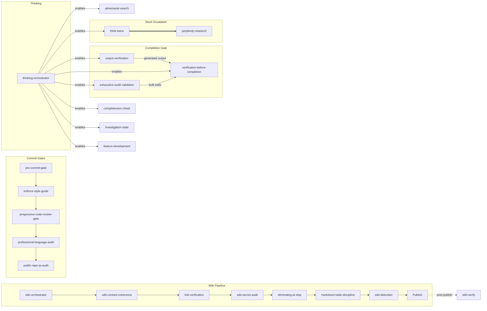

# superpowers-plus

87 skills for AI coding assistants. Extends [obra/superpowers](https://github.com/obra/superpowers) with slop detection, link verification, skill pipelines, issue tracking, and security scanning.

> **⚠️ Token budget:** Skills chain. A wiki edit runs the full wiki-orchestrator pipeline (de-dup → content → coherence → links → secrets → slop → tables → fact-check → publish). Budget accordingly.

## Development Process

Development now uses private branches for maturation, testing, and validation before merging to main. Expect less frequent commits as changes are batched into reviewed, tested releases.

## What's Included

**87 skills** across 9 domains (count excludes `_shared`, `_adapters`, `_archive` support directories):

| Domain | Count | Examples |
|--------|------:|----------|
| engineering | 33 | Blast radius, design triad, TDD, code review, progressive review gate, systematic debugging, feature lifecycle |
| productivity | 19 | TODO tracking, adversarial search, domain design, think-twice, plan-and-execute |
| writing | 7 | Slop detection/elimination, profanity gate, table discipline, skill file authoring |
| wiki | 7 | Orchestrator pipeline, link checks, credential scanning, fact-checking, wiki refactor |
| observability | 8 | Completeness checks, audit validation, repo verification, diagnostics, skill health |
| issue-tracking | 5 | Authoring, editing, verification, link checks, comment debunking |
| security | 4 | Repo scanning, CVE scanning, IP protection, instruction guard |
| research | 3 | Perplexity integration, research incorporation, expert interviewing |
| experimental | 1 | Self-prompting patterns |

## Installation

**Prerequisites:** bash 4+, git, Node.js 18+. npm required for MCP server setup.

> **macOS note:** macOS ships bash 3.2 (frozen at GPLv2 since 2007). Install modern bash first: `brew install bash`. The installer will detect the old version and tell you exactly how to fix it.

### macOS / Linux / WSL

```bash
git clone https://github.com/bordenet/superpowers-plus.git
cd superpowers-plus
bash install.sh      # use 'bash' explicitly — don't rely on ./install.sh
```

The installer:

- Detects wrong shell (sh, zsh, dash) and tells you to use bash
- Detects old bash (3.2) with platform-specific install instructions
- Checks for missing commands (git, node) with remediation steps
- Auto-detects your platform and offers to install missing dependencies
- Auto-fixes Windows CRLF line endings if detected

**Windows/WSL:** Run `wsl --install -d Ubuntu` first, then use the commands above from within WSL.

**Linux containers (Docker/CI):** Works as root without sudo. The installer detects the environment automatically.

### Augment Agent (One-Liner: Ubuntu / Debian / WSL)

```bash
curl -fsSL https://raw.githubusercontent.com/bordenet/superpowers-plus/main/install-augment-superpowers.sh | bash
```

Installs obra/superpowers + the Augment adapter. Does **not** install the 87-skill suite — use git clone above for that.

### Claude Code

```bash
/plugin install https://github.com/bordenet/superpowers-plus
```

### MCP Server

1. `cd mcp && npm install`
2. Add to your MCP config (e.g., `~/.claude/settings.json`):

   ```json
   {
     "mcpServers": {
       "superpowers-plus": {
         "command": "node",
         "args": ["/path/to/superpowers-plus/mcp/superpowers-mcp.js"]
       }
     }
   }
   ```

3. Restart your client. Use the `find_skills` MCP tool to list available skills.

### Codex

```text
Fetch and follow instructions from https://raw.githubusercontent.com/bordenet/superpowers-plus/main/.codex/INSTALL.md
```

### OpenCode

```text
Fetch and follow instructions from https://raw.githubusercontent.com/bordenet/superpowers-plus/main/.opencode/INSTALL.md
```

### Gemini CLI

```bash
gemini extensions install https://github.com/obra/superpowers
gemini extensions install https://github.com/bordenet/superpowers-plus
```

### Using as a Dependency

See [docs/examples/adopter-install-example.sh](docs/examples/adopter-install-example.sh) for a robust install script template.

### Updating

```bash
bash install.sh --upgrade
```

## Configuration

Copy `.env.example` to `.env` for optional integrations:

| Variable | Purpose |
|----------|---------|
| `ISSUE_TRACKER_TYPE` | Adapter key — shipped adapters: `github`, `jira`, `azure-devops` |
| `WIKI_PLATFORM` | Adapter key — see `skills/wiki/_adapters/platform-template.md` to add yours |
| `PERPLEXITY_API_KEY` | Enables deep research escalation (~$0.01/query) |
| `THINK_TWICE_USE_PERPLEXITY` | `false` by default; set `true` to let think-twice escalate to Perplexity |
| `OPENAI_API_KEY` | Enables embedding-based skill matching (optional; TF-IDF works without it) |

## Semantic Skill Matching

Skills activate automatically when your request matches their triggers. Describe what you want:

| You say... | Skill triggered | What happens |
|------------|-----------------|--------------|
| "You're stuck in a loop!" | think-twice | Pauses, consults fresh sub-agent |
| "Create a wiki page for X" | (direct wiki API) | Single-page creation doesn't need a skill |
| "Build a multi-page wiki section" | wiki-orchestrator | Bulk/multi-page documentation pipeline |
| "Review this PR" | providing-code-review | Structured feedback with checklist |
| "Is this done?" | completeness-check | Audits for incomplete work |
| "Check for security issues" | repo-security-scan | Full scan (secrets, deps, patterns, config) |

`think-twice` also auto-detects when the AI is spiraling and suggests pausing.

**CLI matching** (for debugging): `node ~/.codex/superpowers-augment/superpowers-augment.js match-skills "my tests keep failing"`

## Skills

| Domain | Skill | What it does |
|--------|-------|--------------|
| engineering | blast-radius-check | Finds all callers before edits |
| | brainstorming | Explores intent, requirements, and design before implementation |
| | cognitive-complexity-refactoring | Reduces Biome cognitive complexity: extraction, early returns, condition simplification |
| | code-review-battery | Parallel specialized reviewers: defect finder, design critic, guardian, standards enforcer, performance analyst |
| | micro-harsh-review | Per-batch adversarial review: 3 critic personas, 5 dimensions, score <8 = rework |
| | debug-conductor | PREVIEW — Conductor-led parallel investigation for complex distributed incidents |
| | design-triad | 3+ design options, comparison matrix, harsh review loop |
| | engineering-rigor | Meta-skill: dispatches output-verification, pre-commit-gate, blast-radius-check, code review skills |
| | evidence-adjudicator | Synthesizes investigator evidence into ranked root-cause verdicts |
| | feature-development | Full lifecycle: requirements-validation → design-triad → plan-and-execute → TDD → verify |
| | field-rename-verification | Verifies renames across service boundaries |
| | git-branch-conventions | Semantic branch prefix naming: feat/, fix/, exp/, doc/, perf/, chore/ |
| | implementation-tracker | Cross-session progress tracking for large issues |
| | infra-config-investigator | Investigates infrastructure config changes, deployment regressions |
| | investigation-state | Persists debugging context (hypotheses, evidence) across sessions |
| | llm-behavior-investigator | Investigates AI/LLM behavior: tool misselection, prompt regressions |
| | output-verification | Prevents confabulation disguised as verification — no claims about output without inspection |
| | pre-commit-gate | Runs lint → typecheck → test |
| | progressive-code-review-gate | Mandatory harsh review loop before commit/push |
| | progressive-harsh-review | Multi-persona adversarial review (3 critic personas, weighted scoring) |
| | providing-code-review | Structured PR feedback with checklist |
| | receiving-code-review | Verifies incoming feedback before implementing |
| | reproduction-experiment-investigator | Runs controlled reproduction experiments to verify hypotheses |
| | requirements-validation | Tests requirements for falsifiability, contradictions |
| | state-consistency-investigator | Investigates data inconsistency, replication lag, cache staleness |
| | subagent-driven-development | Orchestrates parallel sub-agents for independent tasks |
| | systematic-debugging | Structured debugging: reproduce → hypothesize → isolate → fix |
| | test-driven-development | Red → green → refactor cycle enforcement |
| | timeline-trace-investigator | Reconstructs temporal causation across distributed services |
| | typescript-project-conventions | Import ordering, path aliases, error handling, file size limits |
| | typescript-strict-mode | No any, no !, proper type narrowing, union types |
| | verification-before-completion | Final checks before claiming done |
| | vitest-testing-patterns | SDK constructor mocking, fake timers, event handler capture |
| experimental | experimental-self-prompting | Context-free analysis (unstable) |
| issue-tracking | issue-authoring | Writes tickets with acceptance criteria |
| | issue-comment-debunker | Fact-checks before posting |
| | issue-editing | Updates existing tickets safely |
| | issue-link-verification | Tests URLs in ticket content |
| | issue-verify | Confirms references exist |
| observability | completeness-check | Detects incomplete work from crashes or context loss |
| | evolution-loop | Self-improvement cycle: scans failures, generates skill updates, tracks metrics |
| | exhaustive-audit-validation | Confirms checklist coverage |
| | failure-autopsy | 5-Why post-mortem for wrong assumptions and failed approaches |
| | holistic-repo-verification | Checks all CI paths |
| | measurement-integrity | Cross-validation gate before reporting any metric or percentage |
| | skill-health-check | Validates skill ecosystem: YAML frontmatter, coordination, failure modes |
| | superpowers-doctor | 22-check diagnostic across all installed skills |
| productivity | adversarial-search | Defeats confirmation bias by searching for counter-evidence |
| | autonomous-chain-controller | Meta-orchestrator: auto-detects skill chains, executes with quality gates |
| | code-review | File-protocol handoff for inter-agent code review |
| | code-review-respond | Reviewer-side protocol for file-based review handoff |
| | domain-design | 10-phase domain design: research → brainstorm → review → prioritize → document |
| | enforce-style-guide | Applies project conventions |
| | fallback-planning | Machine-agnostic contingency TODOs |
| | golden-agents | Bootstraps AGENTS.md |
| | innovation | Generates 10x ideas: product shifts, architectural pivots |
| | plan-and-execute | Orchestrates challenge → plan → stress-test → phased TODO execution with retros |
| | skill-authoring | Creates new skills from descriptions/patterns |
| | superpowers-help | Lists available skills |
| | think-twice | Breaks AI out of spirals via fresh sub-agent |
| | thinking-orchestrator | Hub router for metacognition skills |
| | todo-archive | Archives completed tasks to monthly files |
| | todo-guardian | Continuous TODO enforcement: stale detection, completion gate, session-end sweep |
| | todo-management | Parses and tracks tasks |
| research | expert-interviewer | Extracts domain knowledge through structured interviewing |
| | incorporating-research | Merges external findings into current work |
| | perplexity-research | Escalates to Perplexity when free tools insufficient |
| security | public-repo-ip-audit | Detects proprietary content before public push |
| | repo-security-scan | Full scan: secrets, deps, patterns, config |
| | security-upgrade | Scans CVEs, upgrades deps |
| | wiki-instruction-guard | Blocks prompt injection in wiki content |
| wiki | link-verification | Confirms URLs resolve |
| | wiki-content-coherence | Detects duplication and structural defects |
| | wiki-debunker | Fact-checks content against git history, tickets, transcripts |
| | wiki-orchestrator | Pipeline orchestrator: dispatches coherence, link, secret, slop, and fact-check skills |
| | wiki-refactor | Full wiki refactor pipeline: discovery, dedup, IA, rewrite, review, delivery |
| | wiki-secret-audit | Finds leaked credentials in wiki pages |
| | wiki-verify | Checks codebase references for drift |
| writing | detecting-ai-slop | Scores text 0–100 for machine patterns |
| | eliminating-ai-slop | Rewrites stilted prose |
| | markdown-table-discipline | Enforces table formatting and readability |
| | plan-quality-gates | Prevents fabricated timelines in plans |
| | professional-language-audit | Blocks profanity |
| | readme-authoring | Structures documentation |
| | writing-skills | Creates, edits, and validates skill files |

## Skill Coordination

Skills form pipelines with explicit dependencies. The diagram shows inter-skill coordination; orchestrator-internal stages (de-dup, content generation) are omitted.



| Group | Flow | Purpose |
|-------|------|---------|
| Commit Gates | pre-commit → style → code review → language → IP audit | Quality checks before `git commit` |
| Completion Gate | output-verification (generated output) or exhaustive-audit (bulk edits) → verification | Context-dependent gates before claiming done |
| Thinking | orchestrator → child skills | Routes to correct thinking skill by context |
| Wiki Pipeline | orchestrator → coherence → links → secrets → slop → tables → fact-check → publish | Quality gates before publish; wiki-verify runs post-publish for drift |
| Stuck Escalation | think-twice ⟹ perplexity-research | Try free reasoning first, escalate to Perplexity |

### Namespaced Triggers

Skills support namespaced triggers (`domain:action`) for disambiguation:

| Domain | Triggers |
|--------|----------|
| `commit:` | `commit:pre-check`, `commit:gate`, `commit:style`, `commit:lint`, `commit:language`, `commit:ip-audit`, `commit:public` |
| `wiki:` | `wiki:create`, `wiki:update`, `wiki:publish`, `wiki:verify-links` |
| `stuck:` | `stuck:research`, `stuck:knowledge` |
| `link:` | `link:verify` |

## Extending

```text
obra/superpowers (framework)
    └── superpowers-plus (this repo)
            └── your-org-skills
```

See [Enterprise Adopters Guide](docs/ENTERPRISE_ADOPTERS_GUIDE.md).

## Tools

Utility scripts in `tools/`:

| Tool | Purpose |
|------|---------|
| `doctor-checks.sh` | 22-check diagnostic across all installed skills |
| `harsh-review.sh` | Enforces file endings, shebangs, syntax, ShellCheck |
| `harsh-review-loop.sh` | Iterative harsh review until clean |
| `dangerous-pattern-scan.sh` | Pre-commit scanner for `rm -rf`, `chmod 777`, `curl\|bash` |
| `install-hooks.sh` | Installs git hooks (pre-commit, pre-push) |
| `todo-preflight.sh` | Resolves `TODO_FILE_PATH` from `~/.codex/.env` |
| `todo-lock.sh` | Advisory file locking for TODO.md (cross-machine) |
| `todo-crud.sh` | TODO.md create/read/update/delete operations |
| `todo-maintenance.sh` | Archival and cleanup of completed tasks |
| `investigation-crud.sh` | Investigation state CRUD (hypotheses, evidence, verdicts) |
| `public-repo-ip-check.sh` | Scans for proprietary content before public push |
| `skill-trigger-validator.sh` | Audits trigger overlaps and missing triggers |
| `skill-cost-analyzer.sh` | Reports token cost per skill |
| `generate-skill-dag.js` | Generates skill dependency graph (Mermaid) |
| `skill-metrics-analyzer.sh` | Analyzes skill usage metrics |
| `parse-frontmatter.sh` | Extracts YAML frontmatter from skill files |

## Troubleshooting

| Problem | Fix |
|---------|-----|
| `bash 3.2 is too old` | macOS: `brew install bash`, then `/opt/homebrew/bin/bash install.sh` |
| `This script requires bash` | You ran with sh or zsh. Use: `bash install.sh` |
| `Missing required commands: git` | macOS: `xcode-select --install`. Linux: `sudo apt install git` |
| `Missing required commands: node` | macOS: `brew install node`. Linux: `sudo apt install nodejs` |
| Perplexity tools not found | Run `./setup/mcp-perplexity.sh` |
| Issue tracking fails | Set `ISSUE_TRACKER_TYPE` in `.env` |
| Wiki operations fail | Set `WIKI_PLATFORM` in `.env` |
| Skills not loading | Re-run `bash install.sh`; check `~/.codex/skills/` exists |
| Stale skill count | `bash install.sh --upgrade`; verify with `find-skills` |
| TODO lock timeout | Another agent holds the lock; `todo-lock.sh steal` |
| Doctor reports drift | `./tools/doctor-checks.sh --fix-safe` |

## Documentation

[Architecture](docs/ARCHITECTURE.md) · [Contributing](docs/CONTRIBUTING.md) · [Upgrading](UPGRADING.md) · [Changelog](CHANGELOG.md)

## License

MIT
