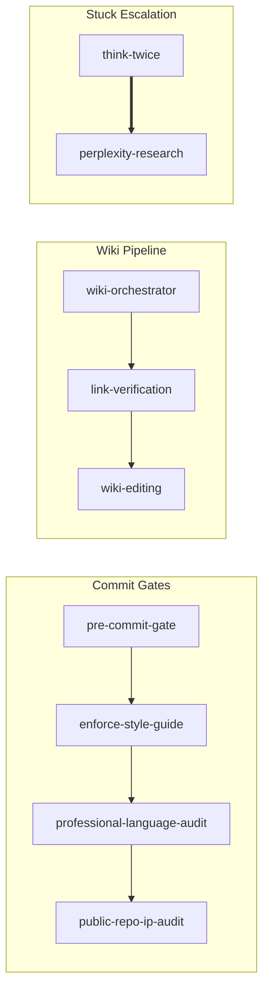

# superpowers-plus

AI slop detection (300+ patterns, 0-100 scoring) and elimination (GVR rewrite loop, 11 strategies) plus 39 skills for wiki management, issue tracking, and security.

**Extends [obra/superpowers](https://github.com/obra/superpowers)** — installed automatically as dependency.

## Quick Start

```bash
git clone https://github.com/bordenet/superpowers-plus.git
cd superpowers-plus
./install.sh
```

## What's Included

**39 skills** (30 superpowers + 9 explicit) across 9 domains:

| Domain | Count | Examples |
|--------|-------|----------|
| wiki | 7 | Page management, link checks, credential scanning |
| engineering | 6 | Pre-commit gates, blast radius, PR review |
| productivity | 6 | Innovation, TODO tracking, style enforcement |
| issue-tracking | 5 | Create, update, verify tickets |
| observability | 5 | Skill effectiveness, completeness checks |
| writing | 5 | Slop detection, profanity gates |
| research | 2 | Perplexity integration |
| security | 2 | CVE scanning, IP protection |
| experimental | 1 | Self-prompting patterns |

**Legend:** 🦸 = auto-triggered (superpowers), 🔧 = internal/invoke by name

## Installation

### Claude Code (Direct)

```bash
/plugin install https://github.com/bordenet/superpowers-plus
```

This installs obra/superpowers automatically as a dependency.

### MCP Server (Any Claude-Compatible Client)

For clients supporting Model Context Protocol:

1. Install dependencies:
   ```bash
   cd mcp && npm install
   ```

2. Add to your client's MCP config (e.g., `~/.claude/settings.json`):
   ```json
   {
     "mcpServers": {
       "superpowers-plus": {
         "command": "node",
         "args": ["/path/to/superpowers-plus/mcp/superpowers-mcp.js"]
       }
     }
   }
   ```

3. Restart your client. Use `find_skills` to list available skills.

### Augment Code

```bash
./install-augment-superpowers.sh
```

### Codex / OpenCode

```text
Fetch and follow instructions from https://raw.githubusercontent.com/bordenet/superpowers-plus/main/.codex/INSTALL.md
```

### Gemini CLI

```bash
gemini extensions install https://github.com/obra/superpowers
gemini extensions install https://github.com/bordenet/superpowers-plus
```

### Manual (macOS/Linux/WSL)

```bash
git clone https://github.com/bordenet/superpowers-plus.git
cd superpowers-plus
./install.sh
```

Windows: Use WSL (`wsl --install -d Ubuntu`).

## Configuration

Copy `.env.example` to `.env` for optional integrations:

| Variable | Purpose |
|----------|---------|
| `ISSUE_TRACKER_TYPE` | `linear`, `github`, `jira`, or `azure-devops` |
| `WIKI_PLATFORM` | `outline` (see `skills/wiki/_adapters/`) |
| `PERPLEXITY_API_KEY` | Deep research fallback |
| `OPENAI_API_KEY` | Optional: Enhanced semantic skill matching |

## Semantic Skill Matching

Skills activate automatically when your request matches their trigger phrases. You don't need to remember exact commands — just describe what you want.

**Examples:**

| You say... | Skill triggered | What happens |
|------------|-----------------|--------------|
| "I'm stuck on this bug" | think-twice | Spawns fresh perspective analysis |
| "Create a wiki page for X" | wiki-orchestrator | Runs full wiki authoring pipeline |
| "Review this PR" | providing-code-review | Structured feedback with checklist |
| "Is this done?" | completeness-check | Audits for incomplete work |
| "Check for security issues" | security-upgrade | Scans CVEs and suggests upgrades |

**CLI matching** (for debugging):

```bash
node ~/.codex/superpowers-augment/superpowers-augment.js match-skills "my tests keep failing"
```

Works offline using local TF-IDF. No API keys required.

## Updating

```bash
./install.sh --upgrade
```

## Skills

| Domain | Skill | What it does |
|--------|-------|--------------|
| engineering | blast-radius-check | Finds all callers before edits |
| | engineering-rigor | Quality philosophy hub |
| | pre-commit-gate | Runs lint → typecheck → test |
| | providing-code-review | Structured PR feedback |
| | receiving-code-review | Evaluates incoming feedback |
| | verification-before-completion | Final checks before claiming done |
| experimental | experimental-self-prompting | Context-free analysis (unstable) |
| issue-tracking | issue-authoring | Writes tickets with acceptance criteria |
| | issue-comment-debunker | Fact-checks before posting |
| | issue-editing | Updates existing tickets safely |
| | issue-link-verification | Tests URLs in ticket content |
| | issue-verify | Confirms references exist |
| observability | completeness-check | Confirms work is done |
| | exhaustive-audit-validation | Confirms checklist coverage |
| | holistic-repo-verification | Checks all CI paths |
| | skill-effectiveness | Tracks outcomes, learns trigger improvements |
| | skill-firing-tracker | Logs which skills ran |
| productivity | enforce-style-guide | Applies project conventions |
| | golden-agents | Bootstraps AGENTS.md |
| | innovation | Radical, high-impact thinking |
| | superpowers-help | Lists available skills |
| | think-twice | Spawns sub-agent for fresh perspective |
| | todo-management | Parses and tracks tasks |
| research | incorporating-research | Merges external findings |
| | perplexity-research | Escalates when stuck |
| security | public-repo-ip-audit | Detects proprietary content |
| | security-upgrade | Scans CVEs, upgrades deps |
| wiki | link-verification | Confirms URLs resolve |
| | wiki-authoring | Creates new pages |
| | wiki-debunker | Fact-checks content |
| | wiki-editing | Safe updates with backup |
| | wiki-orchestrator | Routes tasks to the right handler |
| | wiki-secret-audit | Finds leaked credentials |
| | wiki-verify | Checks links and structure |
| writing | detecting-ai-slop | Scores text 0-100 for machine patterns |
| | eliminating-ai-slop | Rewrites stilted prose |
| | professional-language-audit | Blocks profanity |
| | readme-authoring | Structures documentation |
| | reviewing-ai-text | Evaluates generated content |

> **Note:** All skills are auto-triggered (🦸) except `wiki-editing`, which is internal and invoked by `wiki-orchestrator`.

## Skill Coordination

Skills can be coordinated into pipelines with explicit dependencies. Arrows show **execution order**: A → B means "A must complete before B runs."



| Group | Flow | Purpose |
|-------|------|---------|
| Commit Gates | pre-commit → style → language → IP audit | Quality checks before `git commit` |
| Wiki Pipeline | orchestrator → links → edit | Wiki authoring with validation gates |
| Stuck Escalation | reasoning ⟹ research | Try free reasoning first, escalate to Perplexity if needed |

View the full [Skill Dependency Graph](docs/skill-dependency-graph.md).

### Namespaced Triggers

Skills support namespaced triggers (`domain:action`) for disambiguation:

| Domain | Triggers |
|--------|----------|
| `commit:` | `commit:pre-check`, `commit:style`, `commit:language`, `commit:ip-audit` |
| `wiki:` | `wiki:create`, `wiki:update`, `wiki:edit-internal` |
| `stuck:` | `stuck:reasoning`, `stuck:research` |

Regenerate the graph: `node tools/generate-skill-dag.js`

## Extending

Layer organization-specific skills on top:

```
obra/superpowers (framework)
    └── superpowers-plus (this repo)
            └── your-org-skills
```

See [Enterprise Adopters Guide](docs/ENTERPRISE_ADOPTERS_GUIDE.md).

## Troubleshooting

| Error | Fix |
|-------|-----|
| "Tool not found: perplexity_*" | Run `./setup/mcp-perplexity.sh` |
| Issue tracking fails | Set `ISSUE_TRACKER_TYPE` in `.env` |
| Wiki operations fail | Set `WIKI_PLATFORM` in `.env` |

## Documentation

- [Architecture](docs/ARCHITECTURE.md)
- [Contributing](docs/CONTRIBUTING.md)
- [Upgrading](UPGRADING.md)

## License

MIT
