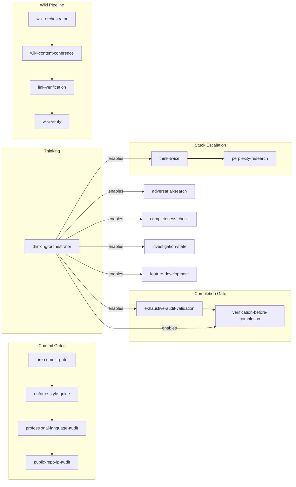

# superpowers-plus

53 skills for AI coding assistants — wiki management, issue tracking, engineering workflows, security audits, and more. Extends [obra/superpowers](https://github.com/obra/superpowers) with AI slop detection, link verification, skill auto-composition, and domain-specific capabilities.

> **⚠️ Token Consumption:** These skills prioritize depth over efficiency. Skills chain into each other, load reference files, and run verification loops — a single wiki edit can trigger 4+ skills. Token consumption is higher by design. Best suited for generous or unlimited token budgets.

## Quick Start

```bash
git clone https://github.com/bordenet/superpowers-plus.git
cd superpowers-plus
./install.sh
```

## What's Included

**53 skills** across 9 domains:

| Domain | Count | Examples |
|--------|------:|----------|
| engineering | 11 | Pre-commit gates, blast radius, PR review, design triad, requirements validation, investigation state, feature development |
| productivity | 12 | TODO tracking, adversarial search, domain design, fallback planning |
| wiki | 6 | Page management, link checks, credential scanning, content coherence |
| writing | 6 | Slop detection/elimination, profanity gates, table discipline |
| issue-tracking | 5 | Create, update, verify tickets |
| observability | 4 | Completeness checks, audit validation, repo verification, diagnostics |
| security | 4 | Repo scanning, CVE scanning, IP protection, instruction guard |
| research | 2 | Perplexity integration |
| experimental | 1 | Self-prompting patterns |

> TypeScript-specific skills have been migrated to a private overlay repo. See the `spc:` prefix in `superpowers-augment.js`.

## Installation

### All Platforms (Git Clone)

```bash
git clone https://github.com/bordenet/superpowers-plus.git
cd superpowers-plus
./install.sh
```

The installer auto-detects your platform and offers to install missing dependencies.

**Windows:** Run `wsl --install -d Ubuntu` first, then use the commands above.

### One-Liner (Ubuntu / Debian / WSL)

```bash
curl -fsSL https://raw.githubusercontent.com/bordenet/superpowers-plus/main/install-augment-superpowers.sh | bash
```

Installs the core superpowers framework. For the full 51-skill suite, use git clone above.

### Claude Code

```bash
/plugin install https://github.com/bordenet/superpowers-plus
```

### MCP Server

1. `cd mcp && npm install`
2. Add to your MCP config (e.g., `~/.claude/settings.json`):
   ```json
   {
     "mcpServers": {
       "superpowers-plus": {
         "command": "node",
         "args": ["/path/to/superpowers-plus/mcp/superpowers-mcp.js"]
       }
     }
   }
   ```
3. Restart your client. Use `find_skills` to list available skills.

### Codex / OpenCode

```text
Fetch and follow instructions from https://raw.githubusercontent.com/bordenet/superpowers-plus/main/.codex/INSTALL.md
```

### Gemini CLI

```bash
gemini extensions install https://github.com/obra/superpowers
gemini extensions install https://github.com/bordenet/superpowers-plus
```

### Using as a Dependency

See [docs/examples/adopter-install-example.sh](docs/examples/adopter-install-example.sh) for a robust install script template.

### Updating

```bash
./install.sh --upgrade
```

## Configuration

Copy `.env.example` to `.env` for optional integrations:

| Variable | Purpose |
|----------|---------|
| `ISSUE_TRACKER_TYPE` | Configured issue-tracker adapter key |
| `WIKI_PLATFORM` | Configured wiki adapter key |
| `PERPLEXITY_API_KEY` | Deep research fallback |
| `OPENAI_API_KEY` | Optional: enhanced semantic skill matching |

## Semantic Skill Matching

Skills activate automatically when your request matches their triggers. Describe what you want:

| You say... | Skill triggered | What happens |
|------------|-----------------|--------------|
| "You're stuck in a loop!" | think-twice | Pauses, consults fresh sub-agent |
| "Create a wiki page for X" | wiki-orchestrator | Full wiki authoring pipeline |
| "Review this PR" | providing-code-review | Structured feedback with checklist |
| "Is this done?" | completeness-check | Audits for incomplete work |
| "Check for security issues" | repo-security-scan | Full scan (secrets, deps, patterns, config) |

`think-twice` also auto-detects when the AI is spiraling and suggests pausing.

**CLI matching** (for debugging): `node ~/.codex/superpowers-augment/superpowers-augment.js match-skills "my tests keep failing"`

## Skills

| Domain | Skill | What it does |
|--------|-------|--------------|
| engineering | blast-radius-check | Finds all callers before edits |
| | design-triad | 3+ design options, comparison matrix, harsh review loop |
| | engineering-rigor | Quality hub (routes to TS skills in overlay) |
| | field-rename-verification | Verifies renames across service boundaries |
| | feature-development | Orchestrates full feature lifecycle from requirements through completion |
| | investigation-state | Persists debugging investigation context across sessions |
| | pre-commit-gate | Runs lint → typecheck → test |
| | providing-code-review | Structured PR feedback |
| | receiving-code-review | Evaluates incoming feedback |
| | requirements-validation | Tests requirements for falsifiability, contradictions |
| | verification-before-completion | Final checks before claiming done |
| experimental | experimental-self-prompting | Context-free analysis (unstable) |
| issue-tracking | issue-authoring | Writes tickets with acceptance criteria |
| | issue-comment-debunker | Fact-checks before posting |
| | issue-editing | Updates existing tickets safely |
| | issue-link-verification | Tests URLs in ticket content |
| | issue-verify | Confirms references exist |
| observability | completeness-check | Confirms work is done |
| | exhaustive-audit-validation | Confirms checklist coverage |
| | holistic-repo-verification | Checks all CI paths |
| | superpowers-doctor | Runs 18-check diagnostic across all skills |
| productivity | adversarial-search | Defeats confirmation bias |
| | domain-design | 10-phase domain design: research → brainstorm → review → prioritize → document |
| | enforce-style-guide | Applies project conventions |
| | fallback-planning | Machine-agnostic contingency TODOs |
| | golden-agents | Bootstraps AGENTS.md |
| | innovation | Generates 10x ideas: product shifts, architectural pivots |
| | skill-authoring | Creates new skills from descriptions/patterns |
| | superpowers-help | Lists available skills |
| | think-twice | Breaks AI out of spirals via fresh sub-agent |
| | thinking-orchestrator | Hub router for metacognition skills |
| | todo-archive | Archives completed tasks to monthly files |
| | todo-management | Parses and tracks tasks |
| research | incorporating-research | Merges external findings |
| | perplexity-research | Escalates when stuck |
| security | public-repo-ip-audit | Detects proprietary content |
| | repo-security-scan | Full repo security scan (4 categories) |
| | security-upgrade | Scans CVEs, upgrades deps |
| | wiki-instruction-guard | Blocks prompt injection in wiki content |
| wiki | link-verification | Confirms URLs resolve |
| | wiki-content-coherence | Detects duplication and structural defects |
| | wiki-debunker | Fact-checks content |
| | wiki-orchestrator | Routes wiki tasks (authoring, editing, review) |
| | wiki-secret-audit | Finds leaked credentials |
| | wiki-verify | Checks links and structure |
| writing | detecting-ai-slop | Scores text 0-100 for machine patterns |
| | eliminating-ai-slop | Rewrites stilted prose |
| | markdown-table-discipline | Enforces table best practices |
| | plan-quality-gates | Prevents fabricated timelines in plans |
| | professional-language-audit | Blocks profanity |
| | readme-authoring | Structures documentation |

Most skills are auto-triggered by semantic matching. Explicit skills (`superpowers-help`, `security-upgrade`, etc.) are invoked by name or as dependencies.

## Skill Coordination

Skills form pipelines with explicit dependencies. Arrows show execution order.



| Group | Flow | Purpose |
|-------|------|---------|
| Commit Gates | pre-commit → style → language → IP audit | Quality checks before `git commit` |
| Completion Gate | exhaustive-audit → verification | Verify completeness and run TODO maintenance before claiming done |
| Thinking | orchestrator → child skills | Routes to correct thinking skill by context |
| Wiki Pipeline | orchestrator → coherence → links → verify | Generate → check → validate → confirm |
| Stuck Escalation | reasoning ⟹ research | Try free reasoning first, escalate to Perplexity |

Full graph: [docs/skill-dependency-graph.md](docs/skill-dependency-graph.md) · Regenerate: `node tools/generate-skill-dag.js`

### Namespaced Triggers

Skills support namespaced triggers (`domain:action`) for disambiguation:

| Domain | Triggers |
|--------|----------|
| `commit:` | `commit:pre-check`, `commit:style`, `commit:language`, `commit:ip-audit` |
| `wiki:` | `wiki:create`, `wiki:update`, `wiki:edit-internal` |
| `stuck:` | `stuck:reasoning`, `stuck:research` |

## Extending

```
obra/superpowers (framework)
    └── superpowers-plus (this repo)
            └── your-org-skills
```

See [Enterprise Adopters Guide](docs/ENTERPRISE_ADOPTERS_GUIDE.md).

## Tools

Utility scripts deployed to `~/.codex/superpowers-plus/tools/`:

| Tool | Purpose |
|------|---------|
| `harsh-review.sh` | Enforces file endings, shebangs, syntax, ShellCheck |
| `harsh-review-loop.sh` | Iterative harsh review until clean |
| `dangerous-pattern-scan.sh` | Pre-commit scanner for `rm -rf`, `chmod 777`, `curl\|bash` |
| `install-hooks.sh` | Installs git hooks for pre-commit checks |
| `todo-preflight.sh` | Resolves `TODO_FILE_PATH` from `~/.codex/.env` |
| `todo-lock.sh` | Advisory file locking for TODO.md (cross-machine) |
| `public-repo-ip-check.sh` | Scans for proprietary content before public push |
| `skill-trigger-validator.sh` | Audits trigger overlaps and missing triggers |
| `generate-skill-dag.js` | Generates skill dependency graph (Mermaid) |
| `skill-metrics-analyzer.sh` | Analyzes skill usage metrics |

## Troubleshooting

| Error | Fix |
|-------|-----|
| "Tool not found: perplexity_*" | Run `./setup/mcp-perplexity.sh` |
| Issue tracking fails | Set `ISSUE_TRACKER_TYPE` in `.env` |
| Wiki operations fail | Set `WIKI_PLATFORM` in `.env` |
| Skills not loading after install | Check `~/.codex/skills/` exists; re-run `./install.sh` |
| Wrong skill count | Run `./install.sh` to reinstall; verify with `find-skills` |
| `todo-lock.sh` timeout | Another agent holds the lock; run `todo-lock.sh steal` |

## Documentation

- [Architecture](docs/ARCHITECTURE.md) · [Contributing](docs/CONTRIBUTING.md) · [Upgrading](UPGRADING.md) · [Changelog](CHANGELOG.md)

## License

MIT
