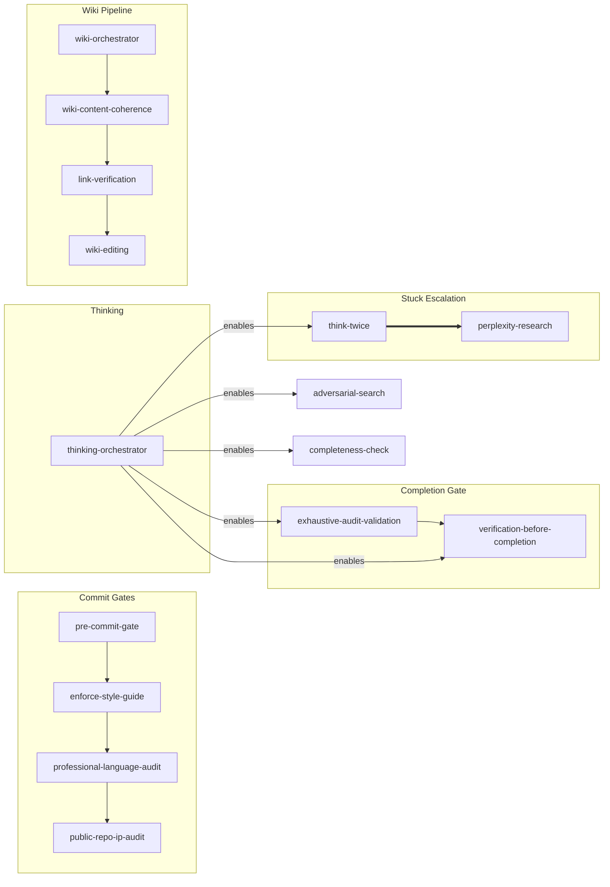

# superpowers-plus

51 skills for AI coding assistants — wiki management, issue tracking, engineering workflows, security audits, and more. Extends [obra/superpowers](https://github.com/obra/superpowers) with domain-specific capabilities including AI slop detection/elimination, link verification, and skill auto-composition.

## Quick Start

```bash
git clone https://github.com/bordenet/superpowers-plus.git
cd superpowers-plus
./install.sh
```

## What's Included

**51 skills** across 9 domains:

| Domain | Count | Examples |
|--------|-------|----------|
| engineering | 11 | Pre-commit gates, blast radius, PR review, TypeScript strict mode |
| productivity | 11 | Innovation, TODO tracking/archiving, adversarial search, thinking orchestrator, domain design, skill synthesis |
| wiki | 8 | Page management, link checks, credential scanning, content coherence |
| writing | 6 | Slop detection, profanity gates, table discipline |
| issue-tracking | 5 | Create, update, verify tickets |
| observability | 3 | Completeness checks, audit validation, repo verification |
| security | 4 | Repo security scanning, CVE scanning, IP protection, instruction guard |
| research | 2 | Perplexity integration |
| experimental | 1 | Self-prompting patterns |

**Legend:** 🦸 = auto-triggered (superpowers), 🔧 = internal/invoke by name

## How This Grows

Skills in this repo are extracted from real work, not built during dedicated tooling sprints. The operating model:

1. You're doing a real task (investigating call review data, designing a new domain, writing a wiki page)
2. You notice a repeatable pattern (a 10-phase design process, a verification checklist, a slop detection heuristic)
3. You extract it into a `skill.md` file and push
4. The next person doing similar work gets that skill automatically

This creates a flywheel: daily work produces skills → skills accelerate daily work → accelerated work produces more skills.

**Concrete example:** The Call Review Domain (March 2026) needed 3 data-query skills (`call-lookup`, `hcat-lookup`, `call-search`). Building them required a structured process — research 5 systems, brainstorm candidates, run 3 rounds of harsh review, verify database permissions with real queries, prioritize into tiers, build a walking skeleton, document everything. That 10-phase process was itself extracted into two meta-skills: `domain-design` (orchestrates the research-to-documentation cycle) and `domain-build` (executes the build-deploy-document cycle). The next domain design — Billing, Provisioning, whatever — starts at Phase 1 with a proven methodology instead of a blank page.

The skills table below is the current output of this flywheel. It will be larger next time you look.

## Installation

### Ubuntu / Debian / WSL (One-Liner)

```bash
curl -fsSL https://raw.githubusercontent.com/bordenet/superpowers-plus/main/install-augment-superpowers.sh | bash
```

This installs the core superpowers framework. For the full 50-skill suite, use the git clone method below.

### Ubuntu / Debian / WSL (Full Install)

```bash
git clone https://github.com/bordenet/superpowers-plus.git
cd superpowers-plus
./install.sh
```

The installer auto-detects your platform and offers to install missing dependencies (git, node).

### macOS

```bash
git clone https://github.com/bordenet/superpowers-plus.git
cd superpowers-plus
./install.sh
```

### Windows

Use WSL first: `wsl --install -d Ubuntu`, then follow Ubuntu instructions.

### Claude Code (Direct)

```bash
/plugin install https://github.com/bordenet/superpowers-plus
```

This installs obra/superpowers automatically as a dependency.

### MCP Server (Any Claude-Compatible Client)

For clients supporting Model Context Protocol:

1. Install dependencies:
   ```bash
   cd mcp && npm install
   ```

2. Add to your client's MCP config (e.g., `~/.claude/settings.json`):
   ```json
   {
     "mcpServers": {
       "superpowers-plus": {
         "command": "node",
         "args": ["/path/to/superpowers-plus/mcp/superpowers-mcp.js"]
       }
     }
   }
   ```

3. Restart your client. Use `find_skills` to list available skills.

### Codex / OpenCode

```text
Fetch and follow instructions from https://raw.githubusercontent.com/bordenet/superpowers-plus/main/.codex/INSTALL.md
```

### Gemini CLI

```bash
gemini extensions install https://github.com/obra/superpowers
gemini extensions install https://github.com/bordenet/superpowers-plus
```

### Using as a Dependency

If you maintain a repo that extends superpowers-plus, see [docs/examples/adopter-install-example.sh](docs/examples/adopter-install-example.sh) for a robust install script template designed for non-technical users.

## Configuration

Copy `.env.example` to `.env` for optional integrations:

| Variable | Purpose |
|----------|---------|
| `ISSUE_TRACKER_TYPE` | `linear`, `github`, `jira`, or `azure-devops` |
| `WIKI_PLATFORM` | `outline` (see `skills/wiki/_adapters/`) |
| `PERPLEXITY_API_KEY` | Deep research fallback |
| `OPENAI_API_KEY` | Optional: Enhanced semantic skill matching |

## Semantic Skill Matching

Skills activate automatically when your request matches their trigger phrases. You don't need to remember exact commands — just describe what you want.

**Examples:**

| You say... | Skill triggered | What happens |
|------------|-----------------|--------------|
| "You're stuck in a loop!" | think-twice | AI pauses, consults fresh sub-agent |
| "Create a wiki page for X" | wiki-orchestrator | Runs full wiki authoring pipeline |
| "Review this PR" | providing-code-review | Structured feedback with checklist |
| "Is this done?" | completeness-check | Audits for incomplete work |
| "Check for security issues" | repo-security-scan | Full security scan (secrets, deps, patterns, config) |

> **Note:** `think-twice` also auto-detects when the AI itself is spiraling (repeated failures, circular reasoning) and suggests pausing for fresh perspective.

**CLI matching** (for debugging):

```bash
node ~/.codex/superpowers-augment/superpowers-augment.js match-skills "my tests keep failing"
```

Works offline using local TF-IDF. No API keys required.

## Updating

```bash
./install.sh --upgrade
```

## Skills

| Domain | Skill | What it does |
|--------|-------|--------------|
| engineering | blast-radius-check | Finds all callers before edits |
| | cognitive-complexity-refactoring | Reduces function complexity scores |
| | engineering-rigor | Quality philosophy hub |
| | field-rename-verification | Verifies renames across service boundaries |
| | pre-commit-gate | Runs lint → typecheck → test |
| | providing-code-review | Structured PR feedback |
| | receiving-code-review | Evaluates incoming feedback |
| | typescript-project-conventions | Import paths, file organization |
| | typescript-strict-mode | Eliminates `any`, `!`, `unknown` |
| | verification-before-completion | Final checks before claiming done |
| | vitest-testing-patterns | Mock patterns, SDK constructors |
| experimental | experimental-self-prompting | Context-free analysis (unstable) |
| issue-tracking | issue-authoring | Writes tickets with acceptance criteria |
| | issue-comment-debunker | Fact-checks before posting |
| | issue-editing | Updates existing tickets safely |
| | issue-link-verification | Tests URLs in ticket content |
| | issue-verify | Confirms references exist |
| observability | completeness-check | Confirms work is done |
| | exhaustive-audit-validation | Confirms checklist coverage |
| | holistic-repo-verification | Checks all CI paths |
| productivity | adversarial-search | Defeats confirmation bias in investigations |
| | domain-design | Orchestrates 10-phase domain design: research → brainstorm → harsh review → prioritize → document |
| | enforce-style-guide | Applies project conventions |
| | golden-agents | Bootstraps AGENTS.md |
| | innovation | Radical, high-impact thinking |
| | skill-authoring | 🦸 Creates new skills from descriptions/patterns |
| | superpowers-help | Lists available skills |
| | think-twice | Breaks AI out of spirals via fresh sub-agent |
| | thinking-orchestrator | Hub router for all metacognition skills |
| | todo-archive | Archives completed tasks to monthly satellite files |
| | todo-management | Parses and tracks tasks |
| research | incorporating-research | Merges external findings |
| | perplexity-research | Escalates when stuck |
| security | repo-security-scan | Full repo security scan (4 categories) |
| | public-repo-ip-audit | Detects proprietary content |
| | security-upgrade | Scans CVEs, upgrades deps |
| | wiki-instruction-guard | Blocks prompt injection in wiki content |
| wiki | link-verification | Confirms URLs resolve |
| | wiki-authoring | Creates new pages |
| | wiki-content-coherence | Detects duplication and structural defects |
| | wiki-debunker | Fact-checks content |
| | wiki-editing | Safe updates with backup |
| | wiki-orchestrator | Routes tasks to the right handler |
| | wiki-secret-audit | Finds leaked credentials |
| | wiki-verify | Checks links and structure |
| writing | detecting-ai-slop | Scores text 0-100 for machine patterns |
| | eliminating-ai-slop | Rewrites stilted prose |
| | markdown-table-discipline | Enforces table best practices |
| | professional-language-audit | Blocks profanity |
| | readme-authoring | Structures documentation |
| | reviewing-ai-text | Evaluates generated content |

> **Note:** Skills marked 🦸 (superpowers) are auto-triggered by semantic matching. Explicit skills are invoked by name or as dependencies of other skills (e.g., `wiki-editing` is invoked by `wiki-orchestrator`, `link-verification` is invoked by `wiki-editing`).

## Skill Coordination

Skills can be coordinated into pipelines with explicit dependencies. Arrows show **execution order**: A → B means "A must complete before B runs."



| Group | Flow | Purpose |
|-------|------|---------|
| Commit Gates | pre-commit → style → language → IP audit | Quality checks before `git commit` |
| Completion Gate | exhaustive-audit → verification | Verify completeness before claiming done |
| Thinking | orchestrator → child skills | Routes to correct thinking skill by context |
| Wiki Pipeline | orchestrator → coherence → links → edit | Content generated → coherence checked → links verified → published |
| Stuck Escalation | reasoning ⟹ research | Try free reasoning first, escalate to Perplexity if needed |

View the full [Skill Dependency Graph](docs/skill-dependency-graph.md).

### Namespaced Triggers

Skills support namespaced triggers (`domain:action`) for disambiguation:

| Domain | Triggers |
|--------|----------|
| `commit:` | `commit:pre-check`, `commit:style`, `commit:language`, `commit:ip-audit` |
| `wiki:` | `wiki:create`, `wiki:update`, `wiki:edit-internal` |
| `stuck:` | `stuck:reasoning`, `stuck:research` |

Regenerate the graph: `node tools/generate-skill-dag.js`

## Extending

Layer organization-specific skills on top:

```
obra/superpowers (framework)
    └── superpowers-plus (this repo)
            └── your-org-skills
```

See [Enterprise Adopters Guide](docs/ENTERPRISE_ADOPTERS_GUIDE.md).

## Tools

Utility scripts deployed to `~/.codex/superpowers-plus/tools/` by `install.sh`:

| Tool | Purpose |
|------|---------|
| `dangerous-pattern-scan.sh` | Pre-commit scanner for `rm -rf`, `chmod 777`, `curl\|bash`, etc. |
| `todo-preflight.sh` | Resolves `TODO_FILE_PATH` from `~/.codex/.env` |
| `todo-lock.sh` | Advisory file locking for TODO.md (cross-machine via OneDrive) |
| `harsh-review.sh` | Enforces file endings, shebangs, syntax, ShellCheck |
| `harsh-review-loop.sh` | Iterative harsh review until clean |
| `public-repo-ip-check.sh` | Scans for proprietary content before public push |
| `install-hooks.sh` | Installs git hooks for pre-commit checks |
| `skill-trigger-validator.sh` | Audits trigger overlaps and missing triggers |
| `generate-skill-dag.js` | Generates skill dependency graph (Mermaid) |
| `skill-metrics-analyzer.sh` | Analyzes skill usage metrics |

## Troubleshooting

| Error | Fix |
|-------|-----|
| "Tool not found: perplexity_*" | Run `./setup/mcp-perplexity.sh` |
| Issue tracking fails | Set `ISSUE_TRACKER_TYPE` in `.env` |
| Wiki operations fail | Set `WIKI_PLATFORM` in `.env` |
| Skills not loading after install | Check `~/.codex/skills/` exists; re-run `./install.sh` |
| Wrong skill count | Run `./install.sh` to reinstall; verify with `find-skills` |
| `todo-lock.sh` timeout | Another agent holds the lock; run `todo-lock.sh steal` |

## Documentation

- [Architecture](docs/ARCHITECTURE.md)
- [Contributing](docs/CONTRIBUTING.md)
- [Upgrading](UPGRADING.md)
- [Changelog](CHANGELOG.md)

## License

MIT
