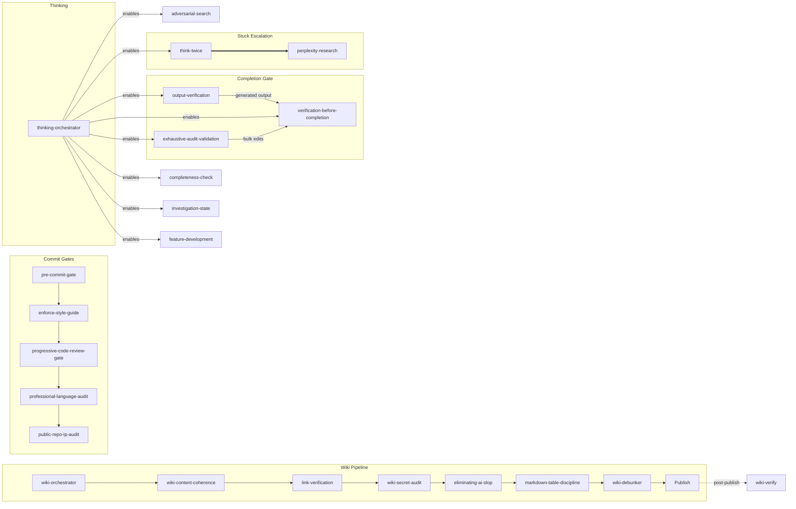

# superpowers-plus

[](LICENSE)

Skills for AI coding assistants that enforce the practices AI would otherwise skip. Extends [obra/superpowers](https://github.com/obra/superpowers). Can be used for non-coding workloads, too!

## What This Is

AI coding assistants skip the practices that catch bugs before production: they implement the first idea without evaluating alternatives and claim "done" without verification.

Skills are structured procedures that AI agents follow automatically. [obra/superpowers](https://github.com/obra/superpowers) is a framework for teaching AI agents reusable procedures. superpowers-plus adds skills across 9 domains. Start debugging and `systematic-debugging` enforces root-cause investigation before fixes. Commit code and a gate chain blocks the commit until lint, type checks, and security scans pass.

Each skill exists because it caught a real problem.

## Standout Skills

| Skill | What it does |
|-------|-------------|
| [**code-review-battery**](skills/engineering/code-review-battery/skill.md) | Dispatches 5 specialist reviewers in parallel (Defect Finder, Design Critic, Guardian, Standards Enforcer, Performance Analyst) instead of one shallow pass. |
| [**design-triad**](skills/engineering/design-triad/skill.md) | Generates 3+ design options, builds a comparison matrix, then red-teams the winner. Requires adversarial review before committing to a design. |
| [**progressive-harsh-review**](skills/engineering/progressive-harsh-review/skill.md) | Three escalating critic personas score non-code deliverables (plans, docs, designs) on 5 dimensions. Score below 6 = rejected. |
| [**systematic-debugging**](skills/engineering/systematic-debugging/skill.md) | Enforces root-cause-first investigation: reproduce, hypothesize, isolate, fix. No fixes without completing Phase 1. |
| [**feature-development**](skills/engineering/feature-development/skill.md) | Full lifecycle orchestrator: brainstorm, design-triad, plan, TDD, review, verify. |
| [**think-twice**](skills/productivity/think-twice/skill.md) | Detects when the AI is stuck in a loop and dispatches a fresh sub-agent with zero shared context. Auto-triggers on circular reasoning. |
| [**detecting-ai-slop**](skills/writing/detecting-ai-slop/skill.md) | Scores text 0-100 for machine-generated patterns across lexical, structural, semantic, and stylometric dimensions. |
| [**wiki-orchestrator**](skills/wiki/wiki-orchestrator/skill.md) | Pipeline for bulk documentation: de-dup, content, coherence, links, secrets, slop detection, fact-check, publish. |
| [**evolution-loop**](skills/observability/evolution-loop/skill.md) | Self-improvement cycle: scans failures for recurring patterns, generates skill updates, tracks metrics over time. |

## Quick Start

Install ([details below](#installation)):

```bash
git clone https://github.com/bordenet/superpowers-plus.git && cd superpowers-plus && bash install.sh
```

Enable pre-commit gates: `bash tools/install-hooks.sh`

Then tell your AI assistant what you're doing:

| You say... | Skill triggered |
|------------|-----------------|
| "Debug this test failure" | `systematic-debugging` enforces root cause before fixes |
| "Build a new feature for X" | `feature-development` orchestrates the full lifecycle |
| "Review this code" | `code-review-battery` dispatches 5 parallel reviewers |
| "I keep getting the same error" | `think-twice` dispatches a fresh sub-agent with zero shared context |
| "Check for security issues" | `repo-security-scan` scans secrets, deps, patterns, config |

**CLI matching** (for debugging): `node ~/.codex/superpowers-augment/superpowers-augment.js match-skills "my tests keep failing"`

## What's Included

**90 skills** across 9 domains:

| Domain | Examples |
|--------|----------|
| **engineering** | Code review battery, design triad, TDD, progressive review, systematic debugging, feature lifecycle |
| **productivity** | TODO tracking, plan-and-execute, think-twice, adversarial search, domain design |
| **writing** | AI slop detection/elimination, profanity gate, table discipline, skill authoring |
| **wiki** | Orchestrator pipeline, link verification, credential scanning, fact-checking |
| **observability** | Completeness checks, evolution loop, audit validation, diagnostics |
| **issue-tracking** | Authoring, editing, verification, link checks, comment debunking |
| **security** | Repo scanning, CVE scanning, IP protection, instruction guard |
| **research** | Perplexity integration, research incorporation, expert interviewing |
| **experimental** | Self-prompting patterns |

**Full skill reference:** [docs/SKILLS.md](docs/SKILLS.md)

## Installation

**Prerequisites:** bash 4+, git, Node.js 18+. npm required for MCP server setup.

> **macOS note:** macOS ships bash 3.2 (frozen at GPLv2 since 2007). Install modern bash first: `brew install bash`. The installer will detect the old version and tell you exactly how to fix it.

### macOS / Linux / WSL

```bash
git clone https://github.com/bordenet/superpowers-plus.git
cd superpowers-plus
bash install.sh      # use 'bash' explicitly, not ./install.sh
```

The installer:

- Detects wrong shell (sh, zsh, dash) and tells you to use bash
- Detects old bash (3.2) with platform-specific install instructions
- Checks for missing commands (git, node) with remediation steps
- Auto-detects your platform and offers to install missing dependencies
- Auto-fixes Windows CRLF line endings if detected

**Windows/WSL:** Run `wsl --install -d Ubuntu` first, then use the commands above from within WSL.

**Linux containers (Docker/CI):** Works as root without sudo. The installer detects the environment automatically.

### Augment Agent (One-Liner: Ubuntu / Debian / WSL)

```bash
curl -fsSL https://raw.githubusercontent.com/bordenet/superpowers-plus/main/install-augment-superpowers.sh | bash
```

Installs obra/superpowers + the Augment adapter. Does **not** install the full skill suite; use git clone above for that.

### Claude Code

```bash
/plugin install https://github.com/bordenet/superpowers-plus
```

### MCP Server

1. `cd mcp && npm install`
2. Add to your MCP config (e.g., `~/.claude/settings.json`):

   ```json
   {
     "mcpServers": {
       "superpowers-plus": {
         "command": "node",
         "args": ["/path/to/superpowers-plus/mcp/superpowers-mcp.js"]
       }
     }
   }
   ```

3. Restart your client. Use the `find_skills` MCP tool to list available skills.

### Codex

```text
Fetch and follow instructions from https://raw.githubusercontent.com/bordenet/superpowers-plus/main/.codex/INSTALL.md
```

### OpenCode

```text
Fetch and follow instructions from https://raw.githubusercontent.com/bordenet/superpowers-plus/main/.opencode/INSTALL.md
```

### Gemini CLI

```bash
gemini extensions install https://github.com/obra/superpowers
gemini extensions install https://github.com/bordenet/superpowers-plus
```

### Using as a Dependency

See [docs/examples/adopter-install-example.sh](docs/examples/adopter-install-example.sh) for a robust install script template.

### Updating

```bash
bash install.sh --upgrade
```

## Configuration

Copy `.env.example` to `.env` for optional integrations:

| Variable | Purpose |
|----------|---------|
| `ISSUE_TRACKER_TYPE` | Adapter key; shipped adapters: `github`, `jira`; see `_adapters/platform-template.md` for others |
| `WIKI_PLATFORM` | Adapter key; see `skills/wiki/_adapters/platform-template.md` to add yours |
| `PERPLEXITY_API_KEY` | Enables deep research escalation (~$0.01/query) |
| `THINK_TWICE_USE_PERPLEXITY` | `false` by default; set `true` to let think-twice escalate to Perplexity |
| `OPENAI_API_KEY` | Enables embedding-based skill matching (optional; TF-IDF works without it) |

## Skill Coordination

Skills form pipelines with explicit dependencies. The diagram shows inter-skill coordination; orchestrator-internal stages (de-dup, content generation) are omitted.

> **Token budget:** Skills chain. A wiki edit runs the full wiki-orchestrator pipeline (de-dup, content, coherence, links, secrets, slop, tables, fact-check, publish). Budget accordingly.



| Group | Flow | Purpose |
|-------|------|---------|
| Commit Gates | pre-commit → style → code review → language → IP audit | Quality checks before `git commit` |
| Completion Gate | output-verification (generated output) or exhaustive-audit (bulk edits) → verification | Context-dependent gates before claiming done |
| Thinking | orchestrator → child skills | Routes to correct thinking skill by context |
| Wiki Pipeline | orchestrator → coherence → links → secrets → slop → tables → fact-check → publish | Quality gates before publish; wiki-verify runs post-publish for drift |
| Stuck Escalation | think-twice ⟹ perplexity-research | Try free reasoning first, escalate to Perplexity |

## Extending

```text
obra/superpowers (framework)
    └── superpowers-plus (this repo)
            └── your-org-skills
```

See [Enterprise Adopters Guide](docs/ENTERPRISE_ADOPTERS_GUIDE.md).

## Tools

Utility scripts in `tools/`:

| Tool | Purpose |
|------|---------|
| `doctor-checks.sh` | 22-check diagnostic across all installed skills |
| `harsh-review.sh` | Enforces file endings, shebangs, syntax, ShellCheck |
| `harsh-review-loop.sh` | Iterative harsh review until clean |
| `dangerous-pattern-scan.sh` | Pre-commit scanner for `rm -rf`, `chmod 777`, `curl\|bash` |
| `install-hooks.sh` | Installs git hooks (pre-commit, pre-push) |
| `todo-preflight.sh` | Resolves `TODO_FILE_PATH` from `~/.codex/.env` |
| `todo-lock.sh` | Advisory file locking for TODO.md (cross-machine) |
| `todo-crud.sh` | TODO.md create/read/update/delete operations |
| `todo-maintenance.sh` | Archival and cleanup of completed tasks |
| `investigation-crud.sh` | Investigation state CRUD (hypotheses, evidence, verdicts) |
| `public-repo-ip-check.sh` | Scans for proprietary content before public push |
| `skill-trigger-validator.sh` | Audits trigger overlaps and missing triggers |
| `skill-cost-analyzer.sh` | Reports token cost per skill |
| `generate-skill-dag.js` | Generates skill dependency graph (Mermaid) |
| `skill-metrics-analyzer.sh` | Analyzes skill usage metrics |
| `parse-frontmatter.sh` | Extracts YAML frontmatter from skill files |

## Troubleshooting

| Problem | Fix |
|---------|-----|
| `bash 3.2 is too old` | macOS: `brew install bash`, then `/opt/homebrew/bin/bash install.sh` |
| `This script requires bash` | You ran with sh or zsh. Use: `bash install.sh` |
| `Missing required commands: git` | macOS: `xcode-select --install`. Linux: `sudo apt install git` |
| `Missing required commands: node` | macOS: `brew install node`. Linux: `sudo apt install nodejs` |
| Perplexity tools not found | Run `./setup/mcp-perplexity.sh` |
| Issue tracking fails | Set `ISSUE_TRACKER_TYPE` in `.env` |
| Wiki operations fail | Set `WIKI_PLATFORM` in `.env` |
| Skills not loading | Re-run `bash install.sh`; check `~/.codex/skills/` exists |
| Stale skill count | `bash install.sh --upgrade`; verify with `find-skills` |
| TODO lock timeout | Another agent holds the lock; `todo-lock.sh steal` |
| Doctor reports drift | `./tools/doctor-checks.sh --fix-safe` |

## Documentation

[Architecture](docs/ARCHITECTURE.md) · [Full Skill Reference](docs/SKILLS.md) · [Enterprise Adopters](docs/ENTERPRISE_ADOPTERS_GUIDE.md) · [Contributing](docs/CONTRIBUTING.md) · [Upgrading](UPGRADING.md) · [Changelog](CHANGELOG.md)

## License

MIT
