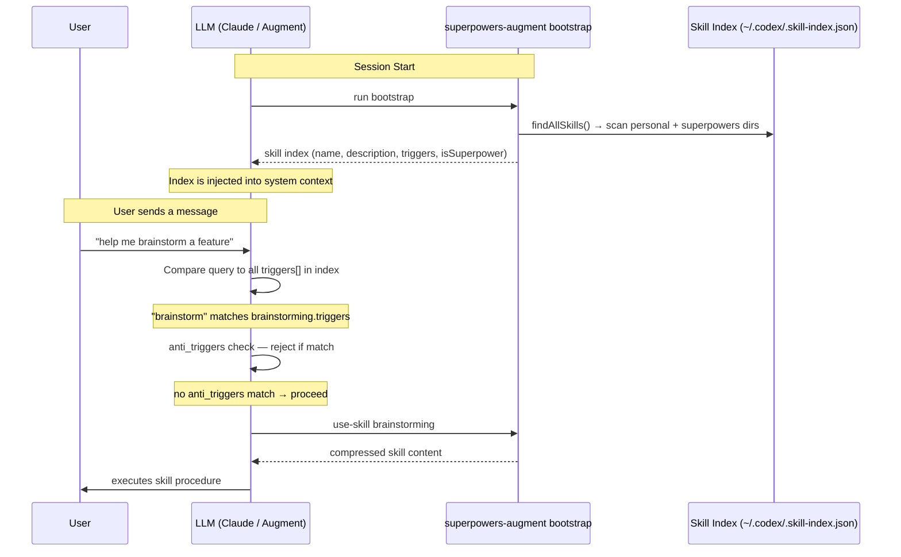
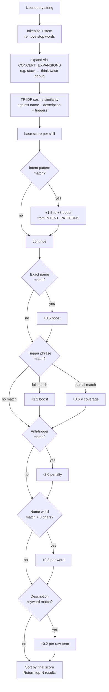
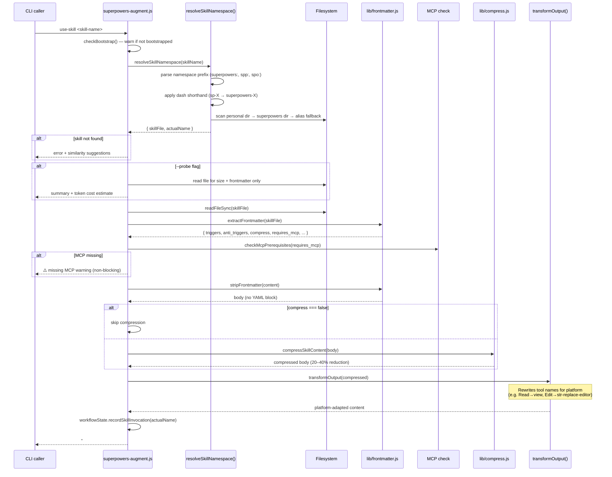
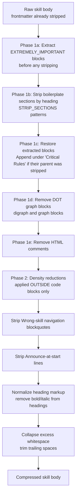
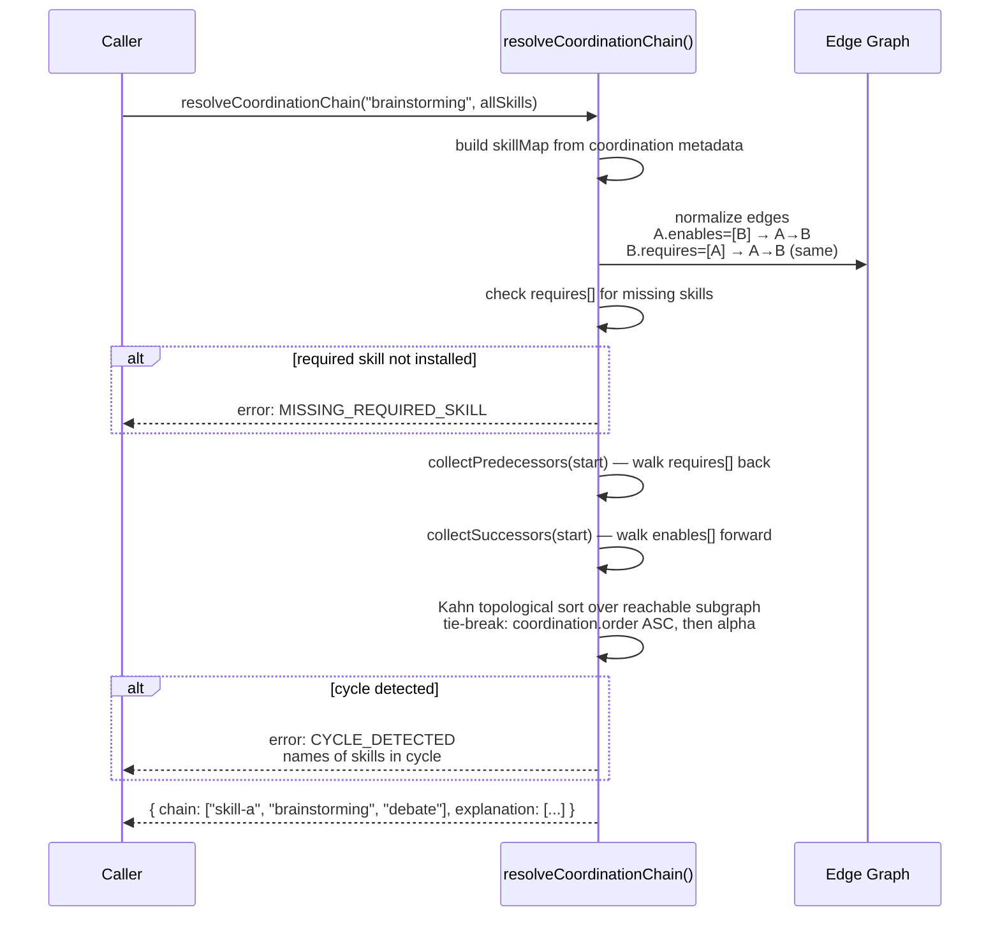
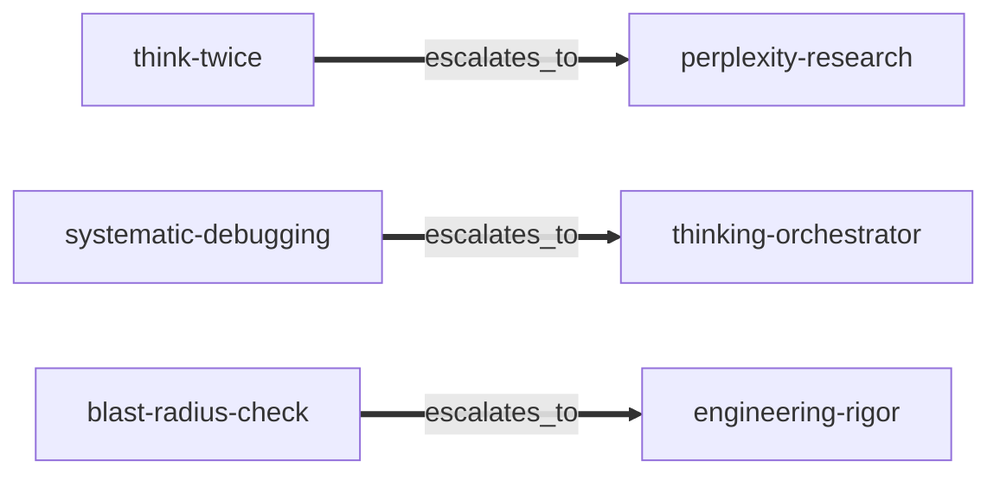
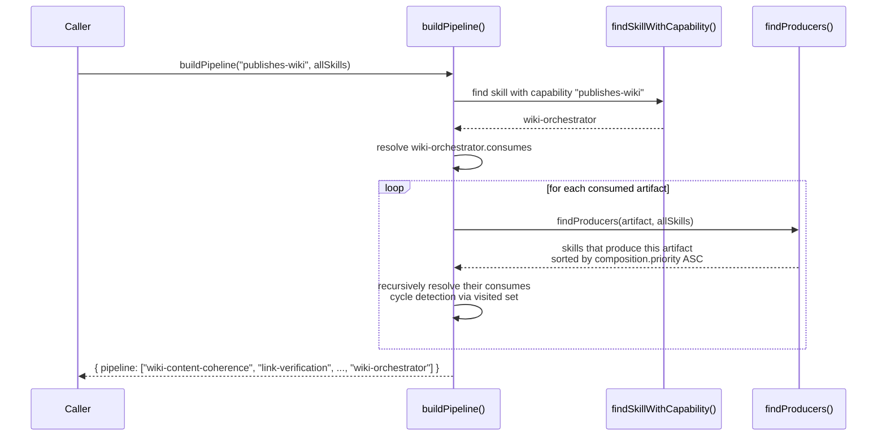
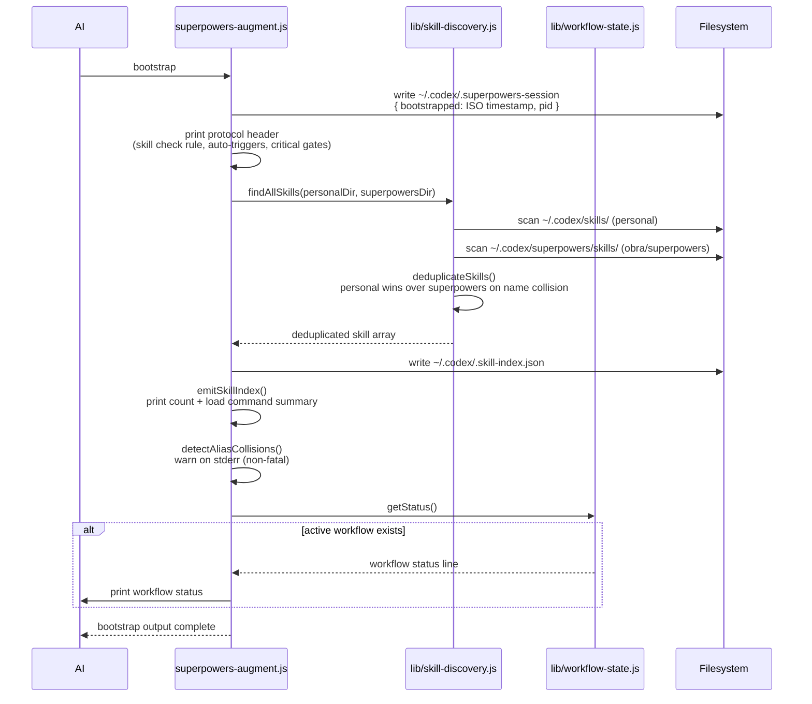
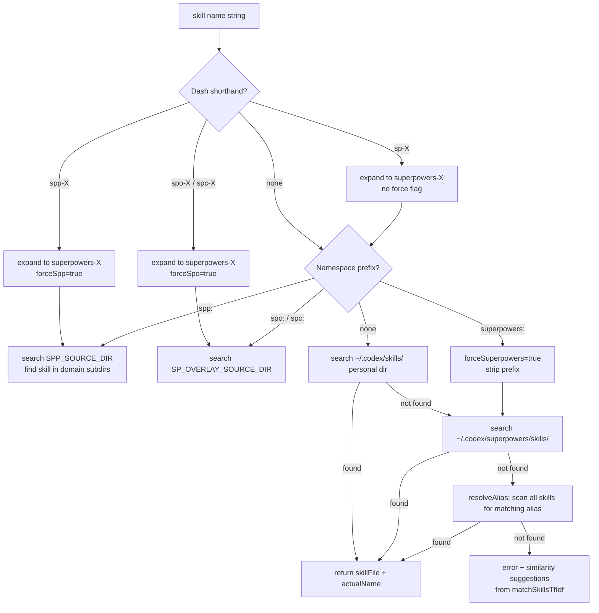

# Technical Design: Skill Triggering, Routing, and Loading

How superpowers-plus discovers skills, matches them to user intent, loads them, and compresses them for token efficiency. This document covers internal mechanisms. For pipeline topology (which skills call which), see [SKILL_TAXONOMY.md](SKILL_TAXONOMY.md). For dependency graphs, see [skill-dependency-graph.md](skill-dependency-graph.md). For deployment paths, see [ARCHITECTURE.md](ARCHITECTURE.md).

---

## Contents

1. [Frontmatter Schema](#1-frontmatter-schema)
2. [Trigger Mechanisms](#2-trigger-mechanisms)
3. [Semantic Skill Router](#3-semantic-skill-router)
4. [Skill Loading Pipeline](#4-skill-loading-pipeline)
5. [Compression Pipeline](#5-compression-pipeline)
6. [Coordination Resolution](#6-coordination-resolution)
7. [Composition and Capability Pipeline](#7-composition-and-capability-pipeline)
8. [Bootstrap Flow](#8-bootstrap-flow)
9. [Namespace Resolution](#9-namespace-resolution)

---

## 1. Frontmatter Schema

Every `skill.md` begins with a YAML frontmatter block. The canonical parser is [`lib/frontmatter.js`](../lib/frontmatter.js). Validation runs at discovery time via `validateFrontmatter()`.

```yaml
---
name: skill-name                          # string, REQUIRED — must match directory name
source: superpowers-plus                  # string, REQUIRED — owning repo identifier
description: "One-line skill description" # string, REQUIRED — used in skill discovery index
triggers: ["phrase one", "phrase two"]    # string[], optional — makes this a superpower (auto-invoked)
anti_triggers: ["phrase to suppress"]     # string[], optional — suppress activation on match
aliases: ["alt-name"]                     # string[], optional — alternate lookup names
overrides: superpowers/skill-name         # string, optional — declares upstream skill being replaced
summary: "Short summary for probe mode"  # string, optional — shown by use-skill --probe
compress: true                            # boolean, optional, default true — set false to skip compression
requires_mcp: ["server-name"]             # string[], optional — MCP servers that must be registered
mcp_install_hint: "path/to/install.sh"   # string, optional — shown when requires_mcp not met
coordination:                             # object, optional — DAG metadata (see §6)
  group: domain-name                      # string — logical grouping for graph rendering
  order: 1                                # integer — tie-break in topological sort (ascending)
  requires: ["skill-a"]                   # string[] — blocking prerequisites
  enables: ["skill-b"]                    # string[] — downstream skills this unlocks
  escalates_to: ["skill-c"]              # string[] — fallback if this skill is insufficient
  internal: false                         # boolean — if true, hidden from user-facing lists
composition:                              # object, optional — capability/artifact metadata (see §7)
  produces: ["artifact-name"]             # string[] — named outputs this skill emits
  consumes: ["artifact-name"]             # string[] — named inputs this skill requires
  capabilities: ["capability-name"]       # string[] — named capabilities this skill provides
  priority: 50                            # integer, default 50 — execution order (ascending)
  optional: false                         # boolean — whether this skill can be skipped
  requires_all: false                     # boolean — whether all consumes must be satisfied
---
```

### Field Classification

| Field | Required | Type | Default | Purpose |
|-------|----------|------|---------|---------|
| `name` | Yes | string | — | Skill identifier |
| `source` | Yes | string | — | Owning repository |
| `description` | Yes | string | — | One-line discovery text |
| `triggers` | No | string[] | `[]` | Auto-invocation phrases → makes skill a **superpower** |
| `anti_triggers` | No | string[] | `[]` | Suppression phrases — prevent false activations |
| `aliases` | No | string[] | `[]` | Alternate lookup names |
| `overrides` | No | string | — | Declares upstream skill being replaced |
| `summary` | No | string | — | Short description for `--probe` mode |
| `compress` | No | boolean | `true` | Set `false` to skip compression |
| `requires_mcp` | No | string[] | `[]` | Required MCP server names |
| `mcp_install_hint` | No | string | — | Install script shown when MCP is missing |
| `coordination` | No | object | `null` | DAG metadata for chain resolution |
| `coordination.group` | No | string | — | Logical group label |
| `coordination.order` | No | integer | `0` | Topo-sort tie-break (ascending) |
| `coordination.requires` | No | string[] | `[]` | Blocking prerequisites |
| `coordination.enables` | No | string[] | `[]` | Downstream skills |
| `coordination.escalates_to` | No | string[] | `[]` | Fallback targets |
| `coordination.internal` | No | boolean | `false` | Hidden from user-facing lists |
| `composition` | No | object | `null` | Capability/artifact metadata |
| `composition.produces` | No | string[] | `[]` | Named outputs |
| `composition.consumes` | No | string[] | `[]` | Required inputs |
| `composition.capabilities` | No | string[] | `[]` | Named capabilities provided |
| `composition.priority` | No | integer | `50` | Execution priority (ascending) |
| `composition.optional` | No | boolean | `false` | Skill may be skipped |
| `composition.requires_all` | No | boolean | `false` | All `consumes` must be satisfied |

### Superpower vs Explicit Skill

The presence and content of `triggers` determines whether a skill is a *superpower* (auto-triggered) or an *explicit skill* (must be invoked by name):

```
triggers: ["update wiki page"]   → SUPERPOWER — AI invokes when trigger matches user query
triggers: []                     → EXPLICIT SKILL — AI invokes only when asked by name
(triggers absent)                → EXPLICIT SKILL
```

---

## 2. Trigger Mechanisms

There are two separate systems that use `triggers` and `anti_triggers`:

### 2a. AI-Native Trigger Matching (Primary)

The primary trigger mechanism is **semantic matching by the LLM itself**. At session start, `bootstrap` emits a compact skill index. The AI reads each skill's `triggers` list and decides contextually when to invoke a skill — no string matching code is involved.



The AI applies **intent-based inference**: it evaluates the *full conversational context*, not just substring matching. This is why `anti_triggers` is needed — without it, broad trigger phrases fire on unrelated queries.

**Example — brainstorming `anti_triggers` preventing false activation:**
```yaml
triggers: ["brainstorm", "design a feature", "build a new"]
anti_triggers: ["radical improvement", "10x improvement", "comparing design options"]
```
Without `anti_triggers`, "compare design options" would incorrectly fire `brainstorming` instead of `debate`.

### 2b. Semantic Skill Router (CLI / Programmatic)

The `match-skills` command uses [`lib/skill-router.js`](../lib/skill-router.js) for programmatic skill lookup. This uses code-side matching and is the basis for tooling integration. See §3 for the full algorithm.

```bash
node ~/.codex/superpowers-augment/superpowers-augment.js match-skills "my tests keep failing"
```

---

## 3. Semantic Skill Router

Used by `match-skills` command and optional tooling integrations. Implements hybrid **TF-IDF + Intent Pattern** matching with heuristic boosts. Source: [`lib/skill-router.js`](../lib/skill-router.js) and [`lib/intent-patterns.js`](../lib/intent-patterns.js).

### Scoring Pipeline



### TF-IDF Index Construction

Each skill's index text is: `name (spaces) + name (kebab) + description + triggers.join(' ')`.

Terms are stemmed (suffix removal: `-ing`, `-ed`, `-s`, `-ly`, `-tion→t`, `-ment`) and stop-words filtered before TF-IDF vectorization.

### Intent Pattern Boosts

[`lib/intent-patterns.js`](../lib/intent-patterns.js) defines high-confidence phrase → skill mappings with non-linear boost levels:

| Boost Level | Value | When to Use |
|-------------|-------|-------------|
| `BOOST_DEFAULT` | 1.5 | Weak signal, no boost specified |
| `BOOST_LOW` | 2 | Generic code-change intent |
| `BOOST_STANDARD` | 3 | Domain-specific intent clearly maps to a skill |
| `BOOST_ELEVATED` | 4 | Multi-step workflow skills |
| `BOOST_HIGH` | 5 | Code review variants |
| `BOOST_CRITICAL` | 6 | Active reviewer protocol |
| `BOOST_EMERGENCY` | 8 | Failure autopsy, explicit disaster |

Boosts accumulate across matched patterns. A single query can receive boosts from multiple patterns.

### Query Expansion

`CONCEPT_EXPANSIONS` maps stemmed terms to related domain terms before TF-IDF scoring:

```
stuck → think-twice, help, research, perplexity
bug   → systematic-debugging, fix, error, fail
wiki  → edit, author, document, orchestrate
commit → git, pre-commit, push, gate
```

### Embedding Mode (Optional)

When `OPENAI_API_KEY` is set, `--embedding` flag switches to OpenAI `text-embedding-3-small` for vector similarity. Embeddings are cached in `~/.codex/.skill-embeddings.json` keyed by content hash. Heuristic boosts (intent patterns, trigger matches, anti-trigger penalties) are applied on top of the embedding score in both modes.

---

## 4. Skill Loading Pipeline

The `use-skill <name>` command executes this pipeline. Source: [`superpowers-augment.js`](../superpowers-augment.js) `useSkill()`.



### Probe Mode

`use-skill --probe <name>` reads only the frontmatter and file size, printing a cost estimate without loading the full content. Shows `summary:` if present, falls back to `description:`.

### Platform Transformation

`transformOutput()` rewrites tool names for the target platform via `TOOL_MAPPINGS` regex substitutions. This allows skill content to use Claude Code tool names (`Read`, `Edit`, `Bash`, `Skill`) while Augment Code receives its equivalents (`view`, `str-replace-editor`, `launch-process`, `superpowers-augment use-skill`).

---

## 5. Compression Pipeline

Source: [`lib/compress.js`](../lib/compress.js). Applied to all skill bodies by default. Opt out with `compress: false` frontmatter. Typical reduction: 20–40%.



### Sections Stripped (Phase 1 — `STRIP_SECTIONS`)

These headings and their content are removed as boilerplate — they aid human navigation but not agent execution:

`When to Use`, `Overview`, `Common Rationalizations`, `Why Order/This/It/the Gate Matters/Exists`, `Quick Reference`, `Related Skills`, `Cross-References`, `Integration with *`, `Reference Files`, `When This Skill Fires`, `When NOT to Use`, `Manual Invocation`, `I'm Stuck`, `Companion Skills`, `Escalation Path`, `Example`, `Example Invocation`, `Example:*`, `Rationalizations to Reject`, `Anti-Patterns`, `Purpose`, `Success Criteria`, `Stop Conditions`, `Escalation Conditions`, `When to Invoke`, `WHEN TO USE THIS SKILL`, `Trigger Conditions`

### Content Preserved Unconditionally

| Content | Why |
|---------|-----|
| `<EXTREMELY_IMPORTANT>` blocks | Operative safety gates (extracted pre-strip, restored post-strip) |
| `Failure Modes` sections | Runtime error handling — agent needs this |
| `Incident Log / Record / History` | Recurrence-prevention context — real past failures |
| `References` sections | Pointers to reference files (distinct from `Reference Files`) |
| `Hallucination Prevention` sections | URL fabrication prevention rules |
| Code blocks | Procedural content |
| Tables | Structured data |
| Checklists | Procedural steps |

> **Incident 2026-04-14:** `STRIP_SECTIONS` previously included `Hallucination Prevention`, `References`, and `Incident Log`. This deleted URL verification rules from `link-verification` and `issue-link-verification`, causing wiki authoring to produce broken hyperlinks. All three were removed from `STRIP_SECTIONS`. The `<EXTREMELY_IMPORTANT>` pre-extraction mechanism was added as a safety net. See [ARCHITECTURE.md § Incident 2026-04-14](ARCHITECTURE.md#incident-2026-04-14).

---

## 6. Coordination Resolution

The `coordination:` frontmatter block defines how skills relate to each other in execution chains. Source: [`lib/skill-router.js`](../lib/skill-router.js) `resolveCoordinationChain()` and `getEscalationTargets()`.

### Edge Types

| Field | Direction | Blocking? | Description |
|-------|-----------|-----------|-------------|
| `requires` | incoming | Yes | This skill needs the named skill to run first |
| `enables` | outgoing | No (warn) | This skill unlocks the named skill next |
| `escalates_to` | outgoing | No | If insufficient, escalate to named skill |

`A.enables = [B]` and `B.requires = [A]` produce the **same edge** (`A → B`). They are not additive.

### Chain Resolution (Kahn's Algorithm)



### Escalation Resolution

`escalates_to` is checked separately from the chain. When a skill signals it is insufficient (e.g., `think-twice` cannot resolve the problem), the caller checks `getEscalationTargets()` and invokes the fallback:



For the full escalation map across all skills, see [skill-dependency-graph.md](skill-dependency-graph.md).

---

## 7. Composition and Capability Pipeline

The `composition:` frontmatter block defines skills in terms of **artifacts** they produce/consume and **capabilities** they provide. Source: [`lib/skill-router.js`](../lib/skill-router.js) `buildPipeline()`, `getComposition()`.

### Artifact Flow



### Composition Metadata Example (brainstorming)

```yaml
composition:
  produces: [design-options, risk-surface, brainstorm-output]
  consumes: [user-intent]
  capabilities: [ideation, design-exploration]
  priority: 10
```

`priority` controls execution order when multiple skills produce the same artifact — lower numbers run first.

---

## 8. Bootstrap Flow

At every session start, the AI assistant runs bootstrap to establish context. Source: [`superpowers-augment.js`](../superpowers-augment.js) `bootstrap()`.



### Session Staleness

`checkBootstrap()` reads `~/.codex/.superpowers-session` and checks if age < 4 hours. Skills warn (non-blocking) if bootstrap was not run within the session window. This prevents skills from firing in isolation without the meta-framework context that makes them effective.

### Skill Discovery Priority

When the same skill name exists in both directories, **personal skills win**:

```
~/.codex/skills/<name>/skill.md    (personal — higher priority)
~/.codex/superpowers/skills/<name>/skill.md  (obra/superpowers — lower priority)
```

This is the override mechanism: superpowers-plus installs its skills into `~/.codex/skills/`, so they shadow the obra/superpowers versions.

---

## 9. Namespace Resolution

`resolveSkillNamespace()` in [`superpowers-augment.js`](../superpowers-augment.js) maps a skill name (possibly with a prefix) to a file path.



### Prefix Reference

| Prefix | Resolves To | Use Case |
|--------|------------|----------|
| (none) | personal → superpowers → alias | Normal usage |
| `superpowers:` | obra/superpowers installed dir | Load unoverridden base skill |
| `spp:` | `SPP_SOURCE_DIR` (superpowers-plus source repo) | Load from source, not installed copy |
| `spo:` / `spc:` | `SP_OVERLAY_SOURCE_DIR` (overlay repo source) | Load from overlay source |
| `sp-X` | expands to `superpowers-X`, then normal resolution | Convenience shorthand |
| `spp-X` | expands to `superpowers-X` in spp source | Dev convenience |
| `spo-X` / `spc-X` | expands to `superpowers-X` in overlay source | Dev convenience |

`SPP_SOURCE_DIR` defaults to the directory containing `superpowers-augment.js` (self-discovery), falling back to `~/.codex/superpowers-plus`. Set `SUPERPOWERS_SKILLS_DIR` or `PERSONAL_SKILLS_DIR` env vars to override discovery paths.
