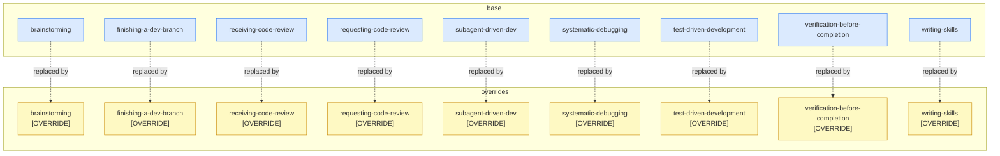
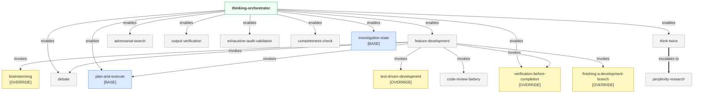
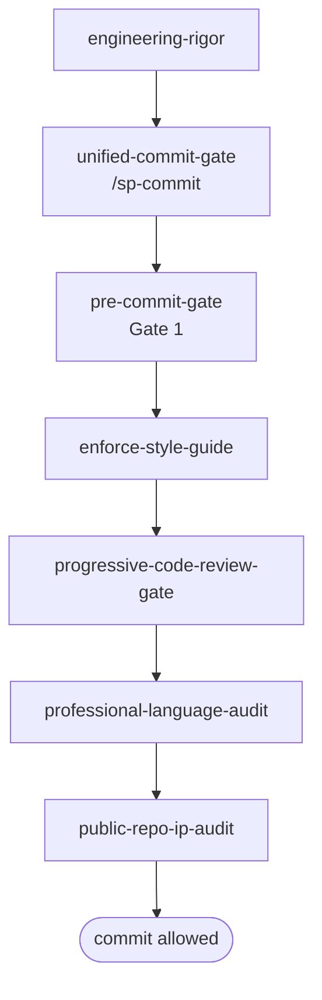
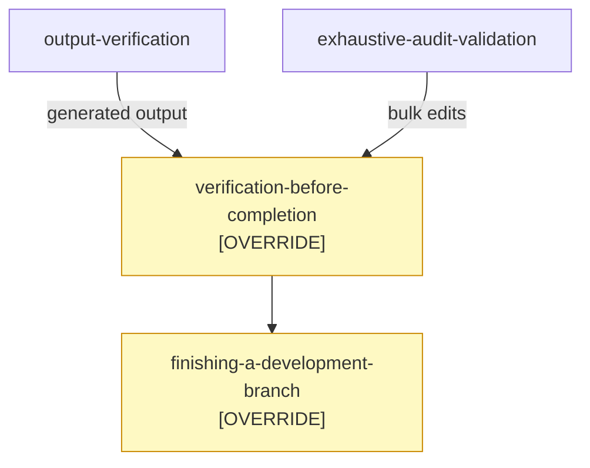
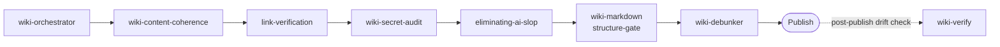
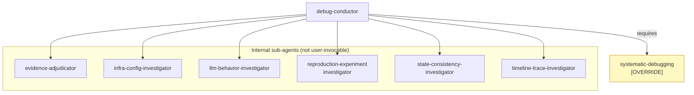
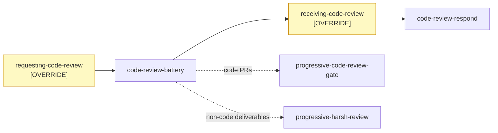

# superpowers-plus Skill Taxonomy

Visual reference for the skill hierarchy of superpowers-plus: orchestration chains, domain groupings, and the explicit boundary between the [obra/superpowers](https://github.com/obra/superpowers) upstream base and superpowers-plus overrides and additions.

> **This document covers pipeline topology (which skills call which).** For how triggers fire, how skill names are resolved, how compression works, and the full frontmatter schema, see [DESIGN.md](DESIGN.md).

> **Legend**
> - **[OVERRIDE]** — superpowers-plus replaces this upstream obra/superpowers skill with a stricter, hardened version
> - **[BASE]** — installed from obra/superpowers unchanged; superpowers-plus adds nothing to it
> - All other nodes are net-new skills that exist only in superpowers-plus

---

## Layer Architecture

superpowers-plus installs on top of [obra/superpowers](https://github.com/obra/superpowers). When the same skill name exists in both repos, the superpowers-plus version wins — that is the override pattern.

| Layer | Contents |
|-------|---------|
| **obra/superpowers (base)** | Core framework skills: `plan-and-execute`, `investigation-state`, and ~50 others |
| **superpowers-plus overrides** | 9 skills that replace upstream versions with additional enforcement gates |
| **superpowers-plus additions** | 82 net-new skills covering engineering, wiki, security, research, and more |

---

## Override Map

Nine upstream skills are replaced by superpowers-plus. Each is a **complete replacement**, not a wrapper — it installs in the same slot as the upstream version. *(Diagram uses shortened labels: `finishing-a-dev-branch` = `finishing-a-development-branch`, `subagent-driven-dev` = `subagent-driven-development`.)*

### What Each Override Adds

| Override | Key enforcement added over upstream |
|----------|-------------------------------------|
| **brainstorming** | HARD GATE blocking any code or scaffolding before design approval; `anti_triggers` field preventing false activations; mandatory design-doc commit before transitioning to planning |
| **finishing-a-development-branch** | Mandatory `code-review-battery` as Step 0 before any integration option is presented |
| **receiving-code-review** | Systemic Verification gate — every fix acknowledgment must confirm the fix actually landed in the artifact, not just acknowledge the feedback |
| **requesting-code-review** | Routes all review requests through `code-review-battery` (5 parallel specialist reviewers); Cardinal Rule enforcement |
| **subagent-driven-development** | Two-stage review (self-review then battery); condensed to 91 lines for faster context load; platform-agnostic framing |
| **systematic-debugging** | Hard "NO FIXES WITHOUT INVESTIGATION" gate — Phase 1 (reproduce + hypothesize) must complete before any fix attempt |
| **test-driven-development** | Strict Red→Green→Refactor sequence with hard gates; production code cannot be written before a failing test exists |
| **verification-before-completion** | Intent-based auto-fire — triggers when AI is *about to claim "done"*, not only on explicit request; battery sentinel short-circuit |
| **writing-skills** | Scoped exclusively to prose quality review; explicitly NOT for skill authoring (prevents misrouting new-skill work through prose review) |

---

## Main Orchestration Cascade

`thinking-orchestrator` is the top-level routing hub. `feature-development` is the full feature lifecycle orchestrator.

---

## Commit Gate Chain

Linear enforcement pipeline. Every commit must clear all gates in sequence.

---

## Completion Gate

Two paths feed into `verification-before-completion [OVERRIDE]` before a branch can finish.

---

## Wiki Pipeline

Sequential quality gate chain. Each stage must pass before the next runs; `wiki-verify` runs post-publish as a drift check.

---

## Debug Flow

`debug-conductor` orchestrates `systematic-debugging [OVERRIDE]` and dispatches specialist sub-agents for deep investigation. Sub-agents are internal to `debug-conductor` and not invoked directly by users.

---

## Code Review Chain

---

## Domain Reference

All 88 skills grouped by filesystem domain. **[OVERRIDE]** replaces an upstream obra/superpowers skill; **[BASE]** is installed from obra/superpowers unchanged; **†** marks debug-conductor internal sub-agents (not invoked directly); all others are net-new superpowers-plus additions.

| Domain | Count | Skills |
|--------|-------|--------|
| **engineering** | 33 | blast-radius-check, brainstorming **[OVERRIDE]**, code-review-battery, cognitive-complexity-refactoring, debug-conductor, debate, evidence-adjudicator†, feature-development, field-rename-verification, finishing-a-development-branch **[OVERRIDE]**, git-branch-conventions, implementation-tracker, infra-config-investigator†, investigation-state **[BASE]**, llm-behavior-investigator†, micro-harsh-review, output-verification, pre-commit-gate, progressive-code-review-gate, progressive-harsh-review, providing-code-review, receiving-code-review **[OVERRIDE]**, reproduction-experiment-investigator†, requesting-code-review **[OVERRIDE]**, requirements-validation, sp-bughunt, state-consistency-investigator†, subagent-driven-development **[OVERRIDE]**, systematic-debugging **[OVERRIDE]**, test-driven-development **[OVERRIDE]**, timeline-trace-investigator†, unified-commit-gate, verification-before-completion **[OVERRIDE]** |
| **experimental** | 1 | experimental-self-prompting |
| **issue-tracking** | 5 | issue-authoring, issue-comment-debunker, issue-editing, issue-link-verification, issue-verify |
| **observability** | 8 | completeness-check, evolution-loop, exhaustive-audit-validation, failure-autopsy, holistic-repo-verification, measurement-integrity, skill-health-check, superpowers-doctor |
| **productivity** | 19 | adversarial-search, autonomous-chain-controller, code-review-respond, domain-design, enforce-style-guide, fallback-planning, golden-agents, innovation, inter-agent-review-protocol, plan-and-execute **[BASE]**, quantitative-decision-gate, skill-authoring, superpowers-help, think-twice, thinking-orchestrator, todo-archive, todo-guardian, todo-management, update-superpowers |
| **research** | 3 | expert-interviewer, incorporating-research, perplexity-research |
| **security** | 4 | public-repo-ip-audit, repo-security-scan, security-upgrade, wiki-instruction-guard |
| **wiki** | 8 | link-verification, wiki-content-coherence, wiki-debunker, wiki-markdown-structure-gate, wiki-orchestrator, wiki-refactor, wiki-secret-audit, wiki-verify |
| **writing** | 7 | detecting-ai-slop, eliminating-ai-slop, markdown-table-discipline, plan-quality-gates, professional-language-audit, readme-authoring, writing-skills **[OVERRIDE]** |

---

*2026-04-15. 88 skills across 9 domains (9 overrides, 2 base, 77 net-new).*
*Full skill descriptions: [SKILLS.md](SKILLS.md)*
