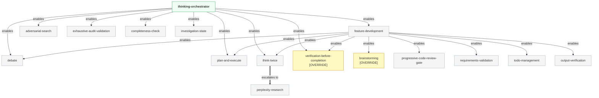
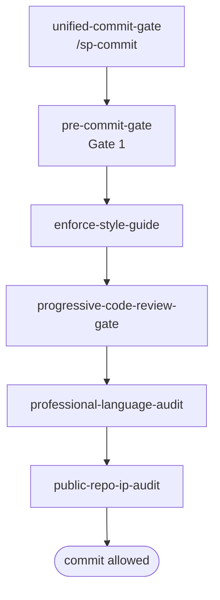
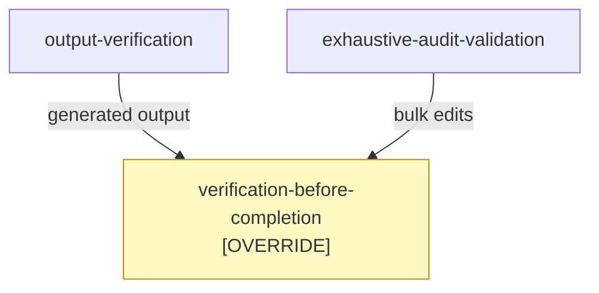
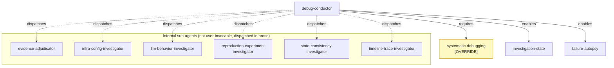
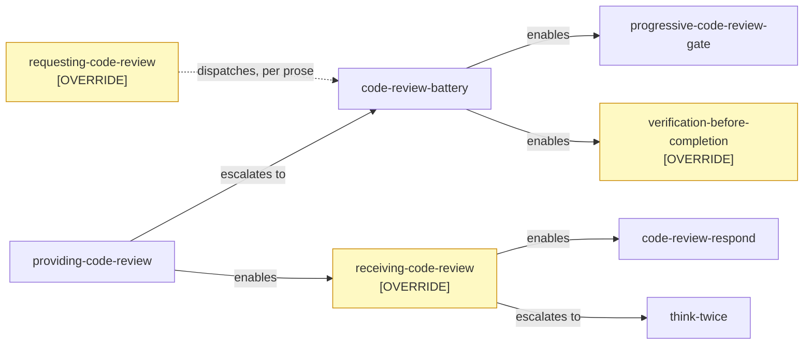

# superpowers-plus Skill Taxonomy

Visual reference for the skill hierarchy of superpowers-plus: orchestration chains, domain groupings, and the boundary between the [obra/superpowers](https://github.com/obra/superpowers) upstream base and superpowers-plus overrides and additions.

> **This document covers pipeline topology (which skills call which).** For how triggers fire, how skill names are resolved, how compression works, and the full frontmatter schema, see [DESIGN.md](DESIGN.md).
>
> **Legend**
>
> - **[OVERRIDE]**: superpowers-plus replaces this upstream obra/superpowers skill with a stricter, hardened version
> - **[BASE]**: installed from obra/superpowers unchanged; superpowers-plus adds nothing to it
> - All other nodes are net-new skills that exist only in superpowers-plus
> - Solid arrows below reproduce a skill's own `coordination.enables` / `requires` frontmatter field exactly, verified against the source file. Dotted arrows mark a real relationship documented in a skill's prose that isn't (yet) encoded in its frontmatter. The machine-generated, always-current version of every coordination edge lives at [skill-dependency-graph.md](skill-dependency-graph.md).

---

## Layer Architecture

superpowers-plus installs on top of [obra/superpowers](https://github.com/obra/superpowers). When the same skill name exists in both repos, the superpowers-plus version wins. That is the override pattern.

| Layer | Contents |
|-------|---------|
| **superpowers-plus overrides** | 9 skills that replace an upstream obra/superpowers skill of the same name with additional enforcement gates |
| **superpowers-plus base (unchanged)** | 5 skills (`dispatching-parallel-agents`, `executing-plans`, `using-git-worktrees`, `using-superpowers`, `writing-plans`) added from obra/superpowers at the v2.6.0 fold-in, unchanged |
| **superpowers-plus additions** | 93 net-new skills covering engineering, wiki, security, research, and more |

107 skills total. Count verified against `find skills -name skill.md | wc -l`; per-domain breakdown in [Domain Reference](#domain-reference) below.

---

## Override Map

Nine upstream skills are replaced by superpowers-plus, each a complete replacement installed in the same slot as the upstream version:

`brainstorming` · `finishing-a-development-branch` · `receiving-code-review` · `requesting-code-review` · `subagent-driven-development` · `systematic-debugging` · `test-driven-development` · `verification-before-completion` · `writing-skills`

### What Each Override Adds

| Override | Key enforcement added over upstream |
|----------|-------------------------------------|
| **brainstorming** | HARD GATE blocking any code or scaffolding before design approval; `anti_triggers` field preventing false activations; mandatory design-doc commit before transitioning to planning |
| **finishing-a-development-branch** | Mandatory `code-review-battery` as Step 0 before any integration option is presented |
| **receiving-code-review** | Systemic Verification gate: every fix acknowledgment must confirm the fix actually landed in the artifact, not just acknowledge the feedback |
| **requesting-code-review** | Routes all review requests through `code-review-battery` (5 parallel specialist reviewers); Cardinal Rule enforcement |
| **subagent-driven-development** | Two-stage review (self-review then battery); condensed to 91 lines for faster context load; platform-agnostic framing |
| **systematic-debugging** | Hard "NO FIXES WITHOUT INVESTIGATION" gate: Phase 1 (reproduce + hypothesize) must complete before any fix attempt |
| **test-driven-development** | Strict Red→Green→Refactor sequence with hard gates; production code cannot be written before a failing test exists |
| **verification-before-completion** | Intent-based auto-fire: triggers when AI is *about to claim "done"*, not only on explicit request; battery sentinel short-circuit |
| **writing-skills** | Scoped exclusively to prose quality review; explicitly NOT for skill authoring (prevents misrouting new-skill work through prose review) |

---

## Main Orchestration Cascade

`thinking-orchestrator` is the top-level routing hub. `feature-development` is the full feature lifecycle orchestrator. Every edge below matches the `coordination.enables` field of the source skill, verified directly against each skill.md.

---

## Commit Gate Chain

Linear enforcement pipeline. Every commit must clear all gates in sequence.

Gate order verified against `unified-commit-gate`'s own `coordination.escalates_to` list: `pre-commit-gate`, `enforce-style-guide`, `progressive-code-review-gate`, `professional-language-audit`, `public-repo-ip-audit`.

---

## Completion Gate

Two paths feed into `verification-before-completion [OVERRIDE]`, both confirmed via that path's own `coordination.enables` field.

---

## Wiki Pipeline

The full 7-stage (10 counting half-steps) sequential quality gate chain, per `wiki-orchestrator`'s own stage table. BLOCK gates halt the pipeline on failure; ADVISORY and WARN gates flag issues without stopping it. `wiki-verify` runs post-publish as a drift check, not part of the blocking chain.

```mermaid
flowchart LR
    DD["1. De-dup<br/>WARN"]
    GEN["2. Generate<br/>format rules"]
    WCC["2.5 Coherence<br/>ADVISORY"]
    LV["3. Links<br/>BLOCK"]
    WSA["4. Secrets<br/>BLOCK"]
    LANG["4.5 Language<br/>BLOCK"]
    EAS["5. Slop<br/>ADVISORY"]
    WMSG["5.5 Structure<br/>BLOCK"]
    WD["6. Facts<br/>WARN"]
    PUB(["7. Publish"])
    WV[wiki-verify]

    DD --> GEN --> WCC --> LV --> WSA --> LANG --> EAS --> WMSG --> WD --> PUB
    PUB -.->|post-publish drift check| WV
```

Skill mapping for the gate stages that invoke a skill rather than a raw script, per `wiki-orchestrator`'s own command column: 2.5 → `wiki-content-coherence`, 3 → `link-verification`, 4 → `wiki-secret-audit`, 5 → `eliminating-ai-slop`, 6 → `wiki-debunker`. Stages 1, 2, 4.5, and 5.5 run scripts directly (`tools/wiki-read.sh`, formatting rules, `tools/language-scanner.js`, `tools/wiki-markdown-validate.js`) rather than dispatching a skill, even though 5.5 corresponds to the `wiki-markdown-structure-gate` skill's concern.

---

## Debug Flow

`debug-conductor` requires `systematic-debugging [OVERRIDE]` (its own `coordination.requires`) and enables `investigation-state` and `failure-autopsy` (its own `coordination.enables`). It also dispatches six specialist sub-agents directly in its prose; those sub-agents are internal to `debug-conductor` and not invoked directly by users.

---

## Code Review Chain

Two separate chains feed into code review, verified against each skill's own `coordination` field. `requesting-code-review`'s frontmatter has empty `requires`/`enables`, but its own prose ("Dispatch `code-review-battery` to catch issues before they cascade") documents a real dispatch relationship, shown dotted below. `progressive-harsh-review` reviews non-code deliverables and is not part of this chain at all. See its own `anti_triggers` (`code review`, `PR review`), which explicitly route code review elsewhere.

---

## Domain Reference

All 107 skills grouped by filesystem domain, verified against `skills/*/*/skill.md` directly. **[OVERRIDE]** replaces an upstream obra/superpowers skill; **[BASE]** is installed from obra/superpowers unchanged; **†** marks debug-conductor internal sub-agents (not invoked directly); all others are net-new superpowers-plus additions.

| Domain | Count | Skills |
|--------|-------|--------|
| **engineering** | 46 | blast-radius-check, brainstorming **[OVERRIDE]**, branch-flow-gate, branch-sync-gate, code-review-battery, cognitive-complexity-refactoring, debate, debug-conductor, dispatching-parallel-agents **[BASE]**, evidence-adjudicator†, executing-plans **[BASE]**, external-cli-audit, feature-development, field-rename-verification, finishing-a-development-branch **[OVERRIDE]**, git-branch-conventions, gitlab-cli, hotfix-charter, implementation-tracker, infra-config-investigator†, investigation-state, llm-behavior-investigator†, micro-harsh-review, output-verification, pre-commit-gate, progressive-code-review-gate, progressive-harsh-review, providing-code-review, receiving-code-review **[OVERRIDE]**, reproduction-experiment-investigator†, requesting-code-review **[OVERRIDE]**, requirements-validation, requirements-validation-pm, scope-tripwire, session-handoff, sp-bughunt, state-consistency-investigator†, subagent-driven-development **[OVERRIDE]**, systematic-debugging **[OVERRIDE]**, test-driven-development **[OVERRIDE]**, timeline-trace-investigator†, token-estimation, unified-commit-gate, using-git-worktrees **[BASE]**, using-superpowers **[BASE]**, verification-before-completion **[OVERRIDE]** |
| **experimental** | 1 | experimental-self-prompting |
| **issue-tracking** | 5 | issue-authoring, issue-comment-debunker, issue-editing, issue-link-verification, issue-verify |
| **observability** | 9 | completeness-check, evolution-loop, exhaustive-audit-validation, failure-autopsy, holistic-repo-verification, measurement-integrity, skill-health-check, substrate-claim-audit, superpowers-doctor |
| **productivity** | 22 | adversarial-search, autonomous-chain-controller, code-review-respond, context-ferry, domain-design, enforce-style-guide, fallback-planning, golden-agents, innovation, inter-agent-review-protocol, model-selector, plan-and-execute, quantitative-decision-gate, screenshot, skill-authoring, superpowers-help, think-twice, thinking-orchestrator, todo-archive, todo-guardian, todo-management, update-superpowers |
| **research** | 3 | expert-interviewer, incorporating-research, perplexity-research |
| **security** | 5 | devsec-audit, public-repo-ip-audit, repo-security-scan, security-upgrade, wiki-instruction-guard |
| **wiki** | 8 | link-verification, wiki-content-coherence, wiki-debunker, wiki-markdown-structure-gate, wiki-orchestrator, wiki-refactor, wiki-secret-audit, wiki-verify |
| **writing** | 8 | detecting-ai-slop, eliminating-ai-slop, markdown-table-discipline, plan-quality-gates, professional-language-audit, readme-authoring, writing-plans **[BASE]**, writing-skills **[OVERRIDE]** |

---

*107 skills across 9 domains (9 overrides, 5 base, 93 net-new). Counts verified against the filesystem, not carried forward from an earlier snapshot. Re-run `find skills -name skill.md | wc -l` and recount this table's domain rows before trusting either number again.*
*Full skill descriptions: [SKILLS.md](SKILLS.md)*
