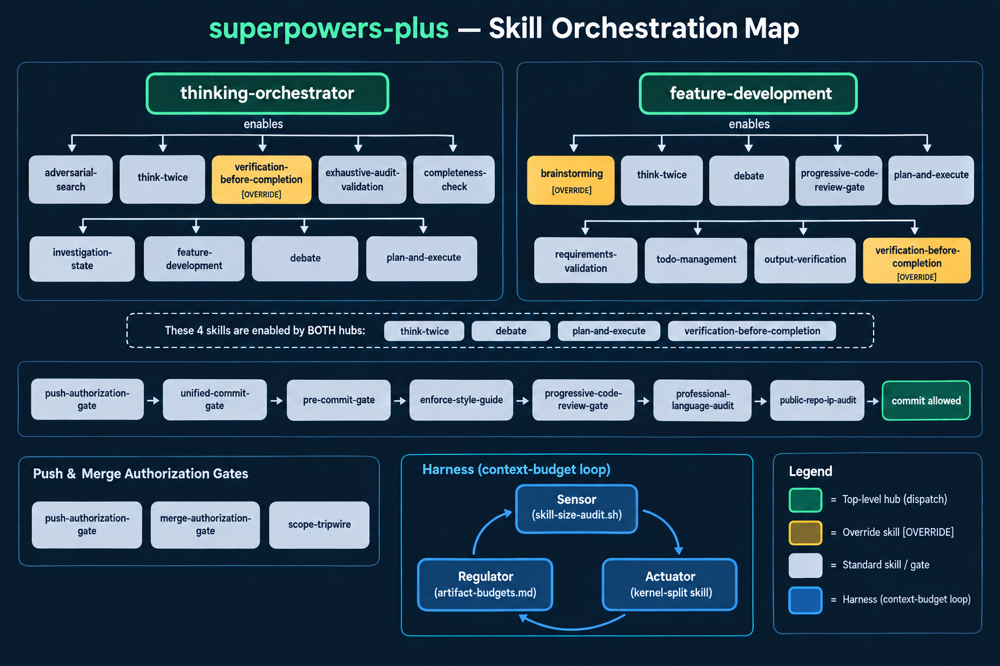
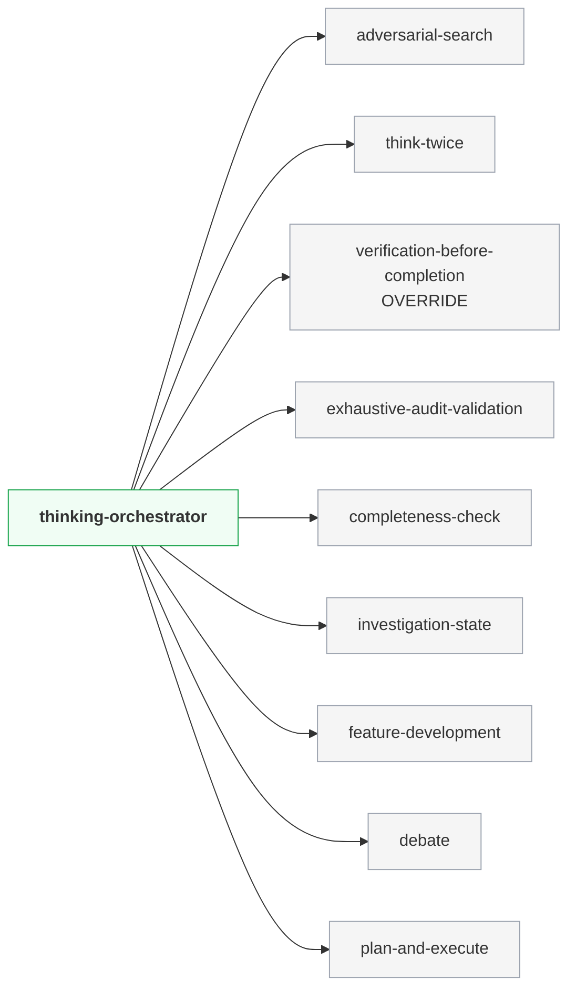
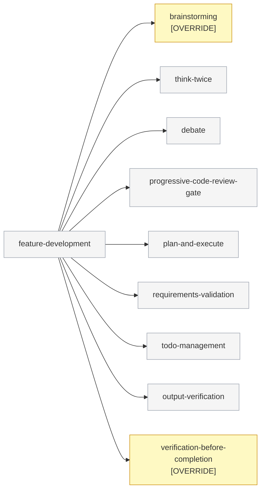
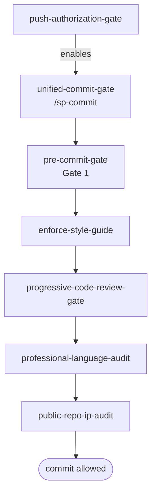
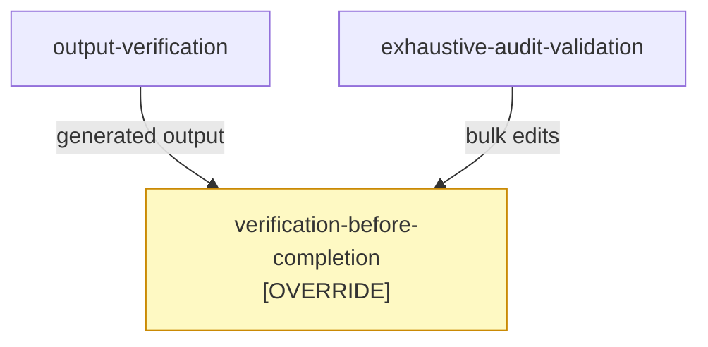
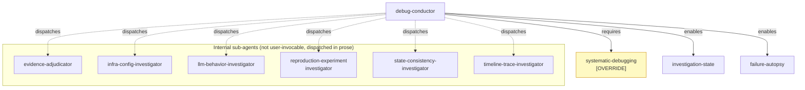
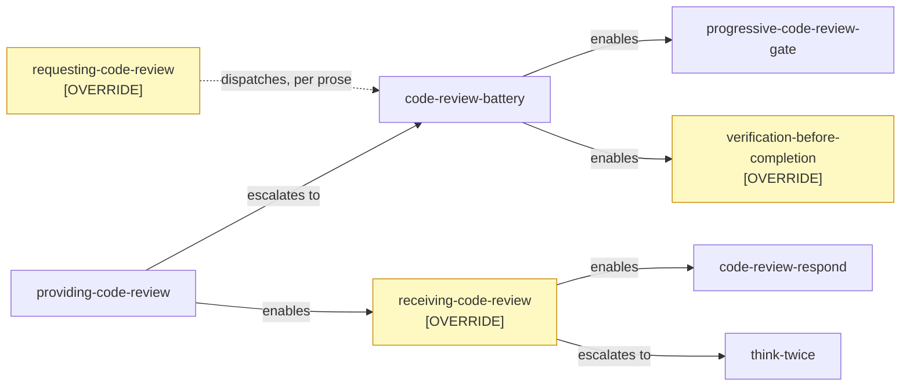

# superpowers-plus Skill Taxonomy

Visual reference for the skill hierarchy of superpowers-plus: orchestration chains, domain groupings, and the boundary between the [obra/superpowers](https://github.com/obra/superpowers) upstream base and superpowers-plus overrides and additions.

> **This document covers pipeline topology (which skills call which).** For how triggers fire, how skill names are resolved, how compression works, and the full frontmatter schema, see [DESIGN.md](DESIGN.md). For how context-window cost is measured and controlled, see [Harness Layer](#harness-layer) below and [docs/harness/README.md](harness/README.md).
>
> **Legend**
>
> - **[OVERRIDE]**: superpowers-plus replaces this upstream obra/superpowers skill with a stricter, hardened version
> - **[BASE]**: installed from obra/superpowers unchanged; superpowers-plus adds nothing to it
> - All other nodes are net-new skills that exist only in superpowers-plus
> - Solid arrows below reproduce a skill's own `coordination.enables` / `requires` frontmatter field exactly, verified against the source file. Dotted arrows mark a real relationship documented in a skill's prose that isn't (yet) encoded in its frontmatter. The machine-generated, always-current version of every coordination edge — all 122 skills, one diagram — lives at [skill-dependency-graph.md](skill-dependency-graph.md). This document is the hand-curated, human-readable subset: individually legible diagrams over one comprehensive but dense one.

---

## Layer Architecture

superpowers-plus installs on top of [obra/superpowers](https://github.com/obra/superpowers). When the same skill name exists in both repos, the superpowers-plus version wins. That is the override pattern.

| Layer | Contents |
|-------|---------|
| **superpowers-plus overrides** | 9 skills that replace an upstream obra/superpowers skill of the same name with additional enforcement gates |
| **superpowers-plus base (unchanged)** | 5 skills (`dispatching-parallel-agents`, `executing-plans`, `using-git-worktrees`, `using-superpowers`, `writing-plans`) added from obra/superpowers at the v2.6.0 fold-in, unchanged |
| **superpowers-plus additions** | 108 net-new skills covering engineering, wiki, security, research, and more |

122 skills total. Count verified against `find skills -name skill.md | wc -l`; per-domain breakdown in [Domain Reference](#domain-reference) below.

---

## Override Map

Nine upstream skills are replaced by superpowers-plus, each a complete replacement installed in the same slot as the upstream version:

`brainstorming` · `finishing-a-development-branch` · `receiving-code-review` · `requesting-code-review` · `subagent-driven-development` · `systematic-debugging` · `test-driven-development` · `verification-before-completion` · `writing-skills`

### What Each Override Adds

| Override | Key enforcement added over upstream |
|----------|-------------------------------------|
| **brainstorming** | HARD GATE blocking any code or scaffolding before design approval; `anti_triggers` field preventing false activations; mandatory design-doc commit before transitioning to planning |
| **finishing-a-development-branch** | Mandatory `code-review-battery` as Step 0 before any integration option is presented |
| **receiving-code-review** | Systemic Verification gate: every fix acknowledgment must confirm the fix actually landed in the artifact, not just acknowledge the feedback |
| **requesting-code-review** | Routes all review requests through `code-review-battery` (up to 7 parallel specialist reviewers); Cardinal Rule enforcement |
| **subagent-driven-development** | Two-stage review (self-review then battery); condensed to 91 lines for faster context load; platform-agnostic framing |
| **systematic-debugging** | Hard "NO FIXES WITHOUT INVESTIGATION" gate: Phase 1 (reproduce + hypothesize) must complete before any fix attempt |
| **test-driven-development** | Strict Red→Green→Refactor sequence with hard gates; production code cannot be written before a failing test exists |
| **verification-before-completion** | Intent-based auto-fire: triggers when AI is *about to claim "done"*, not only on explicit request; battery sentinel short-circuit |
| **writing-skills** | Scoped exclusively to prose quality review; explicitly NOT for skill authoring (prevents misrouting new-skill work through prose review) |

---

## Push & Merge Authorization Gates

Three skills form a `push-gates` coordination group that runs ahead of everything else in the repo's git-safety surface — `priority: 100`, and the two authorization gates carry `order: -5` (negative order means "before the rest of the group," not just "before other groups"):

| Skill | Fires on | What it requires |
|-------|----------|-------------------|
| `push-authorization-gate` | Any `git push` | An explicit human approval utterance in the *current* conversation. Enables `unified-commit-gate` — a push only proceeds into the commit-gate chain once authorized. |
| `merge-authorization-gate` | `gh pr merge` / `glab mr merge` / any forge REST merge | A distinct human merge utterance — separate from push approval, because merge bypasses git hooks and every pre-push gate. |
| `scope-tripwire` | Pre-push, on branches linked to a ticket | Advisory only (never blocks): warns when the branch's cumulative diff exceeds ~2x the ticket's point estimate (200 LOC/point default). |

These were folded in from an internal overlay on 2026-09-08 and are the newest additions to the git-safety surface — they sit chronologically and structurally upstream of the [Commit Gate Chain](#commit-gate-chain) below.

---

## Main Orchestration Cascade

`thinking-orchestrator` and `feature-development` are the two top-level dispatch hubs. Drawing them as one flowchart (the previous version of this doc) produces a tangle: **4 of the 9 skills `feature-development` enables are *also* enabled independently by `thinking-orchestrator`** (`think-twice`, `debate`, `plan-and-execute`, `verification-before-completion`), so a single-diagram layout forces those 4 edges to cross the whole width of the graph. Splitting the two hubs into separate fan-outs removes every crossing edge — each diagram below has zero line intersections. The overlap is called out once, in prose, instead of drawn four times as crossing arrows.

For a single-image overview covering both hubs plus the commit chain, push/merge gates, and the harness loop in one frame:

*Manually generated 2026-09-10 from the same data as the diagrams below — a static snapshot, not auto-verified against frontmatter like the mermaid diagrams are. Re-generate rather than hand-edit if the underlying `coordination` fields change; the prompt used to produce it lives in this repo's PR history.*

Every edge below matches the `coordination.enables` field of the source skill, verified directly against each skill.md.

### thinking-orchestrator fan-out

```mermaid
flowchart LR
    classDef orch fill:#f0fdf4,stroke:#16a34a,font-weight:bold
    classDef new fill:#f5f5f5,stroke:#9ca3af

    TO[thinking-orchestrator]:::orch
    AS[adversarial-search]:::new
    TWT[think-twice]:::new
    VBC["verification-before-completion<br/>OVERRIDE"]:::new
    EAV[exhaustive-audit-validation]:::new
    CS[completeness-check]:::new
    IS[investigation-state]:::new
    FD[feature-development]:::new
    DB[debate]:::new
    PAE[plan-and-execute]:::new

    TO --> AS
    TO --> TWT
    TO --> VBC
    TO --> EAV
    TO --> CS
    TO --> IS
    TO --> FD
    TO --> DB
    TO --> PAE
```

### feature-development fan-out

```mermaid
flowchart LR
    classDef ovrd fill:#fef9c3,stroke:#ca8a04
    classDef new fill:#f5f5f5,stroke:#9ca3af

    FD2[feature-development]:::new
    BST["brainstorming<br/>[OVERRIDE]"]:::ovrd
    TWT2[think-twice]:::new
    DB2[debate]:::new
    PCRG[progressive-code-review-gate]:::new
    PAE2[plan-and-execute]:::new
    RV[requirements-validation]:::new
    TM[todo-management]:::new
    OV[output-verification]:::new
    VBC2["verification-before-completion<br/>[OVERRIDE]"]:::ovrd

    FD2 --> BST
    FD2 --> TWT2
    FD2 --> DB2
    FD2 --> PCRG
    FD2 --> PAE2
    FD2 --> RV
    FD2 --> TM
    FD2 --> OV
    FD2 --> VBC2
```

**Shared targets** (enabled by both hubs independently — not a diagram artifact, a real dual-enablement in the frontmatter): `think-twice`, `debate`, `plan-and-execute`, `verification-before-completion [OVERRIDE]`.

`think-twice` itself escalates further, to `perplexity-research`, on repeated stuck loops.

---

## Commit Gate Chain

Linear enforcement pipeline. `push-authorization-gate` (see [Push & Merge Authorization Gates](#push--merge-authorization-gates)) is the human-approval front door; every commit that gets past it must then clear all five gates in sequence.

```mermaid
flowchart TD
    PAG[push-authorization-gate]
    UCG[unified-commit-gate<br/>/sp-commit]
    PCG[pre-commit-gate<br/>Gate 1]
    ESG[enforce-style-guide]
    PCRG[progressive-code-review-gate]
    PLA[professional-language-audit]
    PRIA[public-repo-ip-audit]
    DONE([commit allowed])

    PAG -->|enables| UCG
    UCG --> PCG --> ESG --> PCRG --> PLA --> PRIA --> DONE
```

Gate order verified against `unified-commit-gate`'s own `coordination.escalates_to` list: `pre-commit-gate`, `enforce-style-guide`, `progressive-code-review-gate`, `professional-language-audit`, `public-repo-ip-audit`. The `push-authorization-gate -> unified-commit-gate` edge is that skill's own `coordination.enables` field.

---

## Completion Gate

Two paths feed into `verification-before-completion [OVERRIDE]`, both confirmed via that path's own `coordination.enables` field.

```mermaid
flowchart TD
    classDef ovrd fill:#fef9c3,stroke:#ca8a04

    OV[output-verification]
    EAV[exhaustive-audit-validation]
    VBC["verification-before-completion<br/>[OVERRIDE]"]:::ovrd

    OV -->|generated output| VBC
    EAV -->|bulk edits| VBC
```

---

## Wiki Pipeline

The full 7-stage (10 counting half-steps) sequential quality gate chain, per `wiki-orchestrator`'s own stage table. BLOCK gates halt the pipeline on failure; ADVISORY and WARN gates flag issues without stopping it. `wiki-verify` runs post-publish as a drift check, not part of the blocking chain.

```mermaid
flowchart LR
    DD["1. De-dup<br/>WARN"]
    GEN["2. Generate<br/>format rules"]
    WCC["2.5 Coherence<br/>ADVISORY"]
    LV["3. Links<br/>BLOCK"]
    WSA["4. Secrets<br/>BLOCK"]
    LANG["4.5 Language<br/>BLOCK"]
    EAS["5. Slop<br/>ADVISORY"]
    WMSG["5.5 Structure<br/>BLOCK"]
    WD["6. Facts<br/>WARN"]
    PUB(["7. Publish"])
    WV[wiki-verify]

    DD --> GEN --> WCC --> LV --> WSA --> LANG --> EAS --> WMSG --> WD --> PUB
    PUB -.->|post-publish drift check| WV
```

Skill mapping for the gate stages that invoke a skill rather than a raw script, per `wiki-orchestrator`'s own command column: 2.5 → `wiki-content-coherence`, 3 → `link-verification`, 4 → `wiki-secret-audit`, 5 → `eliminating-ai-slop`, 6 → `wiki-debunker`. Stages 1, 2, 4.5, and 5.5 run scripts directly (`tools/wiki-read.sh`, formatting rules, `tools/language-scanner.js`, `tools/wiki-markdown-validate.js`) rather than dispatching a skill, even though 5.5 corresponds to the `wiki-markdown-structure-gate` skill's concern.

**`wiki-prune-audit`** (new) is a separate, upstream triage tool — not a pipeline stage. It scans an existing wiki subtree for low-value pages (duplication, obsolescence, orphans, link-rot), publishes a severity-ranked worklist, and its own `coordination.enables` feeds into `wiki-refactor`, not into this per-document pipeline. Run it before `wiki-refactor` on a large or unfamiliar wiki tree; it never touches the 7-stage chain above.

---

## Debug Flow

`debug-conductor` requires `systematic-debugging [OVERRIDE]` (its own `coordination.requires`) and enables `investigation-state` and `failure-autopsy` (its own `coordination.enables`). It also dispatches six specialist sub-agents directly in its prose; those sub-agents are internal to `debug-conductor` and not invoked directly by users.

```mermaid
flowchart TD
    classDef ovrd fill:#fef9c3,stroke:#ca8a04

    DC[debug-conductor]
    SD["systematic-debugging<br/>[OVERRIDE]"]:::ovrd
    IS[investigation-state]
    FA[failure-autopsy]

    DC -->|requires| SD
    DC -->|enables| IS
    DC -->|enables| FA

    subgraph subs["Internal sub-agents (not user-invocable, dispatched in prose)"]
        EA[evidence-adjudicator]
        ICI[infra-config-investigator]
        LBI[llm-behavior-investigator]
        REI[reproduction-experiment<br/>investigator]
        SCI[state-consistency-investigator]
        TTI[timeline-trace-investigator]
    end

    DC -.->|dispatches| EA
    DC -.->|dispatches| ICI
    DC -.->|dispatches| LBI
    DC -.->|dispatches| REI
    DC -.->|dispatches| SCI
    DC -.->|dispatches| TTI
```

---

## Code Review Chain

Two separate chains feed into code review, verified against each skill's own `coordination` field. `requesting-code-review`'s frontmatter has empty `requires`/`enables`, but its own prose ("Dispatch `code-review-battery` to catch issues before they cascade") documents a real dispatch relationship, shown dotted below. `progressive-harsh-review` reviews non-code deliverables and is not part of this chain at all. See its own `anti_triggers` (`code review`, `PR review`), which explicitly route code review elsewhere.

```mermaid
flowchart LR
    classDef ovrd fill:#fef9c3,stroke:#ca8a04

    RQR["requesting-code-review<br/>[OVERRIDE]"]:::ovrd
    CRB[code-review-battery]
    PCRG[progressive-code-review-gate]
    VBC["verification-before-completion<br/>[OVERRIDE]"]:::ovrd
    PCR[providing-code-review]
    RCV["receiving-code-review<br/>[OVERRIDE]"]:::ovrd
    CRR[code-review-respond]
    TWT[think-twice]

    RQR -.->|dispatches, per prose| CRB
    CRB -->|enables| PCRG
    CRB -->|enables| VBC
    PCR -->|escalates to| CRB
    PCR -->|enables| RCV
    RCV -->|enables| CRR
    RCV -->|escalates to| TWT
```

**`pr-triage-gate`** (new) sits upstream of this chain, not inside it: before debugging CI or fixing any PR, it checks whether the PR's stated goals are already on the target branch. On a stale/redundant PR it closes the loop immediately; otherwise its own `coordination.enables` dispatches into `systematic-debugging` or `code-review-battery` depending on what it finds. It is deliberately left out of the diagram above rather than drawn as a third hub feeding `code-review-battery` — see the [Main Orchestration Cascade](#main-orchestration-cascade) section above for why converging hubs get described in prose, not redrawn as crossing arrows.

---

## Harness Layer

A layer orthogonal to the pipelines above: instead of *which skill calls which*, the harness tracks *how much context-window budget the skill catalog costs to load*, and keeps that cost from silently regrowing. Full detail in [docs/harness/README.md](harness/README.md); summary here because it changes how skills in this taxonomy are built, not just how they're measured.

| Stage | Role | Artifact |
|-------|------|----------|
| **Sensor** | Measure | [`tools/skill-size-audit.sh`](../tools/skill-size-audit.sh) — scans every `skills/**/skill.md`, ranks by byte count, exits non-zero over the fleet-wide 10 KB threshold |
| **Actuator** | Shrink | [`kernel-split`](#domain-reference) skill (via [`tools/skill-partitioner`](../tools/skill-partitioner)) — splits an oversized skill into a resident kernel plus an on-demand `reference.md`. Hard gates and "never" rules always stay in the kernel; that safety floor overrides the partitioner's own score. |
| **Regulator** | Guard | [`docs/harness/artifact-budgets.md`](harness/artifact-budgets.md) + [`tests/harness/artifact-budgets.bats`](../tests/harness/artifact-budgets.bats) — committed byte-size baseline that fails CI (`BUDGET_MODE=strict`) or warns (`advisory`) if a split skill balloons back up |

The loop is continuous: Sensor → Actuator → Regulator → back to Sensor, every session and every commit. [`docs/harness/reduction-history.md`](harness/reduction-history.md) is the single source of truth for measured reductions — as of this writing its ledger is empty (`kernel-split` exists and is wired in; no skill has been split yet), so no skill below carries a kernel/reference badge. When one does, note it in the Domain Reference table rather than trusting a diagram, per the ledger's own instruction.

---

## Domain Reference

All 122 skills grouped by filesystem domain, verified against `skills/*/*/skill.md` directly. **[OVERRIDE]** replaces an upstream obra/superpowers skill; **[BASE]** is installed from obra/superpowers unchanged; **†** marks debug-conductor internal sub-agents (not invoked directly); all others are net-new superpowers-plus additions. Full one-line descriptions for every skill: [SKILLS.md](SKILLS.md).

| Domain | Count | Skills |
|--------|-------|--------|
| **engineering** | 55 | blast-radius-check, brainstorming **[OVERRIDE]**, branch-flow-gate, branch-sync-gate, code-review-battery, codebase-recon, codeowners-drift-audit, cognitive-complexity-refactoring, debate, debug-conductor, dispatching-parallel-agents **[BASE]**, domain-build, evidence-adjudicator†, executing-plans **[BASE]**, external-cli-audit, feature-development, field-rename-verification, finishing-a-development-branch **[OVERRIDE]**, git-branch-conventions, gitlab-cli, hotfix-charter, implementation-tracker, infra-config-investigator†, investigation-state, llm-behavior-investigator†, llm-skill-review, merge-authorization-gate, micro-harsh-review, output-verification, pr-triage-gate, pre-commit-gate, progressive-code-review-gate, progressive-harsh-review, providing-code-review, push-authorization-gate, receiving-code-review **[OVERRIDE]**, reproduction-experiment-investigator†, requesting-code-review **[OVERRIDE]**, requirements-validation, requirements-validation-pm, scope-tripwire, session-handoff, skills-hierarchy-tuning, sp-bughunt, kernel-split, state-consistency-investigator†, subagent-driven-development **[OVERRIDE]**, systematic-debugging **[OVERRIDE]**, test-driven-development **[OVERRIDE]**, timeline-trace-investigator†, token-estimation, unified-commit-gate, using-git-worktrees **[BASE]**, using-superpowers **[BASE]**, verification-before-completion **[OVERRIDE]** |
| **experimental** | 1 | experimental-self-prompting |
| **issue-tracking** | 5 | issue-authoring, issue-comment-debunker, issue-editing, issue-link-verification, issue-verify |
| **observability** | 10 | completeness-check, evolution-loop, exhaustive-audit-validation, failure-autopsy, holistic-repo-verification, measurement-integrity, skill-health-check, skill-trigger-audit, substrate-claim-audit, superpowers-doctor |
| **productivity** | 25 | adversarial-search, autonomous-chain-controller, code-review-respond, context-ferry, domain-design, enforce-style-guide, fallback-planning, golden-agents, innovation, inter-agent-review-protocol, knowledge-capture, model-selector, no-empty-promises, plan-and-execute, quantitative-decision-gate, screenshot, session-status, skill-authoring, superpowers-help, think-twice, thinking-orchestrator, todo-archive, todo-guardian, todo-management, update-superpowers |
| **research** | 3 | expert-interviewer, incorporating-research, perplexity-research |
| **security** | 5 | devsec-audit, public-repo-ip-audit, repo-security-scan, security-upgrade, wiki-instruction-guard |
| **wiki** | 9 | link-verification, wiki-content-coherence, wiki-debunker, wiki-markdown-structure-gate, wiki-orchestrator, wiki-prune-audit, wiki-refactor, wiki-secret-audit, wiki-verify |
| **writing** | 9 | detecting-ai-slop, eliminating-ai-slop, explain-like-im-five, markdown-table-discipline, plan-quality-gates, professional-language-audit, readme-authoring, writing-plans **[BASE]**, writing-skills **[OVERRIDE]** |

---

*122 skills across 9 domains (9 overrides, 5 base, 108 net-new). Counts verified against the filesystem, not carried forward from an earlier snapshot.*

*What's machine-regenerated vs. hand-curated, so the next update touches the right file:*

- *Full per-skill coordination graph → `node tools/generate-skill-dag.js` regenerates [skill-dependency-graph.md](skill-dependency-graph.md) directly from frontmatter.*
- *Per-skill token-cost table → `bash tools/skill-cost-analyzer.sh --markdown` regenerates [SKILL_TOKEN_COSTS.md](SKILL_TOKEN_COSTS.md) directly.*
- *This document has no generator.* The diagrams above are a curated subset chosen for readability, and the Domain Reference table is filled in by hand from `find skills -name skill.md | wc -l` plus a per-domain `find skills/<domain> -name skill.md | wc -l`. Re-run both before trusting the counts in this file again — nothing regenerates them for you.

*Full skill descriptions: [SKILLS.md](SKILLS.md)*
