# Skill Dependency Graph

> **Auto-generated** by `tools/generate-skill-dag.js`
> **Last updated:** 2026-03-30

This document visualizes the coordination relationships between skills in superpowers-plus.

## Diagram

```mermaid
graph TD
  subgraph engineering["Engineering"]
    cognitive_complexity_refactoring["cognitive-complexity-refactoring"]
    engineering_rigor["engineering-rigor"]
    feature_development["feature-development"]
    git_branch_conventions["git-branch-conventions"]
    implementation_tracker["implementation-tracker"]
    requirements_validation["requirements-validation"]
    typescript_project_conventions["typescript-project-conventions"]
    typescript_strict_mode["typescript-strict-mode"]
    vitest_testing_patterns["vitest-testing-patterns"]
    blast_radius_check["blast-radius-check"]
    debug_conductor["debug-conductor"]
    systematic_debugging["systematic-debugging"]
    field_rename_verification["field-rename-verification"]
    test_driven_development["test-driven-development"]
    subagent_driven_development["subagent-driven-development"]
    evidence_adjudicator["evidence-adjudicator [internal]"]
    infra_config_investigator["infra-config-investigator [internal]"]
    llm_behavior_investigator["llm-behavior-investigator [internal]"]
    reproduction_experiment_investigator["reproduction-experiment-investigator [internal]"]
    state_consistency_investigator["state-consistency-investigator [internal]"]
    timeline_trace_investigator["timeline-trace-investigator [internal]"]
  end

  subgraph thinking["Thinking"]
    brainstorming["brainstorming"]
    adversarial_search["adversarial-search"]
    debate["debate"]
    innovation["innovation"]
    thinking_orchestrator["thinking-orchestrator"]
  end

  subgraph code-quality["Code Quality"]
    code_review_battery["code-review-battery"]
    micro_harsh_review["micro-harsh-review"]
    code_review["code-review"]
    providing_code_review["providing-code-review"]
    receiving_code_review["receiving-code-review"]
    code_review_respond["code-review-respond"]
  end

  subgraph debugging["Debugging"]
    investigation_state["investigation-state"]
  end

  subgraph completion-gate["Completion Gate"]
    exhaustive_audit_validation["exhaustive-audit-validation"]
    verification_before_completion["verification-before-completion"]
    output_verification["output-verification"]
  end

  subgraph commit-gates["Commit Gates"]
    pre_commit_gate["pre-commit-gate"]
    enforce_style_guide["enforce-style-guide"]
    progressive_code_review_gate["progressive-code-review-gate"]
    professional_language_audit["professional-language-audit"]
    public_repo_ip_audit["public-repo-ip-audit"]
  end

  subgraph quality["Quality"]
    progressive_harsh_review["progressive-harsh-review"]
  end

  subgraph experimental["Experimental"]
    experimental_self_prompting["experimental-self-prompting"]
  end

  subgraph issue-tracking["Issue Tracking"]
    issue_comment_debunker["issue-comment-debunker"]
    issue_editing["issue-editing"]
    issue_link_verification["issue-link-verification"]
    issue_verify["issue-verify"]
    issue_authoring["issue-authoring"]
  end

  subgraph observability["Observability"]
    holistic_repo_verification["holistic-repo-verification"]
    skill_health_check["skill-health-check"]
    superpowers_doctor["superpowers-doctor"]
    completeness_check["completeness-check"]
  end

  subgraph meta-improvement["Meta Improvement"]
    evolution_loop["evolution-loop"]
  end

  subgraph quality-feedback["Quality Feedback"]
    failure_autopsy["failure-autopsy"]
    measurement_integrity["measurement-integrity"]
  end

  subgraph orchestration["Orchestration"]
    autonomous_chain_controller["autonomous-chain-controller"]
  end

  subgraph productivity["Productivity"]
    plan_and_execute["plan-and-execute"]
    domain_design["domain-design"]
    fallback_planning["fallback-planning"]
    golden_agents["golden-agents"]
    skill_authoring["skill-authoring"]
    todo_archive["todo-archive"]
    todo_management["todo-management"]
  end

  subgraph decision-making["Decision Making"]
    quantitative_decision_gate["quantitative-decision-gate"]
  end

  subgraph meta["Meta"]
    superpowers_help["superpowers-help"]
  end

  subgraph stuck-escalation["Stuck Escalation"]
    think_twice["think-twice"]
    perplexity_research["perplexity-research"]
  end

  subgraph todo-enforcement["Todo Enforcement"]
    todo_guardian["todo-guardian"]
  end

  subgraph research["Research"]
    expert_interviewer["expert-interviewer"]
    incorporating_research["incorporating-research"]
  end

  subgraph security["Security"]
    repo_security_scan["repo-security-scan"]
    security_upgrade["security-upgrade"]
    wiki_instruction_guard["wiki-instruction-guard"]
  end

  subgraph wiki["Wiki"]
    link_verification["link-verification"]
    wiki_debunker["wiki-debunker"]
    wiki_secret_audit["wiki-secret-audit"]
    wiki_verify["wiki-verify"]
  end

  subgraph wiki-pipeline["Wiki Pipeline"]
    wiki_orchestrator["wiki-orchestrator"]
    wiki_content_coherence["wiki-content-coherence"]
    wiki_refactor["wiki-refactor"]
  end

  subgraph writing["Writing"]
    detecting_ai_slop["detecting-ai-slop"]
    eliminating_ai_slop["eliminating-ai-slop"]
    writing_skills["writing-skills"]
    plan_quality_gates["plan-quality-gates"]
    readme_authoring["readme-authoring"]
    markdown_table_discipline["markdown-table-discipline"]
  end

  blast_radius_check -->|enables| field_rename_verification
  blast_radius_check ==>|escalates to| engineering_rigor
  brainstorming -->|enables| debate
  brainstorming ==>|escalates to| thinking_orchestrator
  code_review_battery -->|enables| progressive_code_review_gate
  systematic_debugging -->|then| debug_conductor
  debug_conductor -->|enables| investigation_state
  debug_conductor -->|enables| failure_autopsy
  debug_conductor ==>|escalates to| thinking_orchestrator
  debate ==>|escalates to| thinking_orchestrator
  engineering_rigor -->|enables| pre_commit_gate
  engineering_rigor -->|enables| blast_radius_check
  debug_conductor -->|then| evidence_adjudicator
  evidence_adjudicator ==>|escalates to| debug_conductor
  feature_development -->|enables| brainstorming
  feature_development -->|enables| think_twice
  feature_development -->|enables| debate
  feature_development ==>|escalates to| thinking_orchestrator
  field_rename_verification -->|enables| verification_before_completion
  field_rename_verification ==>|escalates to| engineering_rigor
  debug_conductor -->|then| infra_config_investigator
  infra_config_investigator ==>|escalates to| debug_conductor
  investigation_state -->|enables| think_twice
  investigation_state ==>|escalates to| thinking_orchestrator
  debug_conductor -->|then| llm_behavior_investigator
  llm_behavior_investigator ==>|escalates to| debug_conductor
  micro_harsh_review -->|enables| pre_commit_gate
  micro_harsh_review ==>|escalates to| progressive_code_review_gate
  output_verification -->|enables| verification_before_completion
  pre_commit_gate -->|enables| enforce_style_guide
  enforce_style_guide -->|then| progressive_code_review_gate
  progressive_code_review_gate -->|enables| professional_language_audit
  progressive_harsh_review -->|enables| think_twice
  progressive_harsh_review -->|enables| debate
  code_review -->|then| providing_code_review
  providing_code_review -->|enables| receiving_code_review
  providing_code_review ==>|escalates to| code_review_battery
  receiving_code_review -->|enables| code_review_respond
  receiving_code_review ==>|escalates to| think_twice
  debug_conductor -->|then| reproduction_experiment_investigator
  reproduction_experiment_investigator ==>|escalates to| debug_conductor
  requirements_validation -->|enables| debate
  requirements_validation -->|enables| brainstorming
  requirements_validation ==>|escalates to| feature_development
  debug_conductor -->|then| state_consistency_investigator
  state_consistency_investigator ==>|escalates to| debug_conductor
  plan_and_execute -->|then| subagent_driven_development
  systematic_debugging -->|enables| investigation_state
  systematic_debugging -->|enables| think_twice
  systematic_debugging ==>|escalates to| thinking_orchestrator
  test_driven_development -->|enables| verification_before_completion
  debug_conductor -->|then| timeline_trace_investigator
  timeline_trace_investigator ==>|escalates to| debug_conductor
  issue_authoring -->|enables| issue_verify
  issue_editing -->|enables| issue_verify
  completeness_check -->|enables| verification_before_completion
  completeness_check ==>|escalates to| thinking_orchestrator
  failure_autopsy -->|then| evolution_loop
  measurement_integrity -->|then| evolution_loop
  evolution_loop -->|enables| skill_authoring
  exhaustive_audit_validation -->|enables| verification_before_completion
  failure_autopsy -->|enables| quantitative_decision_gate
  failure_autopsy -->|enables| measurement_integrity
  failure_autopsy ==>|escalates to| think_twice
  measurement_integrity -->|enables| verification_before_completion
  measurement_integrity ==>|escalates to| failure_autopsy
  skill_health_check ==>|escalates to| superpowers_doctor
  adversarial_search -->|enables| think_twice
  adversarial_search -->|enables| verification_before_completion
  adversarial_search ==>|escalates to| thinking_orchestrator
  autonomous_chain_controller -->|enables| brainstorming
  autonomous_chain_controller -->|enables| debate
  autonomous_chain_controller -->|enables| plan_and_execute
  autonomous_chain_controller -->|enables| test_driven_development
  autonomous_chain_controller ==>|escalates to| think_twice
  autonomous_chain_controller ==>|escalates to| failure_autopsy
  code_review -->|enables| progressive_code_review_gate
  code_review ==>|escalates to| code_review_battery
  code_review_respond -->|enables| pre_commit_gate
  code_review_respond ==>|escalates to| think_twice
  domain_design -->|enables| skill_authoring
  domain_design -->|enables| brainstorming
  domain_design -->|enables| debate
  plan_and_execute -->|then| fallback_planning
  innovation -->|enables| brainstorming
  innovation -->|enables| debate
  plan_and_execute -->|enables| brainstorming
  plan_and_execute -->|enables| think_twice
  plan_and_execute -->|enables| todo_management
  plan_and_execute -->|enables| plan_quality_gates
  plan_and_execute ==>|escalates to| thinking_orchestrator
  quantitative_decision_gate -->|enables| brainstorming
  quantitative_decision_gate -->|enables| debate
  quantitative_decision_gate -->|enables| plan_and_execute
  quantitative_decision_gate ==>|escalates to| think_twice
  skill_authoring -->|enables| writing_skills
  think_twice ==>|escalates to| perplexity_research
  thinking_orchestrator -->|enables| adversarial_search
  thinking_orchestrator -->|enables| think_twice
  thinking_orchestrator -->|enables| verification_before_completion
  thinking_orchestrator -->|enables| exhaustive_audit_validation
  thinking_orchestrator -->|enables| completeness_check
  thinking_orchestrator -->|enables| investigation_state
  thinking_orchestrator -->|enables| feature_development
  thinking_orchestrator -->|enables| debate
  thinking_orchestrator -->|enables| plan_and_execute
  todo_management -->|then| todo_archive
  todo_management -->|then| todo_guardian
  todo_guardian -->|enables| verification_before_completion
  todo_guardian ==>|escalates to| quantitative_decision_gate
  todo_management -->|enables| fallback_planning
  professional_language_audit -->|then| public_repo_ip_audit
  link_verification ==>|escalates to| wiki_orchestrator
  wiki_orchestrator -->|then| wiki_content_coherence
  wiki_content_coherence -->|enables| link_verification
  wiki_content_coherence ==>|escalates to| wiki_orchestrator
  wiki_debunker ==>|escalates to| wiki_orchestrator
  wiki_orchestrator -->|enables| link_verification
  wiki_refactor -->|enables| link_verification
  wiki_refactor -->|enables| wiki_secret_audit
  wiki_verify ==>|escalates to| wiki_orchestrator
  detecting_ai_slop -->|enables| eliminating_ai_slop
```



## Coordination Groups

| Group | Skills | Purpose |
|-------|--------|---------|
| Engineering | `cognitive-complexity-refactoring`, `engineering-rigor`, `feature-development`, `git-branch-conventions`, `implementation-tracker`, `requirements-validation`, `typescript-project-conventions`, `typescript-strict-mode`, `vitest-testing-patterns`, `blast-radius-check`, `debug-conductor`, `systematic-debugging`, `field-rename-verification`, `test-driven-development`, `subagent-driven-development`, `evidence-adjudicator`, `infra-config-investigator`, `llm-behavior-investigator`, `reproduction-experiment-investigator`, `state-consistency-investigator`, `timeline-trace-investigator` | Coordinated skill group |
| Thinking | `brainstorming`, `adversarial-search`, `debate`, `innovation`, `thinking-orchestrator` | Metacognition and thinking orchestration |
| Code Quality | `code-review-battery`, `micro-harsh-review`, `code-review`, `providing-code-review`, `receiving-code-review`, `code-review-respond` | Coordinated skill group |
| Debugging | `investigation-state` | Coordinated skill group |
| Completion Gate | `exhaustive-audit-validation`, `verification-before-completion`, `output-verification` | Verification and TODO maintenance before claiming done |
| Commit Gates | `pre-commit-gate`, `enforce-style-guide`, `progressive-code-review-gate`, `professional-language-audit`, `public-repo-ip-audit` | Quality checks before git commit |
| Quality | `progressive-harsh-review` | Coordinated skill group |
| Experimental | `experimental-self-prompting` | Coordinated skill group |
| Issue Tracking | `issue-comment-debunker`, `issue-editing`, `issue-link-verification`, `issue-verify`, `issue-authoring` | Coordinated skill group |
| Observability | `holistic-repo-verification`, `skill-health-check`, `superpowers-doctor`, `completeness-check` | Coordinated skill group |
| Meta Improvement | `evolution-loop` | Coordinated skill group |
| Quality Feedback | `failure-autopsy`, `measurement-integrity` | Coordinated skill group |
| Orchestration | `autonomous-chain-controller` | Coordinated skill group |
| Productivity | `plan-and-execute`, `domain-design`, `fallback-planning`, `golden-agents`, `skill-authoring`, `todo-archive`, `todo-management` | Coordinated skill group |
| Decision Making | `quantitative-decision-gate` | Coordinated skill group |
| Meta | `superpowers-help` | Coordinated skill group |
| Stuck Escalation | `think-twice`, `perplexity-research` | Getting unstuck when blocked |
| Todo Enforcement | `todo-guardian` | Coordinated skill group |
| Research | `expert-interviewer`, `incorporating-research` | Coordinated skill group |
| Security | `repo-security-scan`, `security-upgrade`, `wiki-instruction-guard` | Coordinated skill group |
| Wiki | `link-verification`, `wiki-debunker`, `wiki-secret-audit`, `wiki-verify` | Coordinated skill group |
| Wiki Pipeline | `wiki-orchestrator`, `wiki-content-coherence`, `wiki-refactor` | Wiki authoring quality pipeline |
| Writing | `detecting-ai-slop`, `eliminating-ai-slop`, `writing-skills`, `plan-quality-gates`, `readme-authoring`, `markdown-table-discipline` | Coordinated skill group |

## Legend

| Edge Type | Meaning |
|-----------|---------|
| `-->` solid | "enables" — this skill unlocks the next |
| `-.->` dashed | "requires" — must run before |
| `==>` thick | "escalates to" — fallback if insufficient |
| `[internal]` | Not user-invocable; called by other skills |

## Namespaced Triggers

Skills now support namespaced triggers (`domain:action`) for disambiguation:

| Domain | Example Triggers |
|--------|------------------|
| `commit:` | `commit:pre-check`, `commit:style`, `commit:language`, `commit:ip-audit` |
| `wiki:` | `wiki:create`, `wiki:update`, `wiki:edit-internal`, `wiki:verify-links` |
| `stuck:` | `stuck:reasoning`, `stuck:research`, `stuck:knowledge` |

## Regenerating This Document

```bash
node tools/generate-skill-dag.js
```
