# Skill Dependency Graph

> **Auto-generated** by `tools/generate-skill-dag.js`
> **Last updated:** 2026-03-15

This document visualizes the coordination relationships between skills in superpowers-plus.

## Diagram

```mermaid
graph TD
  subgraph commit-gates["Commit Gates"]
    pre_commit_gate["pre-commit-gate"]
    enforce_style_guide["enforce-style-guide"]
    professional_language_audit["professional-language-audit"]
    public_repo_ip_audit["public-repo-ip-audit"]
  end

  subgraph stuck-escalation["Stuck Escalation"]
    think_twice["think-twice"]
    perplexity_research["perplexity-research"]
  end

  subgraph wiki-pipeline["Wiki Pipeline"]
    wiki_orchestrator["wiki-orchestrator"]
    link_verification["link-verification"]
    wiki_editing["wiki-editing [internal]"]
  end

  pre_commit_gate -->|then| enforce_style_guide
  think_twice ==>|escalates to| perplexity_research
  professional_language_audit -->|then| public_repo_ip_audit
  wiki_orchestrator -->|then| link_verification
  wiki_orchestrator -->|then| wiki_editing
  link_verification -->|then| wiki_editing
  enforce_style_guide -->|then| professional_language_audit
```



## Coordination Groups

| Group | Skills | Purpose |
|-------|--------|---------|
| Commit Gates | `pre-commit-gate`, `enforce-style-guide`, `public-repo-ip-audit`, `professional-language-audit` | Quality checks before git commit |
| Stuck Escalation | `think-twice`, `perplexity-research` | Getting unstuck when blocked |
| Wiki Pipeline | `link-verification`, `wiki-editing`, `wiki-orchestrator` | Wiki authoring quality pipeline |

## Legend

| Edge Type | Meaning |
|-----------|---------|
| `-->` solid | "enables" — this skill unlocks the next |
| `-.->` dashed | "requires" — must run before |
| `==>` thick | "escalates to" — fallback if insufficient |
| `[internal]` | Not user-invocable; called by other skills |

## Namespaced Triggers

Skills now support namespaced triggers (`domain:action`) for disambiguation:

| Domain | Example Triggers |
|--------|------------------|
| `commit:` | `commit:pre-check`, `commit:style`, `commit:language`, `commit:ip-audit` |
| `wiki:` | `wiki:create`, `wiki:update`, `wiki:edit-internal`, `wiki:verify-links` |
| `stuck:` | `stuck:reasoning`, `stuck:research`, `stuck:knowledge` |

## Regenerating This Document

```bash
node tools/generate-skill-dag.js
```
