# Skill Dependency Graph

> **Auto-generated** by `tools/generate-skill-dag.js`
> **Last updated:** 2026-09-10

This document visualizes the coordination relationships between skills in superpowers-plus. One diagram per `coordination.group` (internal edges only) -- a single graph with all 122 skills and every cross-group edge is unreadable at GitHub's rendering width, so edges that cross group boundaries are listed in [Cross-Group Edges](#cross-group-edges) below instead of drawn.

## Diagrams by Group

### Code Quality (8)

Coordinated skill group

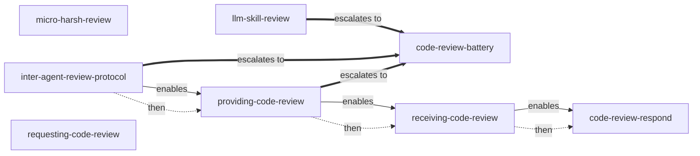
```mermaid
flowchart LR
  code_review_battery["code-review-battery"]
  llm_skill_review["llm-skill-review"]
  micro_harsh_review["micro-harsh-review"]
  inter_agent_review_protocol["inter-agent-review-protocol"]
  requesting_code_review["requesting-code-review"]
  providing_code_review["providing-code-review"]
  receiving_code_review["receiving-code-review"]
  code_review_respond["code-review-respond"]
  llm_skill_review ==>|escalates to| code_review_battery
  inter_agent_review_protocol -->|enables| providing_code_review
  inter_agent_review_protocol ==>|escalates to| code_review_battery
  inter_agent_review_protocol -.->|then| providing_code_review
  providing_code_review -->|enables| receiving_code_review
  providing_code_review ==>|escalates to| code_review_battery
  providing_code_review -.->|then| receiving_code_review
  receiving_code_review -->|enables| code_review_respond
  receiving_code_review -.->|then| code_review_respond
```

### Commit Gates (7)

Quality checks before git commit


```mermaid
flowchart LR
  hotfix_charter["hotfix-charter"]
  pre_commit_gate["pre-commit-gate"]
  enforce_style_guide["enforce-style-guide"]
  progressive_code_review_gate["progressive-code-review-gate"]
  professional_language_audit["professional-language-audit"]
  public_repo_ip_audit["public-repo-ip-audit"]
  unified_commit_gate["unified-commit-gate"]
  hotfix_charter -->|enables| unified_commit_gate
  pre_commit_gate -->|enables| enforce_style_guide
  pre_commit_gate -.->|then| enforce_style_guide
  enforce_style_guide -->|enables| progressive_code_review_gate
  enforce_style_guide -.->|then| progressive_code_review_gate
  progressive_code_review_gate -->|enables| professional_language_audit
  progressive_code_review_gate -.->|then| professional_language_audit
  professional_language_audit -->|enables| public_repo_ip_audit
  professional_language_audit -.->|then| public_repo_ip_audit
  unified_commit_gate ==>|escalates to| pre_commit_gate
  unified_commit_gate ==>|escalates to| enforce_style_guide
  unified_commit_gate ==>|escalates to| progressive_code_review_gate
  unified_commit_gate ==>|escalates to| professional_language_audit
  unified_commit_gate ==>|escalates to| public_repo_ip_audit
```

### Completion Gate (5)

Verification and TODO maintenance before claiming done

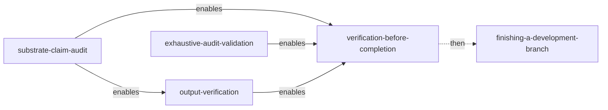
```mermaid
flowchart LR
  substrate_claim_audit["substrate-claim-audit"]
  exhaustive_audit_validation["exhaustive-audit-validation"]
  finishing_a_development_branch["finishing-a-development-branch"]
  verification_before_completion["verification-before-completion"]
  output_verification["output-verification"]
  substrate_claim_audit -->|enables| output_verification
  substrate_claim_audit -->|enables| verification_before_completion
  exhaustive_audit_validation -->|enables| verification_before_completion
  verification_before_completion -.->|then| finishing_a_development_branch
  output_verification -->|enables| verification_before_completion
```

### Debugging (1)

Coordinated skill group

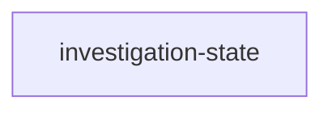
```mermaid
flowchart LR
  investigation_state["investigation-state"]
```

### Decision Making (1)

Coordinated skill group

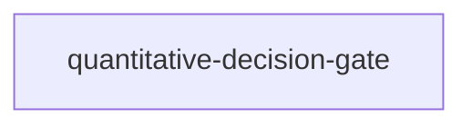
```mermaid
flowchart LR
  quantitative_decision_gate["quantitative-decision-gate"]
```

### Engineering (31)

Coordinated skill group

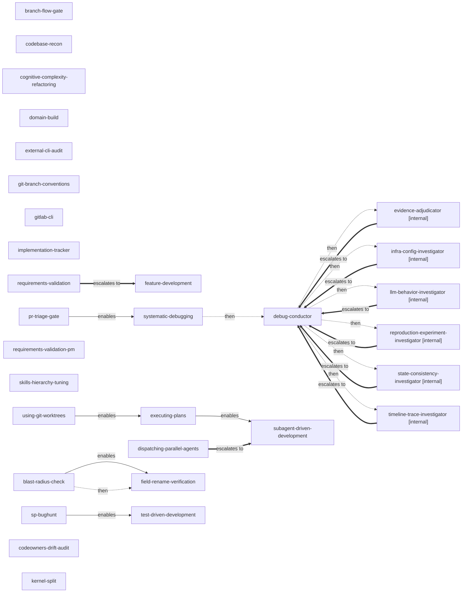
```mermaid
flowchart LR
  branch_flow_gate["branch-flow-gate"]
  codebase_recon["codebase-recon"]
  cognitive_complexity_refactoring["cognitive-complexity-refactoring"]
  domain_build["domain-build"]
  external_cli_audit["external-cli-audit"]
  feature_development["feature-development"]
  git_branch_conventions["git-branch-conventions"]
  gitlab_cli["gitlab-cli"]
  implementation_tracker["implementation-tracker"]
  pr_triage_gate["pr-triage-gate"]
  requirements_validation["requirements-validation"]
  requirements_validation_pm["requirements-validation-pm"]
  skills_hierarchy_tuning["skills-hierarchy-tuning"]
  using_git_worktrees["using-git-worktrees"]
  blast_radius_check["blast-radius-check"]
  debug_conductor["debug-conductor"]
  sp_bughunt["sp-bughunt"]
  executing_plans["executing-plans"]
  systematic_debugging["systematic-debugging"]
  dispatching_parallel_agents["dispatching-parallel-agents"]
  field_rename_verification["field-rename-verification"]
  test_driven_development["test-driven-development"]
  codeowners_drift_audit["codeowners-drift-audit"]
  subagent_driven_development["subagent-driven-development"]
  evidence_adjudicator["evidence-adjudicator [internal]"]
  infra_config_investigator["infra-config-investigator [internal]"]
  llm_behavior_investigator["llm-behavior-investigator [internal]"]
  reproduction_experiment_investigator["reproduction-experiment-investigator [internal]"]
  state_consistency_investigator["state-consistency-investigator [internal]"]
  timeline_trace_investigator["timeline-trace-investigator [internal]"]
  kernel_split["kernel-split"]
  pr_triage_gate -->|enables| systematic_debugging
  requirements_validation ==>|escalates to| feature_development
  using_git_worktrees -->|enables| executing_plans
  blast_radius_check -->|enables| field_rename_verification
  systematic_debugging -.->|then| debug_conductor
  sp_bughunt -->|enables| test_driven_development
  executing_plans -->|enables| subagent_driven_development
  dispatching_parallel_agents ==>|escalates to| subagent_driven_development
  blast_radius_check -.->|then| field_rename_verification
  debug_conductor -.->|then| evidence_adjudicator
  evidence_adjudicator ==>|escalates to| debug_conductor
  debug_conductor -.->|then| infra_config_investigator
  infra_config_investigator ==>|escalates to| debug_conductor
  debug_conductor -.->|then| llm_behavior_investigator
  llm_behavior_investigator ==>|escalates to| debug_conductor
  debug_conductor -.->|then| reproduction_experiment_investigator
  reproduction_experiment_investigator ==>|escalates to| debug_conductor
  debug_conductor -.->|then| state_consistency_investigator
  state_consistency_investigator ==>|escalates to| debug_conductor
  debug_conductor -.->|then| timeline_trace_investigator
  timeline_trace_investigator ==>|escalates to| debug_conductor
```

### Experimental (1)

Coordinated skill group

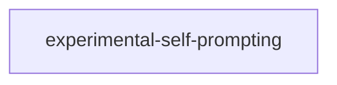
```mermaid
flowchart LR
  experimental_self_prompting["experimental-self-prompting"]
```

### Issue Tracking (5)

Coordinated skill group

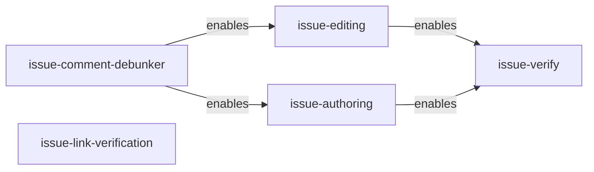
```mermaid
flowchart LR
  issue_comment_debunker["issue-comment-debunker"]
  issue_editing["issue-editing"]
  issue_link_verification["issue-link-verification"]
  issue_verify["issue-verify"]
  issue_authoring["issue-authoring"]
  issue_comment_debunker -->|enables| issue_editing
  issue_comment_debunker -->|enables| issue_authoring
  issue_editing -->|enables| issue_verify
  issue_authoring -->|enables| issue_verify
```

### Meta (3)

Coordinated skill group

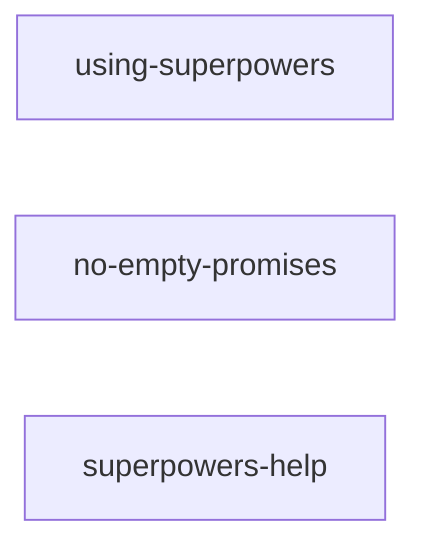
```mermaid
flowchart LR
  using_superpowers["using-superpowers"]
  no_empty_promises["no-empty-promises"]
  superpowers_help["superpowers-help"]
```

### Meta Improvement (1)

Coordinated skill group

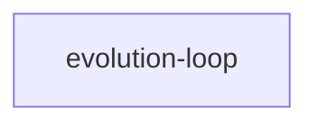
```mermaid
flowchart LR
  evolution_loop["evolution-loop"]
```

### Observability (5)

Coordinated skill group

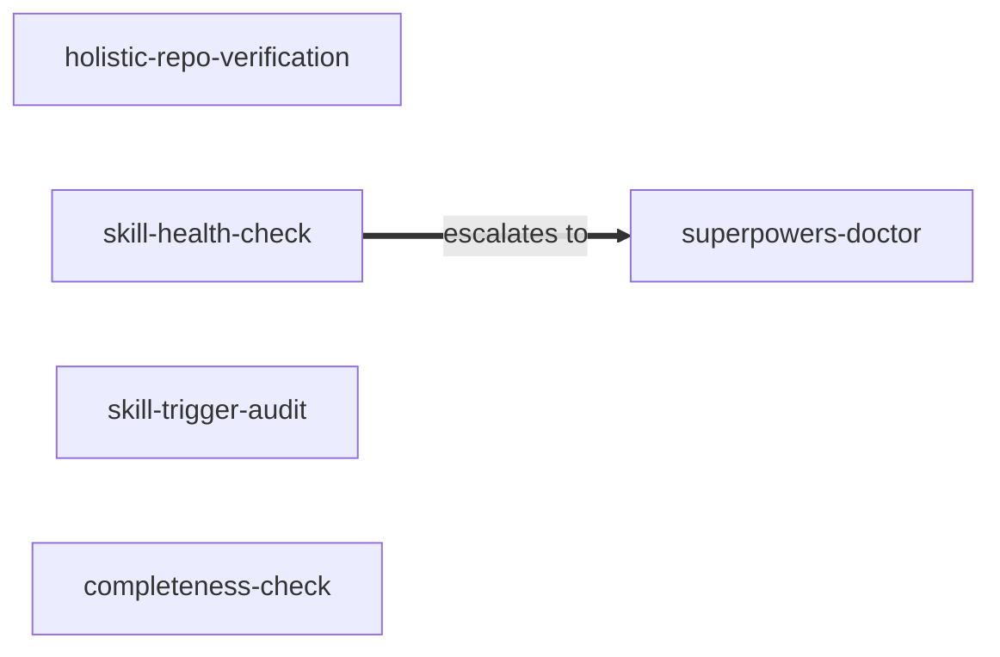
```mermaid
flowchart LR
  holistic_repo_verification["holistic-repo-verification"]
  skill_health_check["skill-health-check"]
  skill_trigger_audit["skill-trigger-audit"]
  superpowers_doctor["superpowers-doctor"]
  completeness_check["completeness-check"]
  skill_health_check ==>|escalates to| superpowers_doctor
```

### Orchestration (1)

Coordinated skill group

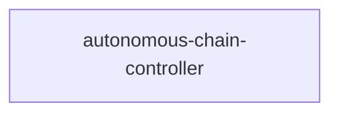
```mermaid
flowchart LR
  autonomous_chain_controller["autonomous-chain-controller"]
```

### Pre Compact (1)

Coordinated skill group

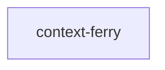
```mermaid
flowchart LR
  context_ferry["context-ferry"]
```

### Productivity (12)

Coordinated skill group

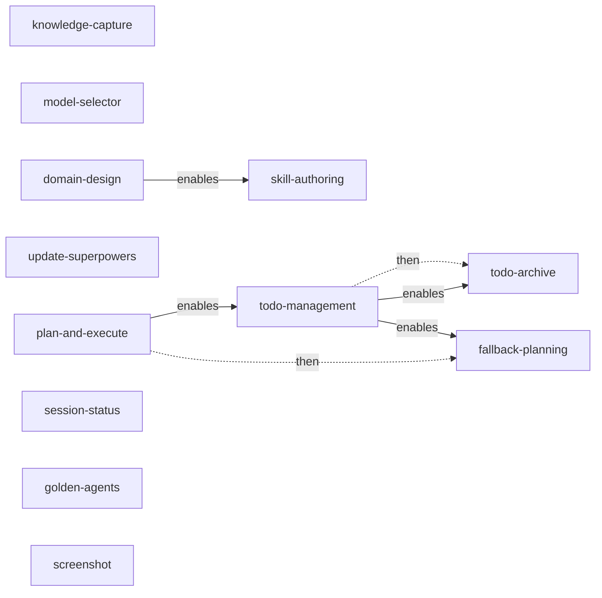
```mermaid
flowchart LR
  knowledge_capture["knowledge-capture"]
  model_selector["model-selector"]
  plan_and_execute["plan-and-execute"]
  update_superpowers["update-superpowers"]
  domain_design["domain-design"]
  fallback_planning["fallback-planning"]
  session_status["session-status"]
  golden_agents["golden-agents"]
  skill_authoring["skill-authoring"]
  screenshot["screenshot"]
  todo_archive["todo-archive"]
  todo_management["todo-management"]
  plan_and_execute -->|enables| todo_management
  domain_design -->|enables| skill_authoring
  plan_and_execute -.->|then| fallback_planning
  todo_management -.->|then| todo_archive
  todo_management -->|enables| todo_archive
  todo_management -->|enables| fallback_planning
```

### Push Gates (3)

Coordinated skill group

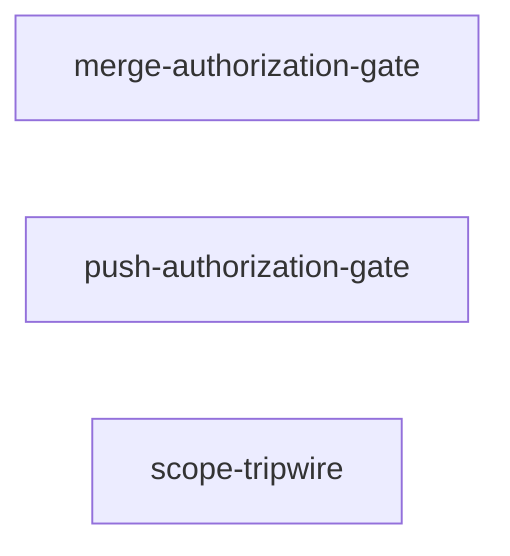
```mermaid
flowchart LR
  merge_authorization_gate["merge-authorization-gate"]
  push_authorization_gate["push-authorization-gate"]
  scope_tripwire["scope-tripwire"]
```

### Quality (1)

Coordinated skill group


```mermaid
flowchart LR
  progressive_harsh_review["progressive-harsh-review"]
```

### Quality Feedback (2)

Coordinated skill group

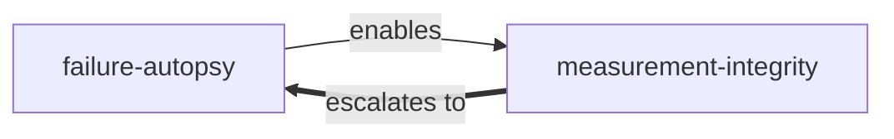
```mermaid
flowchart LR
  failure_autopsy["failure-autopsy"]
  measurement_integrity["measurement-integrity"]
  failure_autopsy -->|enables| measurement_integrity
  measurement_integrity ==>|escalates to| failure_autopsy
```

### Research (2)

Coordinated skill group

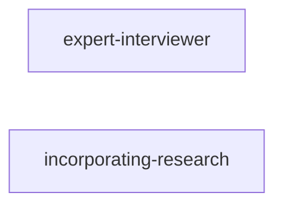
```mermaid
flowchart LR
  expert_interviewer["expert-interviewer"]
  incorporating_research["incorporating-research"]
```

### Security (4)

Coordinated skill group

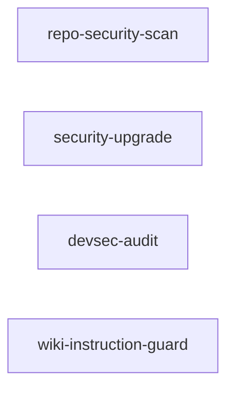
```mermaid
flowchart LR
  repo_security_scan["repo-security-scan"]
  security_upgrade["security-upgrade"]
  devsec_audit["devsec-audit"]
  wiki_instruction_guard["wiki-instruction-guard"]
```

### Session Start (1)

Coordinated skill group

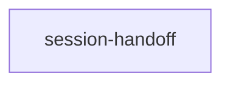
```mermaid
flowchart LR
  session_handoff["session-handoff"]
```

### Session Start Gate (1)

Coordinated skill group

```mermaid
flowchart LR
  branch_sync_gate["branch-sync-gate"]
```

### Stuck Escalation (2)

Getting unstuck when blocked

```mermaid
flowchart LR
  think_twice["think-twice"]
  perplexity_research["perplexity-research"]
  think_twice ==>|escalates to| perplexity_research
```

### Thinking (7)

Metacognition and thinking orchestration

```mermaid
flowchart LR
  brainstorming["brainstorming"]
  debate["debate"]
  adversarial_search["adversarial-search"]
  writing_plans["writing-plans"]
  innovation["innovation"]
  token_estimation["token-estimation"]
  thinking_orchestrator["thinking-orchestrator"]
  brainstorming -->|enables| debate
  brainstorming ==>|escalates to| thinking_orchestrator
  debate ==>|escalates to| thinking_orchestrator
  adversarial_search ==>|escalates to| thinking_orchestrator
  innovation -->|enables| brainstorming
  token_estimation -->|enables| debate
  thinking_orchestrator -->|enables| adversarial_search
  thinking_orchestrator -->|enables| debate
```

### Todo Enforcement (1)

Coordinated skill group

```mermaid
flowchart LR
  todo_guardian["todo-guardian"]
```

### Wiki (4)

Coordinated skill group

```mermaid
flowchart LR
  link_verification["link-verification"]
  wiki_debunker["wiki-debunker"]
  wiki_secret_audit["wiki-secret-audit"]
  wiki_verify["wiki-verify"]
```

### Wiki Pipeline (5)

Wiki authoring quality pipeline

```mermaid
flowchart LR
  wiki_prune_audit["wiki-prune-audit"]
  wiki_orchestrator["wiki-orchestrator"]
  wiki_content_coherence["wiki-content-coherence"]
  wiki_markdown_structure_gate["wiki-markdown-structure-gate"]
  wiki_refactor["wiki-refactor"]
  wiki_prune_audit -->|enables| wiki_refactor
  wiki_prune_audit ==>|escalates to| wiki_refactor
  wiki_orchestrator -.->|then| wiki_content_coherence
  wiki_content_coherence ==>|escalates to| wiki_orchestrator
  wiki_orchestrator -.->|then| wiki_markdown_structure_gate
  wiki_markdown_structure_gate ==>|escalates to| wiki_orchestrator
```

### Writing (7)

Coordinated skill group

```mermaid
flowchart LR
  detecting_ai_slop["detecting-ai-slop"]
  eliminating_ai_slop["eliminating-ai-slop"]
  writing_skills["writing-skills"]
  plan_quality_gates["plan-quality-gates"]
  readme_authoring["readme-authoring"]
  explain_like_im_five["explain-like-im-five"]
  markdown_table_discipline["markdown-table-discipline"]
  detecting_ai_slop -->|enables| eliminating_ai_slop
```

## Cross-Group Edges

Edges whose source and target skills belong to different coordination groups -- not drawn above to keep each group's diagram readable.

| From | Edge | To |
|------|------|-----|
| `adversarial-search` | enables | `think-twice` |
| `adversarial-search` | enables | `verification-before-completion` |
| `autonomous-chain-controller` | enables | `brainstorming` |
| `autonomous-chain-controller` | enables | `debate` |
| `autonomous-chain-controller` | enables | `plan-and-execute` |
| `autonomous-chain-controller` | enables | `test-driven-development` |
| `autonomous-chain-controller` | escalates to | `think-twice` |
| `autonomous-chain-controller` | escalates to | `failure-autopsy` |
| `blast-radius-check` | escalates to | `unified-commit-gate` |
| `branch-flow-gate` | enables | `finishing-a-development-branch` |
| `branch-sync-gate` | requires | `branch-flow-gate` |
| `branch-sync-gate` | enables | `pre-commit-gate` |
| `branch-sync-gate` | enables | `unified-commit-gate` |
| `branch-sync-gate` | enables | `finishing-a-development-branch` |
| `code-review-battery` | enables | `progressive-code-review-gate` |
| `code-review-battery` | enables | `verification-before-completion` |
| `code-review-respond` | enables | `pre-commit-gate` |
| `code-review-respond` | escalates to | `think-twice` |
| `codebase-recon` | enables | `surgical-fix` |
| `codebase-recon` | escalates to | `progressive-harsh-review` |
| `completeness-check` | enables | `verification-before-completion` |
| `completeness-check` | escalates to | `thinking-orchestrator` |
| `debug-conductor` | enables | `investigation-state` |
| `debug-conductor` | enables | `failure-autopsy` |
| `debug-conductor` | escalates to | `thinking-orchestrator` |
| `domain-design` | enables | `brainstorming` |
| `domain-design` | enables | `debate` |
| `evolution-loop` | enables | `skill-authoring` |
| `external-cli-audit` | escalates to | `providing-code-review` |
| `failure-autopsy` | requires | `evolution-loop` |
| `failure-autopsy` | enables | `quantitative-decision-gate` |
| `failure-autopsy` | escalates to | `think-twice` |
| `feature-development` | enables | `brainstorming` |
| `feature-development` | enables | `think-twice` |
| `feature-development` | enables | `debate` |
| `feature-development` | escalates to | `thinking-orchestrator` |
| `field-rename-verification` | enables | `verification-before-completion` |
| `innovation` | enables | `plan-and-execute` |
| `innovation` | enables | `think-twice` |
| `inter-agent-review-protocol` | enables | `progressive-code-review-gate` |
| `investigation-state` | enables | `think-twice` |
| `investigation-state` | escalates to | `thinking-orchestrator` |
| `link-verification` | escalates to | `wiki-orchestrator` |
| `llm-skill-review` | enables | `think-twice` |
| `llm-skill-review` | escalates to | `progressive-harsh-review` |
| `measurement-integrity` | requires | `evolution-loop` |
| `measurement-integrity` | enables | `verification-before-completion` |
| `micro-harsh-review` | enables | `pre-commit-gate` |
| `micro-harsh-review` | escalates to | `progressive-code-review-gate` |
| `no-empty-promises` | enables | `failure-autopsy` |
| `no-empty-promises` | enables | `skill-authoring` |
| `no-empty-promises` | enables | `evolution-loop` |
| `no-empty-promises` | enables | `verification-before-completion` |
| `no-empty-promises` | enables | `substrate-claim-audit` |
| `no-empty-promises` | enables | `output-verification` |
| `no-empty-promises` | escalates to | `think-twice` |
| `plan-and-execute` | enables | `brainstorming` |
| `plan-and-execute` | enables | `think-twice` |
| `plan-and-execute` | enables | `plan-quality-gates` |
| `plan-and-execute` | escalates to | `thinking-orchestrator` |
| `pr-triage-gate` | enables | `code-review-battery` |
| `progressive-harsh-review` | requires | `llm-skill-review` |
| `progressive-harsh-review` | enables | `think-twice` |
| `progressive-harsh-review` | enables | `debate` |
| `push-authorization-gate` | enables | `unified-commit-gate` |
| `quantitative-decision-gate` | enables | `brainstorming` |
| `quantitative-decision-gate` | enables | `debate` |
| `quantitative-decision-gate` | enables | `plan-and-execute` |
| `quantitative-decision-gate` | escalates to | `think-twice` |
| `receiving-code-review` | escalates to | `think-twice` |
| `requirements-validation` | enables | `debate` |
| `requirements-validation` | enables | `brainstorming` |
| `requirements-validation-pm` | enables | `debate` |
| `requirements-validation-pm` | enables | `brainstorming` |
| `requirements-validation-pm` | enables | `plan-and-execute` |
| `screenshot` | enables | `systematic-debugging` |
| `screenshot` | enables | `brainstorming` |
| `screenshot` | enables | `feature-development` |
| `session-handoff` | enables | `branch-sync-gate` |
| `skill-authoring` | enables | `writing-skills` |
| `sp-bughunt` | enables | `surgical-fix` |
| `sp-bughunt` | escalates to | `progressive-harsh-review` |
| `substrate-claim-audit` | enables | `progressive-harsh-review` |
| `substrate-claim-audit` | escalates to | `progressive-harsh-review` |
| `systematic-debugging` | enables | `investigation-state` |
| `systematic-debugging` | enables | `think-twice` |
| `systematic-debugging` | escalates to | `thinking-orchestrator` |
| `test-driven-development` | enables | `verification-before-completion` |
| `thinking-orchestrator` | enables | `think-twice` |
| `thinking-orchestrator` | enables | `verification-before-completion` |
| `thinking-orchestrator` | enables | `exhaustive-audit-validation` |
| `thinking-orchestrator` | enables | `completeness-check` |
| `thinking-orchestrator` | enables | `investigation-state` |
| `thinking-orchestrator` | enables | `feature-development` |
| `thinking-orchestrator` | enables | `plan-and-execute` |
| `todo-guardian` | enables | `verification-before-completion` |
| `todo-guardian` | escalates to | `quantitative-decision-gate` |
| `todo-management` | requires | `todo-guardian` |
| `using-git-worktrees` | enables | `writing-plans` |
| `wiki-content-coherence` | enables | `link-verification` |
| `wiki-debunker` | escalates to | `wiki-orchestrator` |
| `wiki-markdown-structure-gate` | enables | `wiki-debunker` |
| `wiki-orchestrator` | enables | `link-verification` |
| `wiki-refactor` | enables | `link-verification` |
| `wiki-refactor` | enables | `wiki-secret-audit` |
| `wiki-verify` | escalates to | `wiki-orchestrator` |
| `writing-plans` | requires | `executing-plans` |
| `writing-plans` | requires | `subagent-driven-development` |
| `writing-plans` | enables | `executing-plans` |
| `writing-plans` | enables | `subagent-driven-development` |

## Coordination Groups

| Group | Skills | Purpose |
|-------|--------|---------|
| Code Quality | `code-review-battery`, `llm-skill-review`, `micro-harsh-review`, `inter-agent-review-protocol`, `requesting-code-review`, `providing-code-review`, `receiving-code-review`, `code-review-respond` | Coordinated skill group |
| Commit Gates | `hotfix-charter`, `pre-commit-gate`, `enforce-style-guide`, `progressive-code-review-gate`, `professional-language-audit`, `public-repo-ip-audit`, `unified-commit-gate` | Quality checks before git commit |
| Completion Gate | `substrate-claim-audit`, `exhaustive-audit-validation`, `finishing-a-development-branch`, `verification-before-completion`, `output-verification` | Verification and TODO maintenance before claiming done |
| Debugging | `investigation-state` | Coordinated skill group |
| Decision Making | `quantitative-decision-gate` | Coordinated skill group |
| Engineering | `branch-flow-gate`, `codebase-recon`, `cognitive-complexity-refactoring`, `domain-build`, `external-cli-audit`, `feature-development`, `git-branch-conventions`, `gitlab-cli`, `implementation-tracker`, `pr-triage-gate`, `requirements-validation`, `requirements-validation-pm`, `skills-hierarchy-tuning`, `using-git-worktrees`, `blast-radius-check`, `debug-conductor`, `sp-bughunt`, `executing-plans`, `systematic-debugging`, `dispatching-parallel-agents`, `field-rename-verification`, `test-driven-development`, `codeowners-drift-audit`, `subagent-driven-development`, `evidence-adjudicator`, `infra-config-investigator`, `llm-behavior-investigator`, `reproduction-experiment-investigator`, `state-consistency-investigator`, `timeline-trace-investigator`, `kernel-split` | Coordinated skill group |
| Experimental | `experimental-self-prompting` | Coordinated skill group |
| Issue Tracking | `issue-comment-debunker`, `issue-editing`, `issue-link-verification`, `issue-verify`, `issue-authoring` | Coordinated skill group |
| Meta | `using-superpowers`, `no-empty-promises`, `superpowers-help` | Coordinated skill group |
| Meta Improvement | `evolution-loop` | Coordinated skill group |
| Observability | `holistic-repo-verification`, `skill-health-check`, `skill-trigger-audit`, `superpowers-doctor`, `completeness-check` | Coordinated skill group |
| Orchestration | `autonomous-chain-controller` | Coordinated skill group |
| Pre Compact | `context-ferry` | Coordinated skill group |
| Productivity | `knowledge-capture`, `model-selector`, `plan-and-execute`, `update-superpowers`, `domain-design`, `fallback-planning`, `session-status`, `golden-agents`, `skill-authoring`, `screenshot`, `todo-archive`, `todo-management` | Coordinated skill group |
| Push Gates | `merge-authorization-gate`, `push-authorization-gate`, `scope-tripwire` | Coordinated skill group |
| Quality | `progressive-harsh-review` | Coordinated skill group |
| Quality Feedback | `failure-autopsy`, `measurement-integrity` | Coordinated skill group |
| Research | `expert-interviewer`, `incorporating-research` | Coordinated skill group |
| Security | `repo-security-scan`, `security-upgrade`, `devsec-audit`, `wiki-instruction-guard` | Coordinated skill group |
| Session Start | `session-handoff` | Coordinated skill group |
| Session Start Gate | `branch-sync-gate` | Coordinated skill group |
| Stuck Escalation | `think-twice`, `perplexity-research` | Getting unstuck when blocked |
| Thinking | `brainstorming`, `debate`, `adversarial-search`, `writing-plans`, `innovation`, `token-estimation`, `thinking-orchestrator` | Metacognition and thinking orchestration |
| Todo Enforcement | `todo-guardian` | Coordinated skill group |
| Wiki | `link-verification`, `wiki-debunker`, `wiki-secret-audit`, `wiki-verify` | Coordinated skill group |
| Wiki Pipeline | `wiki-prune-audit`, `wiki-orchestrator`, `wiki-content-coherence`, `wiki-markdown-structure-gate`, `wiki-refactor` | Wiki authoring quality pipeline |
| Writing | `detecting-ai-slop`, `eliminating-ai-slop`, `writing-skills`, `plan-quality-gates`, `readme-authoring`, `explain-like-im-five`, `markdown-table-discipline` | Coordinated skill group |

## Legend

| Edge Type | Meaning |
|-----------|---------|
| `-->` solid | "enables" — this skill unlocks the next |
| `-.->` dashed | "requires" — must run before |
| `==>` thick | "escalates to" — fallback if insufficient |
| `[internal]` | Not user-invocable; called by other skills |

## Namespaced Triggers

Skills now support namespaced triggers (`domain:action`) for disambiguation:

| Domain | Example Triggers |
|--------|------------------|
| `commit:` | `commit:pre-check`, `commit:style`, `commit:language`, `commit:ip-audit` |
| `wiki:` | `wiki:create`, `wiki:update`, `wiki:edit-internal`, `wiki:verify-links` |
| `stuck:` | `stuck:reasoning`, `stuck:research`, `stuck:knowledge` |

## Regenerating This Document

```bash
node tools/generate-skill-dag.js
```
