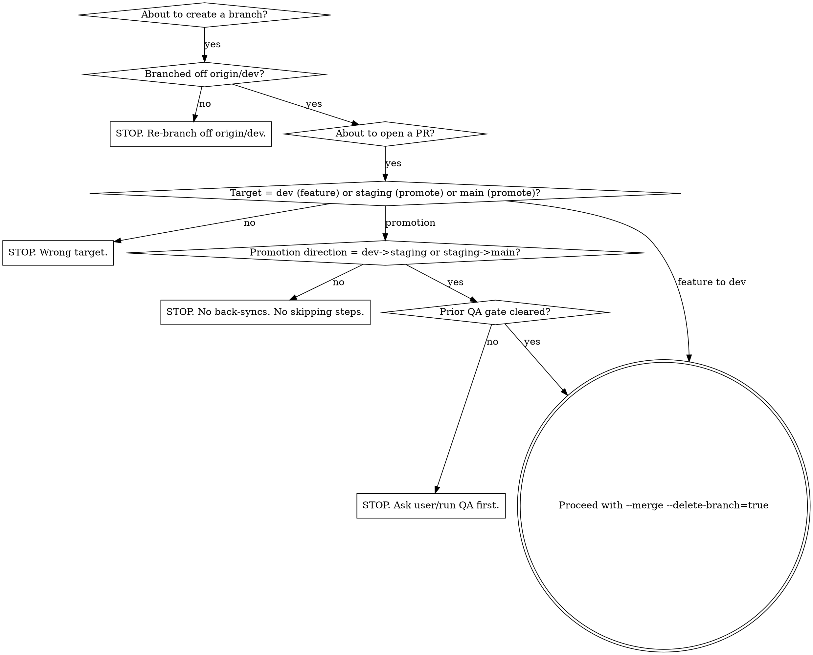

# merge-discipline -- The Only Flow That Exists

> **Wrong skill?** Single feature PR ceremony -> `finishing-a-development-branch`. Pre-commit code review -> `progressive-code-review-gate`. Pull before resuming -> `branch-sync-gate`.

**Announce at start:** "I'm using **merge-discipline**. Verifying we are on the canonical flow before any branch action."

## The Canonical Flow (NON-NEGOTIABLE)

```text
feature/* or fix/*  --PR-->  dev  --QA-->  PR-->  staging  --QA-->  PR-->  main
        ^                       ^                     ^                     ^
        |                       |                     |                     |
   branched from dev       merged via PR        merged via PR         merged via PR
```

Rules, in order of importance:

1. **Feature/fix branches branch off `dev`.** Never off staging. Never off main. Never off another feature branch unless it is a stacked PR explicitly disclosed.
2. **All work lands on `dev` via PR first.** No direct push to dev. No PR targeting staging or main directly.
3. **Promotion direction is dev -> staging -> main. ONE WAY.** Never main -> staging. Never staging -> dev. Never main -> dev.
4. **QA between each promotion step.** dev gets QA before promoting to staging. staging gets QA before promoting to main.
5. **No back-syncs.** Back-syncs are a SIGN OF FAILURE. If you find yourself wanting to open `main -> dev`, STOP -- something upstream went wrong (someone pushed directly to main, or a hotfix happened out-of-band). Fix the cause, don't paper over with a back-sync.
6. **No mirrors between independent repos.** If you're cherry-picking across repos, the destination still flows feature -> dev -> staging -> main on its own terms.
7. **Delete the source branch on merge.** `--delete-branch=true` ALWAYS.

## Pre-Flight Checklist (MANDATORY)

Run BEFORE any of: opening a PR, creating a branch, retrying a failed merge.

```text
[ ] 1. What is the source branch?
       - If you are creating it: must be off `origin/dev` (or a documented stacked-PR parent)
       - If it exists: must originally have branched from dev

[ ] 2. What is the target branch?
       - feature/fix work -> dev
       - dev's accumulated changes -> staging (promotion)
       - staging's accumulated changes -> main (promotion)
       - NOTHING ELSE IS LEGAL

[ ] 3. Has the previous QA gate cleared?
       - dev -> staging: dev CI green AND user/QA has signed off
       - staging -> main: staging CI green AND user/QA has signed off
       - If unsigned, ASK -- do not promote on autopilot

[ ] 4. Inspect branch protection on the target (informational, not for bypass)
       gh api repos/<owner>/<repo>/branches/<branch>/protection | jq .
       Note required status checks. CI must pass on the PR.

[ ] 5. For cherry-picks across repos:
       Scan the diff for:
         - Literal company-internal strings (anti-leak hooks WILL flag these)
         - Realistic-looking secrets/tokens in test fixtures
         - Non-ASCII added by the source repo
         - Platform-specific paths that do not belong on the target
       Sanitize before pushing.
```

## What You Will NEVER Do

| Forbidden action | Why | What to do instead |
|------------------|-----|--------------------|
| Open a PR targeting `staging` or `main` from a feature branch | Skips dev QA | Target dev. After it lands, separately promote dev -> staging. |
| Branch off `staging` or `main` | Forks history outside the canonical line | Branch off dev. Always. |
| Direct-push to staging or main | Bypasses CI + QA + review | Use a PR. Always. |
| Rebase-merge a promotion PR | Rewrites SHAs into siblings; breaks ancestry-based tooling | Use `--merge` (merge commit) on promotion PRs. |
| Open a `main -> staging` or `main -> dev` back-sync | Reverses the canonical flow. Indicates an out-of-band landing on main. | STOP. Find the out-of-band landing. Decide whether to revert it, redo it through the flow, or accept it AS-IS (one-time, documented). Do NOT routinize back-syncs. |
| Create a new topic branch when the previous one fails CI | Branch sprawl. The network graph disgrace. | Fix the source branch in place. `git commit --amend` or new commit. Force-push the existing branch. Never `chore/foo-v2`. |
| Mirror dev between independent repos | "DO NOT MIRROR" is a real instruction. Independent repos diverge for real reasons. | Cherry-pick the SPECIFIC commits the user wants ported. Adapt per the destination's policy. |
| Forget `--delete-branch=true` on merge | Leaves topic branches on remote. Pollutes the network graph. | ALWAYS pass the flag. `gh pr merge --delete-branch=true` / `glab mr merge --remove-source-branch`. |
| Retry the same failing API call expecting different results | Loops on opaque server-hook errors. | Change ONE variable (sanitize a string, drop a path, retarget). Two identical errors -> stop and diagnose. |

## Decision Tree



## Mandatory Behaviors

1. **Confirm the model BEFORE the first branch action.** State out loud: "Feature branches off dev. dev -> staging -> main only. No back-syncs."

2. **State the PR sequence before opening anything.** "I will open ONE PR: feat/foo -> dev. After QA: ONE PR dev -> staging. After QA: ONE PR staging -> main." If you have written more than 3 PRs in your plan, you are wrong.

3. **`--delete-branch=true` on every merge.** Without exception.

4. **`--merge` strategy on promotion PRs.** Not rebase. Not squash (unless explicitly requested for a single-commit feature).

5. **If a merge is rejected, fix the source branch in place.** Never `chore/<thing>-v2`.

6. **Stop on the second identical opaque error.** Don't loop. Diagnose. Sanitize. Retarget.

7. **Sanitize test fixtures.** Anti-leak hooks scan content. Use `FAKE-LEAK-PATTERN-FOR-TEST`, never a string that resembles a real internal term.

## Red Flags (you are about to break the flow)

| Thought | Reality |
|---------|---------|
| "I'll branch off staging just this once" | No. Off dev. |
| "I'll target main directly because it's just a dep bump" | No. PR to dev. dev to staging. staging to main. Three PRs. |
| "I need to back-sync main to dev" | Something is wrong UPSTREAM. Stop. Figure out why main has content dev doesn't. |
| "I'll create chore/promote-X-to-Y-v2" | You created v1. Fix v1. Don't make v2. |
| "Rebase-merge will be cleaner" | It produces sibling SHAs. Use --merge for promotions. |
| "I'll force-push to dev to clean it up" | Branch protection blocks it. And it's wrong. Use a PR. |

## When the Flow Was Already Broken Before You Got Here

If you inherit a repo state where the flow was violated (e.g., a dependabot PR landed directly on main, sibling SHAs already exist), do NOT compound it with back-syncs and mirror PRs:

1. ASK the user how they want to handle the inherited mess.
2. Options to offer: revert the off-flow commit, accept it and reconcile via ONE squashed-content topic branch that re-enters dev, or document and ignore.
3. NEVER routinize back-syncs into the canonical flow.

## Failure Modes

See `reference.md` for the full catalogue and concrete recipes.

## Companion Skills

- `branch-sync-gate` -- pull-gate before any work on a shared branch
- `finishing-a-development-branch` -- final commit/push/PR ceremony for feature branches
- `progressive-code-review-gate` -- cr-battery + sentinel writing
