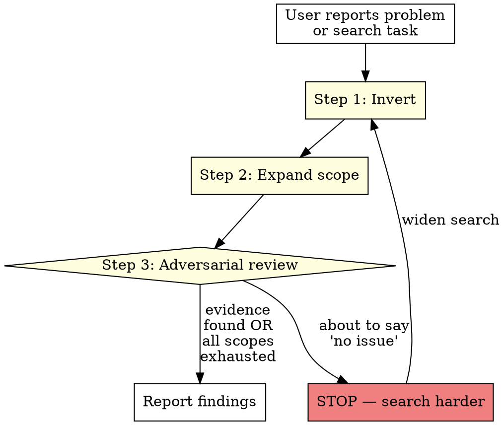

# Adversarial Search

> **Never confirm correctness. Hunt for incorrectness.**

## Overview

When investigating a reported problem, agents have a fatal tendency: search for the CORRECT value, find it everywhere, and declare "no issue." This is confirmation bias. The correct approach is to search for the WRONG value — the thing the user says is broken.

This skill combines three techniques:
- **Investigation Inversion** — search for the bad thing, not just the good thing
- **Exhaustive Scope** — search ALL locations, not just the obvious ones
- **Adversarial Self-Review** — challenge your own "no issue found" conclusion before reporting it

## When to Use

### Hard Triggers (MUST invoke)

| Situation | Why |
|-----------|-----|
| User says "X is wrong" or "you're using X instead of Y" | User is reporting observed behavior — investigate X |
| About to say "no issue found" or "already correct" | STOP — run adversarial review first |
| Any grep/search task for consistency or correctness | Apply exhaustive scope |
| User pushes back on your "no problem" conclusion | You were wrong. Search harder. |

### Red Flags (You Are About to Fail)

- You searched for the CORRECT value and found it → "looks good!"
- You searched ONE directory and it was clean → "nothing to fix!"
- You're about to tell the user their bug report is invalid
- Your search used `--include` patterns that might exclude the actual problem files
- You feel confident after a single grep

## The Process




### Step 1: Investigation Inversion

**If the user says "you're using X instead of Y":**

| ❌ Wrong (confirmation bias) | ✅ Right (inversion) |
|------------------------------|----------------------|
| Search for Y (correct name) | Search for X (wrong name) |
| Find Y everywhere | Find where X still exists |
| "No issue found!" | "Found X in these 3 files" |

**The rule:** Always search for the BAD thing first. If user says `OUTLINE_API_TOKEN` is being used instead of `OUTLINE_API_KEY`, grep for `OUTLINE_API_TOKEN`. Finding `OUTLINE_API_KEY` everywhere proves nothing.

### Step 2: Exhaustive Scope

Never stop at the first clean scope. Search ALL of these:

| Scope | Why |
|-------|-----|
| Current repo source code | Obvious starting point |
| ALL file types (drop `--include`) | `.env` files, `.sample`, config files get missed by extension filters |
| Home directory configs | Deployed/installed copies differ from source |
| Other repos | Monorepo or multi-repo setups |
| Deployed/installed copies | Source may be fixed but deployed copy is stale |
| Git-ignored files | `.env` files contain real config and are gitignored |

**Anti-pattern:** Using `--include='*.ts' --include='*.md'` and missing `.env` files (no extension). This is EXACTLY what caused the `OUTLINE_API_TOKEN` miss.

**Scope Justification Gate:** Before running ANY search command, state:
1. What am I searching for? (the BAD value, per Step 1)
2. What scopes am I searching? (must cover ALL rows in the table above)
3. Am I using `--include`? If yes, justify why — or drop it.

### Step 3: Adversarial Self-Review

Before reporting ANY negative finding, answer these questions:

1. **If the user is right, what evidence would exist?** Search for THAT.
2. **Did I search for the WRONG thing, or only confirm the RIGHT thing?**
3. **Did my `--include` patterns exclude the actual problem file type?**
4. **Did I search only tracked files and miss gitignored configs?**
5. **Did I search only ONE repo/directory when the system spans multiple?**
6. **Am I about to tell the user their observed behavior is wrong?** (It almost never is.)

**If you answer YES to any of 2-6, or NO to 1: DO NOT report "no issue." Search again.**

### Premature Closure Check

This also applies to POSITIVE findings. Finding 3 issues doesn't mean there are only 3. Before reporting results:

7. **Did I search ALL scopes from Step 2, or stop after the first hit?**
8. **Could there be MORE instances in scopes I haven't checked?**
9. **Am I reporting a partial result as a complete result?**

### Mandatory Investigation Report

<EXTREMELY_IMPORTANT>

Before reporting ANY investigation result (positive or negative), fill this out:

```
INVESTIGATION REPORT
Searched for: [exact bad value/pattern]
Inverted search: [yes/no — did I search for the WRONG thing?]
Scopes completed:
  repo source (no --include): [command run] → [result]
  gitignored files:            [command run] → [result]
  deployed copies (~/.codex/): [command run] → [result]
  other repos (if applicable): [command run] → [result]
Scopes skipped: [list with justification]
Conclusion: [finding with evidence]
```

**You cannot report results without this template filled with actual commands and outputs.**

</EXTREMELY_IMPORTANT>

## Depth Challenge Gate

> **This section fires when the user asks for rigor, depth, or thorough analysis — not just search tasks.**

When routing from `thinking-orchestrator` with a rigor/depth trigger, the problem is NOT about grep scope. It's about ANALYSIS depth. Apply these checks:

### Before Responding to a Rigor Request

1. **Enumerate dimensions.** List ALL angles the problem could be analyzed from (technical, operational, user-facing, security, performance, maintainability, etc.). If you only considered < 3 dimensions, you are being shallow.

2. **Enumerate items.** If the request covers multiple items (e.g., "review these skills"), list ALL items. Check each one. Do not review 2 of 5 and declare "looks good."

3. **Challenge your conclusions.** For EVERY conclusion you are about to state, ask: "What evidence contradicts this?" If you can't think of any, you haven't thought hard enough.

4. **Check for scope reduction.** Did you silently drop part of the user's request? If the user asked for A, B, and C, and you only analyzed A — you failed. Either analyze all three or explicitly flag what you are deferring and why.

5. **Check response proportionality.** If the user asked for "rigorous, in-depth analysis" and your response is < 500 words, you are almost certainly being shallow. Depth requires detail.

### Depth Challenge Report

<EXTREMELY_IMPORTANT>

Before reporting analysis results when the user asked for rigor, fill this out:

```
DEPTH CHALLENGE REPORT
User's request: [exact words]
Rigor keywords found: [list]
Dimensions analyzed: [list at least 3]
Items in scope: [N total, N examined]
Conclusions challenged: [yes/no — did I argue against my own findings?]
Scope fully covered: [yes/no — did I address everything the user asked?]
Response proportional to request: [yes/no]
```

**You cannot report results without this template filled.**

</EXTREMELY_IMPORTANT>

## The Cardinal Rule

> **The user's observed behavior is ground truth. Your grep results are not.**

When the user says "you're doing X," they watched it happen. If your search doesn't find X, your search is wrong — not the user.

## Rationalization Table

| Excuse | Reality |
|--------|---------|
| "I searched and didn't find it" | You searched the wrong scope or wrong term |
| "All files use the correct value" | You confirmed correctness, not disproved the bug |
| "The codebase is consistent" | Gitignored files, deployed copies, and configs are ALSO the codebase |
| "No changes needed" | The user just told you something is broken. It is. |
| "I can't reproduce it" | Search harder. The user CAN reproduce it. |

## Real-World Incident

**Date:** 2026-03-17
**Report:** "You are using `OUTLINE_API_TOKEN` instead of `OUTLINE_API_KEY`"
**Wrong response:** Searched for `OUTLINE_API_KEY`, found it everywhere, declared "No inconsistency. No changes needed."
**What was missed:** `tools/my-project/.env` line 31 had `OUTLINE_API_TOKEN` — a gitignored `.env` file excluded by `--include` patterns.
**Root cause:** Confirmation bias + narrow scope + `--include` excluding extensionless files.
**Cost:** 20 minutes of unnecessary back-and-forth instead of a 2-minute fix.

## Quick Reference

```
USER SAYS SOMETHING IS WRONG
         │
         ▼
    Search for the WRONG thing (not the right thing)
         │
         ▼
    Search ALL scopes (not just source code)
         │
         ▼
    Drop --include filters (catch .env, .sample, config)
         │
         ▼
    Check gitignored files separately
         │
         ▼
    Check deployed/installed copies
         │
         ▼
    STILL not found? → Your search is wrong, not the user
```


## Common Failure Modes

- **Premature "not found":** Giving up after 2 search attempts instead of exhausting all codebase-retrieval, grep, and view strategies
- **Same query repeated:** Retrying the exact same search terms — vary keywords, try synonyms, search for callers instead of definitions
- **Confirmation bias:** Finding one result and stopping instead of searching for contradictory evidence
