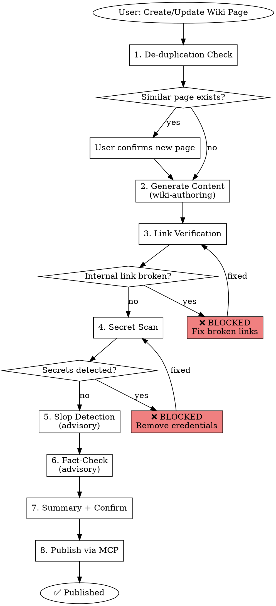

# Wiki Orchestrator — Decision Flowchart

> Reference material for the `wiki-orchestrator` skill.
> See `skill.md` for core guidance.

## Graphviz DOT Diagram

```dot
digraph wiki_orchestrator {
    rankdir=TB;
    node [shape=box];

    start [label="User: Create/Update Wiki Page" shape=ellipse];
    dedup [label="1. De-duplication Check"];
    dedup_result [label="Similar page exists?" shape=diamond];
    confirm_new [label="User confirms new page"];
    content [label="2. Generate Content\n(wiki-authoring)"];
    links [label="3. Link Verification"];
    links_fail [label="Internal link broken?" shape=diamond];
    block_links [label="❌ BLOCKED\nFix broken links" shape=box style=filled fillcolor=lightcoral];
    secrets [label="4. Secret Scan"];
    secrets_fail [label="Secrets detected?" shape=diamond];
    block_secrets [label="❌ BLOCKED\nRemove credentials" shape=box style=filled fillcolor=lightcoral];
    slop [label="5. Slop Detection\n(advisory)"];
    facts [label="6. Fact-Check\n(advisory)"];
    summary [label="7. Summary + Confirm"];
    publish [label="8. Publish via MCP"];
    done [label="✅ Published" shape=ellipse];

    start -> dedup;
    dedup -> dedup_result;
    dedup_result -> confirm_new [label="yes"];
    dedup_result -> content [label="no"];
    confirm_new -> content;
    content -> links;
    links -> links_fail;
    links_fail -> block_links [label="yes"];
    links_fail -> secrets [label="no"];
    block_links -> links [label="fixed"];
    secrets -> secrets_fail;
    secrets_fail -> block_secrets [label="yes"];
    secrets_fail -> slop [label="no"];
    block_secrets -> secrets [label="fixed"];
    slop -> facts;
    facts -> summary;
    summary -> publish;
    publish -> done;
}
```
